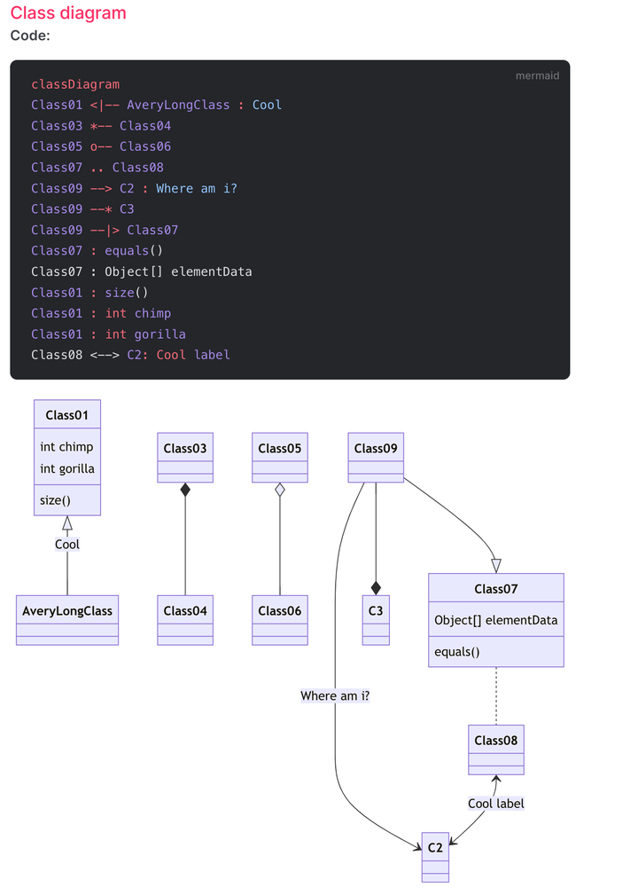

Visio：是一款流程图和架构图绘制工具，前身为MS Office自带的流程图功能，在后续版本中独立出来，并逐渐加入更多功能。
MindMaster：是一款亿图品牌的新一代流程图制作软件,其亲少儿科、思维导图、流程图等功能深受用户的青睐。
Lucidchart：是一款在线图表制作工具，支持网页端和移动端，可以轻松制作各种图表，如流程图、组织结构图、UML图、网络拓扑图等等。
Draw.io：是一款免费的在线图形绘制工具，支持多人在线协作，适用于制作流程图、组织结构图、UML图、网络拓扑图等多种图表。
Whimsical：是一款在线的协作工具，可以轻松制作各种类型的图表，包括流程图、组织结构图、UML图等等。
Diagrams.net：是一款基于Web的图形绘制工具，支持多种图形绘制方式，包括但不限于流程图、组织结构图、UML图等等。
PlantUML：是一款开源的UML图形绘制工具，使用简单的文本语言来描述UML图形，可以轻松生成各种类型的UML图形。

#### Mermaid：是一款开源的流程图和UML图形绘制工具，使用简单的文本语言来描述图形，可以轻松生成各种类型的流程图和UML图形。

#### SmartDraw是一款功能强大的图表制作软件，专门用于创建各种类型的流程图、组织结构图、思维导图、UML图、平面图、网络图等。它具备丰富的符号库，可以满足用户制作各类图表的需求。此外，SmartDraw还具备与其他工具集成的功能，使得用户能够更加便捷地进行文件共享和协作。

在界面设计方面，SmartDraw提供直观易用的操作界面，用户可以通过简单的拖拽和点击操作，快速创建和编辑图表。同时，软件还提供了多种模板和样式供用户选择，使得用户能够更加方便地创建符合自己需求的图表。

此外，SmartDraw还具有强大的协作功能。多人可以同时在同一份图表上进行编辑和修改，实时共享彼此的更改，提高了团队协作的效率。这对于需要频繁进行沟通和协作的团队来说，是一个非常实用的功能。

值得一提的是，SmartDraw还提供了为特定行业而设的版本，如律师行业版的SmartDraw Legal Edition和医疗行业版的SmartDraw Healthcare Edition。这些特定版本的软件根据行业的特点和需求进行了优化和定制，使得用户能够更加便捷地创建符合行业规范的图表。

总的来说，SmartDraw是一款功能全面、操作简便的图表制作软件，无论是个人用户还是团队用户，都可以通过它快速创建出专业、美观的图表。无论是用于工作汇报、项目展示还是学术研究，SmartDraw都是一个值得尝试的选择。

