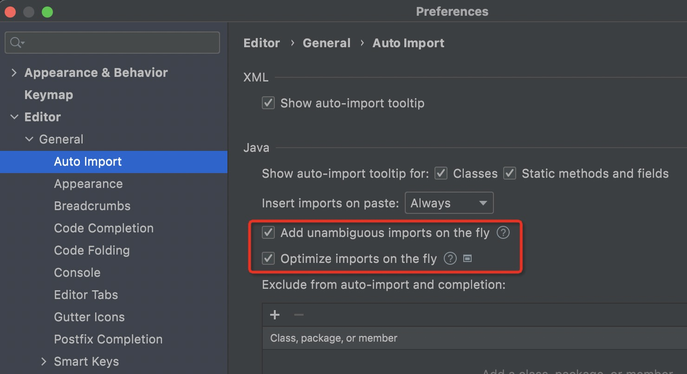

## 调整字体

Settings —— Editor —— Font

## 控制台设置

Settings —— Editor —— General —— Console 

## properties文件中中文问题

Settings —— Editor —— File Encodings —— 勾选 Transparent native-to-ascii conversion

## 提示不区分大小写

File–>Settings–>Editor–>General–>Code Completion–>Mach case的勾取消掉就OK了

# 插件篇

## Lombok

## alibaba 代码扫描插件

https://github.com/alibaba/p3c

## 小地图

CodeGlance
>  Ctrl+Shift+G  显示/隐藏

## 括号美化

Rainbow Brackets

## 高亮代码块
HighlightBracketPair

## 缩进高亮
Indent Rainbow

## 彩虹进度条
Nyan Progress Bar

## 统计代码行数

Statistic

## 快捷键提示

Key Promoter X

## FindBugs-IDEA

## Background Image Plus 

这个在2019.2版本上idea自带了这个功能，Settings —— Appearance & Behavior —— Appearance ——  UI Options —— Background Image

## 自动生成单元测试代码

JUnitGenerator V2.0

## Free Mybatis plugin

Free Mybatis plugin

## 时序图生成工具

SequenceDiagram

## 关闭代码检查

Settings —— Editor —— Inspections , 把不必要的代码检查关闭

## TODO配置 —— 自定义代码模板

Settings —— Editor —— Live Templates —— +号 —— Template Group 自定义一个名字 —— +号 —— Live Template 

## 优化导包配置

Editor —— General —— Auto Import

第一个：自动导包
第二个：自动删除未使用的包

---

## 设置tab页多行显示

---

## 显示方法分割线

---

## 优化版本控制的目录颜色展示

勾选即可

---

## 双斜杠注释改成紧跟代码头

---