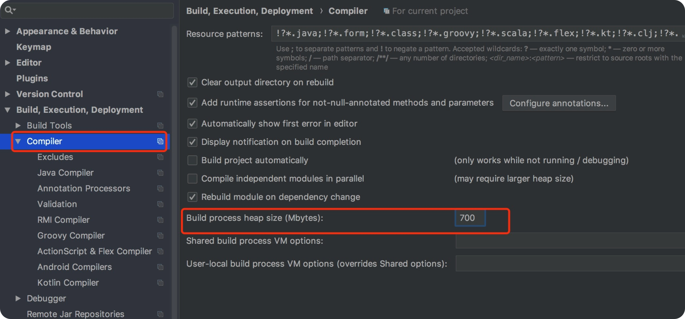

## java.lang.OutOfMemoryError: GC overhead limit exceeded
在用idea开发java项目时，启动报内存溢出错误，致服务启动失败：

Error:java: java.lang.OutOfMemoryError: GC overhead limit exceeded

报此错说明启动期间内存不够用了，把idea的启动进程堆内存值设大点就行了。
设置窗口：Settings --->Build,Execution,Deployment---> Complier
把 build process heap size 值改大点即可

