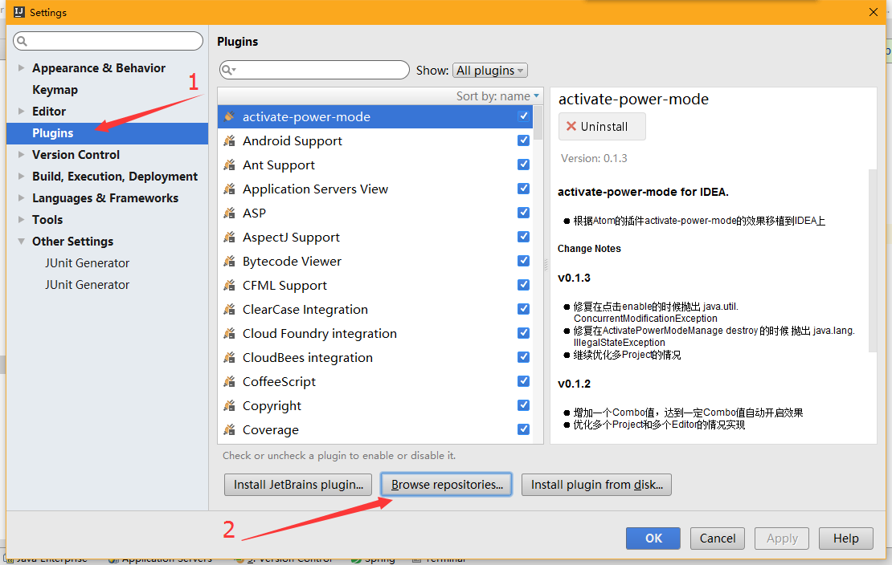
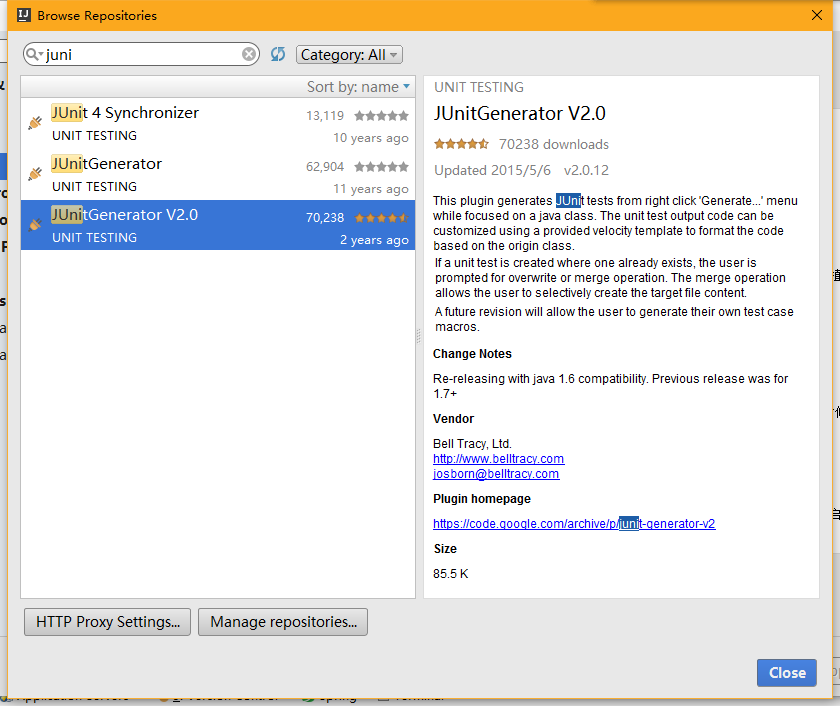
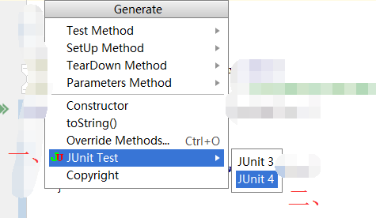
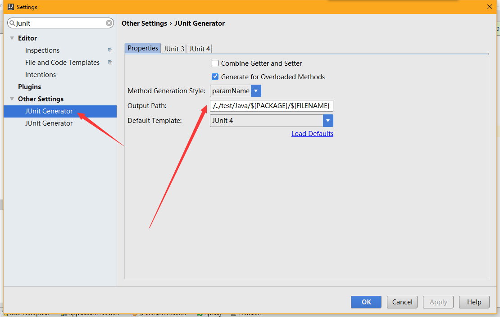
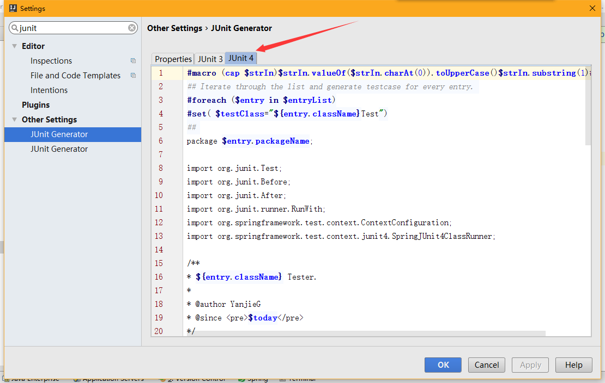

## 一、搜索junit插件并安装

- 打开设置  File —— Settings —— Plugins —— Browse repositories    
如下图：


- 在搜索框里输入 `juni` 选择搜索结果中的 `JUnitGenerator V2.0` 点击 右边的 install

如下图：




- 安装完后会提示需要重启idea，重启即可，重启完毕后在一个类里面右键 选择 `Generate` （也可以按快捷键 `Alt+Insert`） ，在出现的菜单中选择 `JUnit Test` ———— `JUnit 4` 即可生成单元测试类

如下图：




## 二、自定义JUnit配置

- 1、生成单元测试类的路径

在 File —— Settings 里面搜索 junit， 如下图：



修改右侧 Output Paths ,

> 默认值为： `${SOURCEPATH}/test/${PACKAGE}/${FILENAME}`

> 修改至为： `${SOURCEPATH}/../../test/Java/${PACKAGE}/${FILENAME}`

- 2、修改单元测试类的模板

如下图：



> 默认：

````
########################################################################################
##
## Available variables:
##         $entryList.methodList - List of method composites
##         $entryList.privateMethodList - List of private method composites
##         $entryList.fieldList - ArrayList of class scope field names
##         $entryList.className - class name
##         $entryList.packageName - package name
##         $today - Todays date in MM/dd/yyyy format
##
##            MethodComposite variables:
##                $method.name - Method Name
##                $method.signature - Full method signature in String form
##                $method.reflectionCode - list of strings representing commented out reflection code to access method (Private Methods)
##                $method.paramNames - List of Strings representing the method's parameters' names
##                $method.paramClasses - List of Strings representing the method's parameters' classes
##
## You can configure the output class name using "testClass" variable below.
## Here are some examples:
## Test${entry.ClassName} - will produce TestSomeClass
## ${entry.className}Test - will produce SomeClassTest
##
########################################################################################
##
#macro (cap $strIn)$strIn.valueOf($strIn.charAt(0)).toUpperCase()$strIn.substring(1)#end
## Iterate through the list and generate testcase for every entry.
#foreach ($entry in $entryList)
#set( $testClass="${entry.className}Test")
##
package test.$entry.packageName;

import org.junit.Test;
import org.junit.Before;
import org.junit.After;

/**
* ${entry.className} Tester.
*
* @author <Authors name>
* @since <pre>$date</pre>
* @version 1.0
*/
public class $testClass {

@Before
public void before() throws Exception {
}

@After
public void after() throws Exception {
}

#foreach($method in $entry.methodList)
/**
*
* Method: $method.signature
*
*/
@Test
public void test#cap(${method.name})() throws Exception {
//TODO: Test goes here...
}

#end

#foreach($method in $entry.privateMethodList)
/**
*
* Method: $method.signature
*
*/
@Test
public void test#cap(${method.name})() throws Exception {
//TODO: Test goes here...
#foreach($string in $method.reflectionCode)
$string
#end
}

#end
}
#end

````

> 修改为：


````

#macro (cap $strIn)$strIn.valueOf($strIn.charAt(0)).toUpperCase()$strIn.substring(1)#end
## Iterate through the list and generate testcase for every entry.
#foreach ($entry in $entryList)
#set( $testClass="${entry.className}Test")
##
package $entry.packageName;

import org.junit.Test;
import org.junit.Before;
import org.junit.After;
import org.junit.runner.RunWith;
import org.springframework.test.context.ContextConfiguration;
import org.springframework.test.context.junit4.SpringJUnit4ClassRunner;

/**
* ${entry.className} Tester.
*
* @author nb
* @since <pre>$today</pre>
*/
@RunWith(SpringJUnit4ClassRunner.class)
@ContextConfiguration(locations = "classpath:spring/applicationContext.xml")
public class $testClass {

    @Before
    public void before() throws Exception {
    }

    @After
    public void after() throws Exception {
    }

    #foreach($method in $entry.methodList)
    /**
    *
    * Method: $method.signature
    *
    */
    @Test
    public void test#cap(${method.name})() throws Exception {
    //TODO: Test goes here...
    }

    #end

    #foreach($method in $entry.privateMethodList)
    /**
    *
    * Method: $method.signature
    *
    */
    @Test
    public void test#cap(${method.name})() throws Exception {
    //TODO: Test goes here...
    #foreach($string in $method.reflectionCode)
    $string
    #end
    }

    #end
}
#end

````
