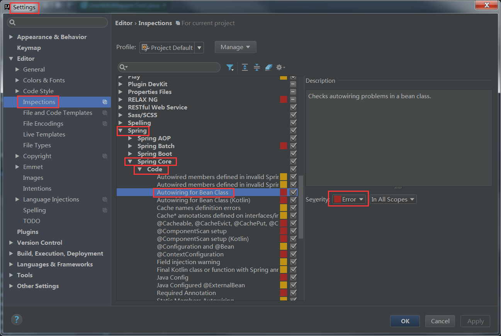

## 在接口interface添加一个方法后，打开实现类， 按ctrl+i 即可自动补全方法

## 打开类的直接定位到某一行

## 像 Sublime 那样多行编

alt+shift+左键

## 自动生成serialVersionUID

打开settings  --> Editor --> Inspections

搜索serialVersionUID

勾选“Serializable class without serialVersionUID”，然后确定就可以了。

将光标移动到类上，按Alt + Enter,就可以看到下面的提示了

## 去掉Could not autowire. No beans of 'xxxx' type found的错误提示

> 这个错误一般是IDEA本事的问题，不影响程序的编译和运行的，但有强迫症的看着很难受

- 解决方法：降低Autowired检测的级别，将Severity的级别由之前的error改成warning或其它可以忽略的级别。

## 直接跳转到方法的实现类

Ctrl+Alt+B

---