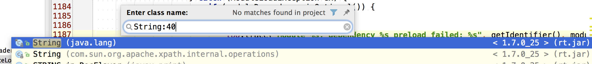
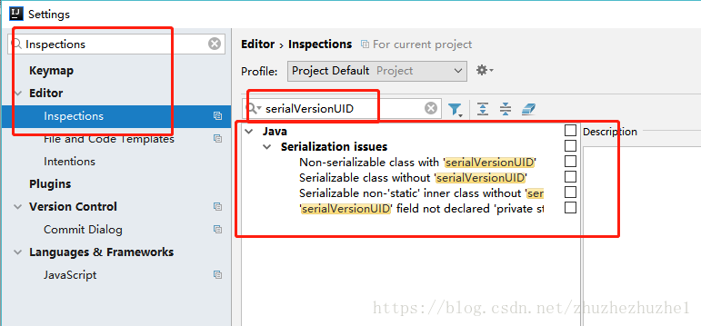
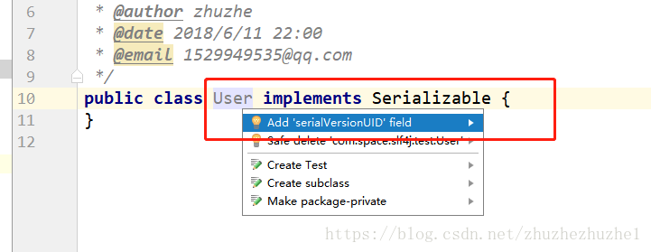

## 在接口interface添加一个方法后，打开实现类， 按ctrl+i 即可自动补全方法

## 打开类的直接定位到某一行

## 像 Sublime 那样多行编

alt+shift+左键

## 自动生成serialVersionUID

打开settings  --> Editor --> Inspections

搜索serialVersionUID

勾选“Serializable class without serialVersionUID”，然后确定就可以了。

将光标移动到类上，按Alt + Enter,就可以看到下面的提示了

---