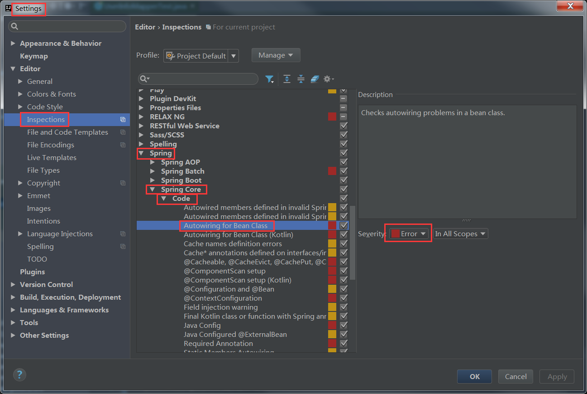
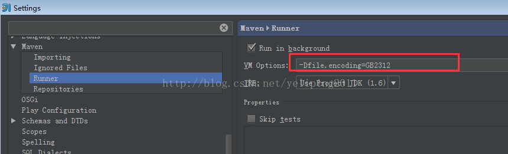
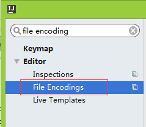
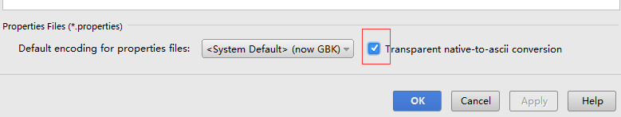
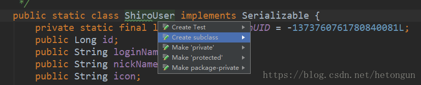
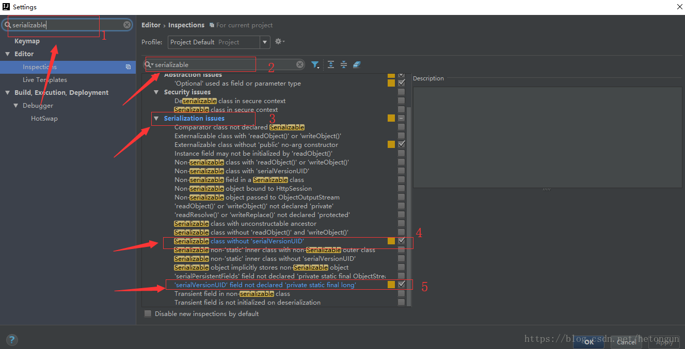
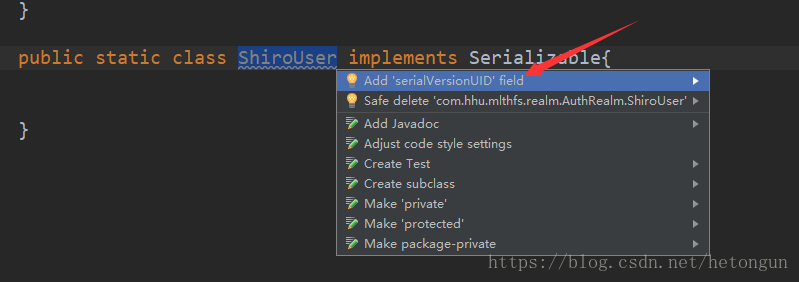

## IntelliJ Idea取消Could not autowire. No beans of 'xxxx' type found的错误提示

1.问题描述
在Idea的spring工程里，经常会遇到Could not autowire. No beans of 'xxxx' type found的错误提示。但程序的编译和运行都是没有问题的，这个错误提示并不会产生影响。但红色的错误提示在有些有强迫症的程序员眼里，多多少少有些不太舒服。

2.原因
　　spring auto scan配置，在编辑情况下，无法找不到对应的bean，于是提示找不到对应bean的错误。常见于mybatis的mapper，如下：

3.解决方案
　　降低Autowired检测的级别，将Severity的级别由之前的error改成warning或其它可以忽略的级别。




## 提示不区分大小写

File–>Settings–>Editor–>General–>Code Completion–>Mach case的勾取消掉就OK了

## Console控制台取消行数限制

idea只能在配置中改。

打开%安装目录%\bin\idea.properties，设置idea.cycle.buffer.size=disabled。即可

## Intellij idea操作maven时控制台中文乱码

windows环境下，Intellij idea12中maven操作时，控制台中文乱码问题（编译报错或者clean install时出现的其他错误描述乱码）

在cmd中mvn中文正常显示,log4j打印日志也是ok的。

解决方法：

Setting->maven->runner

         VMoptions: -Dfile.encoding=GB2312



## 解决查看properties中文变成unicode码

- 使用idea打开一个包含Properties文件的项目，然后打开Properties配置文件（包含中文的），如果显示成\u开头的ascii值，被转换成了unicode编码了

- 点击菜单File，选择Settings，还可以按快捷键（Ctrl+Alt+S），打开设置界面

- 在搜索框中输入file encoding关键字，搜索定位到File Encoding菜单



- 打开File Encoding菜单，右侧可以看到Transparent native-to-ascii conversion勾选框，勾选之后点击确认。



- 再打开之前的Properties文件，这个时候可以看到中文已经正常的显示了

## 自动生成 serialVersionUID 的设置

- 1、没有设置之前，选中对应的类名，然后按 alt+enter 快捷键 的情况如下所示



- 2、设置自动生成 serialVersionUID 的方式如下图所示



- 3、设置之后，选中对应的类名，然后按 alt+enter 快捷键 的情况如下所示



##


## idea vm options

```
# IDEA的JVM以Server模式启动（新生代默认使用ParNew）
-server


##################内存分配###########################

# 堆初始值占用3G，意味着IDEA启动即分配3G内存
-Xms3g

# 堆最大值占用3G
-Xmx3g

# 强制JVM在启动时申请到足够的堆内存（否则IDEA启动时堆初始大小不足3g）
-XX:+AlwaysPreTouch

# 年轻代与老年代比例为1:3（默认值是1:4），降低年轻代的回收频率
-XX:NewRatio=3

# 栈帧大小为16m
-Xss16m

##################老年代回收器########################

# 使用CMS老年代回收器
-XX:+UseConcMarkSweepGC

# CMS的重新标记步骤：多线程一起执行
-XX:+CMSParallelRemarkEnabled

# CMS的并发标记步骤：启用4个线程并发标记（理论上越多越好，前提是CPU核心足够多）
-XX:ConcGCThreads=8


##################JIT编译器###########################

# 代码缓存，用于存放Just In Time编译后的本地代码，如果塞满，JVM将只解释执行，不再编译native代码。
-XX:ReservedCodeCacheSize=512m

# 分层编译，JIT编译优化越来越好，IDEA运行时间越久越快
-XX:+TieredCompilation

# 节省64位指针占用的空间，代价是JVM额外开销
#-XX:+UseCompressedOops

# 增大软引用在JVM中的存活时长（堆空闲空间越大越久）
-XX:SoftRefLRUPolicyMSPerMB=50

# 设为false Idea会提示无法利用Https更新
-Djsse.enableSNIExtension=true

-ea
-Dsun.io.useCanonCaches=false
-Djava.net.preferIPv4Stack=true
-Djdk.http.auth.tunneling.disabledSchemes=""
-XX:+HeapDumpOnOutOfMemoryError
-XX:-OmitStackTraceInFastThrow
-XX:MaxJavaStackTraceDepth=10000
-Dide.no.platform.update=true

```
