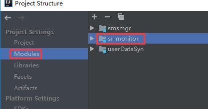
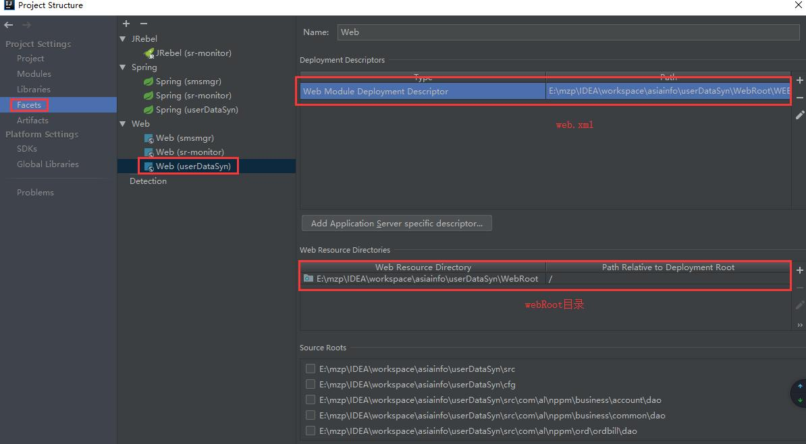
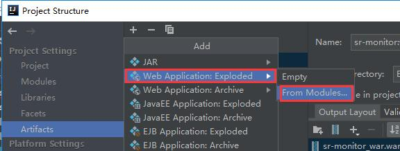
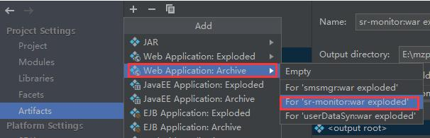
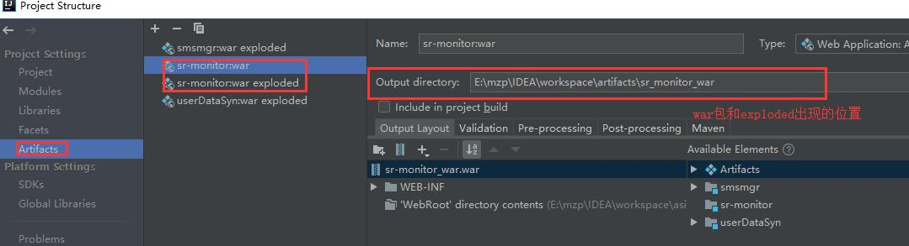
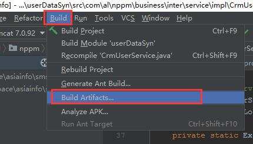
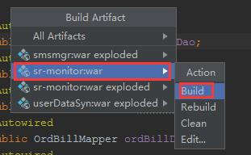
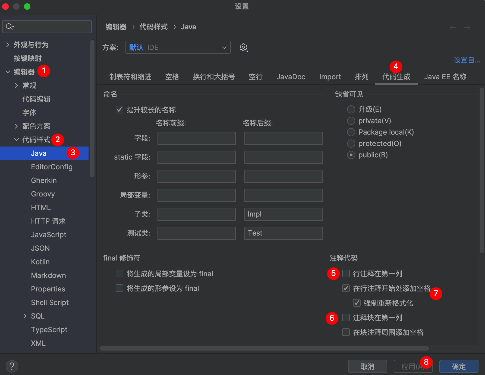

## 非maven项目如何打包


1.在modules中将项目导入。

2.在facets中点击加号，分别给要打包的项目添加web

3.在Artifacts中点击“+”添加一个web application：exploded （这个是项目的文件夹的形式。个人理解：war包展开、解压后的形式）

然后再点击“+”添加一个web application：archive（这个是项目的war包形式）。选中上一步添加的exploded


配置完成。可以开始打包了。
二、打包
选择Build ===> Build Artifacts

然后选择刚刚项目产品对应的war。第一次打包可以选择build，如果不是第一次可选择Rebuild

打包完成。


## 类注释模板

`Settings —— Editor —— File and Code Templates`
选择`Files`选项卡下面的`Class`
输入下面的内容
```
/**
 * @author admin
 * @date ${YEAR}年${MONTH}月${DAY}日 ${TIME}
 */
```


## 使用快捷键添加注释时，注释出现在行首




---