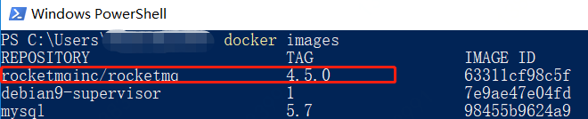
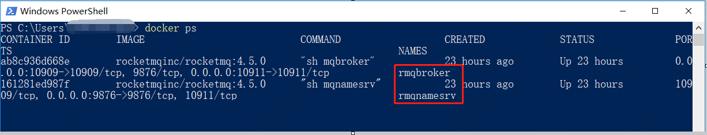
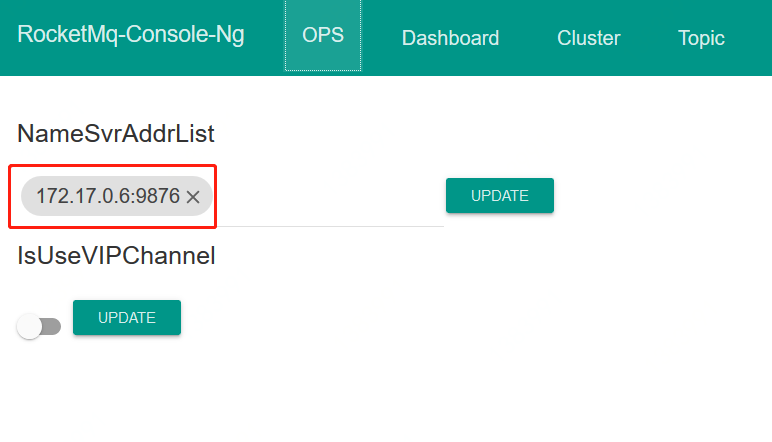

## github地址

https://github.com/apache/rocketmq-externals


https://github.com/apache/rocketmq-externals/tree/master/rocketmq-docker/image-build

## 首先构建Docker镜像

可以执行 `sh build-image.sh 4.5.0`
也可以执行命令行执行下面命令：

```
docker build --no-cache -t rocketmqinc/rocketmq:4.5.0 --build-arg version=4.5.0 .
```

**注意**
因为我是在windows下操作的，所以导致scripts目录下两个sh脚本包含了windows的换行符，从而出现错误$'\r': command not found 错误。
**解决方法：** 修改Dockerfile文件
- 1、安装dos2unix* 
在安装脚本里面添加安装dos2unix* 

```
RUN yum install -y dos2unix* java-1.8.0-openjdk-devel.x86_64 unzip gettext nmap-ncat openssl, which gnupg, telnet \
 && yum clean all -y
```

- 2、对两个脚本进行转码
在添加脚本后的操作后面添加 `RUN dos2unix ${}.sh` 语句，如下：

```
# add scripts
COPY scripts/ ${ROCKETMQ_HOME}/bin/

RUN chown -R ${uid}:${gid} ${ROCKETMQ_HOME}/bin/

RUN dos2unix ${ROCKETMQ_HOME}/bin/runserver-customize.sh
RUN dos2unix ${ROCKETMQ_HOME}/bin/runbroker-customize.sh
```

执行 `docker images` 就可以看到镜像


## 启动

- 先启动 mqnamesrv
执行

```
docker run -d -p 9876:9876 -v `pwd`/data/namesrv/logs:/root/logs -v `pwd`/data/namesrv/store:/root/store --name rmqnamesrv -e "MAX_POSSIBLE_HEAP=100000000" rocketmqinc/rocketmq:4.5.0 sh mqnamesrv
```

其中`pwd`表示执行命令的当前目录，可以改成你磁盘的一个绝对路径，例如 /d/docker/data/namesrv/logs:/root/logs

如果上面命令没报错，且执行docker ps 能看到rmqnamesrv容器running状态，则执行下面的命令：

```
docker run -d -p 10911:10911 -p 10909:10909 -v `pwd`/data/broker/logs:/root/logs -v `pwd`/data/broker/store:/root/store --name rmqbroker --link rmqnamesrv:namesrv -e "NAMESRV_ADDR=namesrv:9876" -e "MAX_POSSIBLE_HEAP=200000000" rocketmqinc/rocketmq:4.5.0 sh mqbroker
```

最后，执行 `docker ps`，可以到两个容器都在运行中，



## 安装Rocketmq控制台

查看

https://github.com/apache/rocketmq-externals/tree/master/rocketmq-console

- 1、先拉取镜像

```
docker pull styletang/rocketmq-console-ng
```

- 2、启动

```
docker run -e "JAVA_OPTS=-Drocketmq.namesrv.addr=127.0.0.1:9876 -Dcom.rocketmq.sendMessageWithVIPChannel=false" -p 8080:8080 -t styletang/rocketmq-console-ng
```

**注意** 脚本里的namesvrAddr要改成你自定义的，这里因为我们用了docker，所以需要获取docker容器的ip，进入到rmqnamesrv容器中，先执行下面命令：

```
docker exec -it rmqnamesrv bash
```

然后执行： `cat /etc/hosts`
可以看到docker容器的ip，把上面的127.0.0.1改成对应的ip即可

> 后来发现在web控制台修改也行，如下图




---