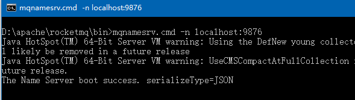
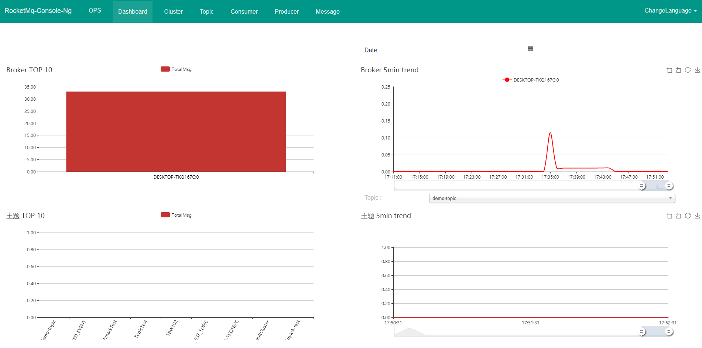

> 写在前面：
> 1、基于rocketmq 4.2.0版本
> 2、64位 win10 系统
> 3、JDK 1.8 （注意，jdk路径一定不要有空格，不然执行相应的cmd命令时会报错）
> 4、其它需要的软件，maven，git

## 一、下载二进制程序包


在官网选择编译后的压缩包下载
http://rocketmq.apache.org/release_notes/release-notes-4.2.0/
下图中红框处


或者去apache存档库中下载
http://archive.apache.org/dist/rocketmq/4.2.0/

下载好的文件： `rocketmq-all-4.2.0-bin-release.zip`

将下载好的zip包解压，注意路径也不要包含空格。

## 二、修改rocketmq配置

> 这一步也可以跳过，但有可能会因为内存设置过大导致一系列的问题

需要执行的命令都在程序目录下的bin文件夹下，主要是`mqnamesrv.cmd`和`mqbroker.cmd`这两个命令，但他们又都各自调用了`runserver.cmd`和`runbroker.cmd`命令，分别修改这两个文件里的JAVA_OPT设置，如下

```
set "JAVA_OPT=%JAVA_OPT% -server -Xms2g -Xmx2g -Xmn1g -XX:MetaspaceSize=128m -XX:MaxMetaspaceSize=320m"
```

将 Xms Xmx 这两个值改小一些，改为1g，如:

```
set "JAVA_OPT=%JAVA_OPT% -server -Xms1g -Xmx1g -Xmn1g -XX:MetaspaceSize=128m -XX:MaxMetaspaceSize=320m"
```

## 三、启动 NameServer

在rocketmq安装目录下的bin目录下，执行命令：
```
mqnamesrv.cmd -n localhost:9876
```
出现`The Name Server boot success.`字样表示成功



## 四、启动 Broker

在rocketmq安装目录下的bin目录下，执行命令：
```
mqbroker.cmd -n localhost:9876
```
注意，这个执行完没有任何提示，只要不报错即表示成功


## 五、java示例代码

添加maven依赖
```
<dependency>
    <groupId>org.apache.rocketmq</groupId>
    <artifactId>rocketmq-client</artifactId>
    <version>4.2.0</version>
</dependency>
```

#### 消费者

```
import org.apache.rocketmq.client.consumer.DefaultMQPushConsumer;
import org.apache.rocketmq.client.consumer.listener.ConsumeConcurrentlyContext;
import org.apache.rocketmq.client.consumer.listener.ConsumeConcurrentlyStatus;
import org.apache.rocketmq.client.consumer.listener.MessageListenerConcurrently;
import org.apache.rocketmq.client.exception.MQClientException;
import org.apache.rocketmq.common.message.MessageExt;

import java.util.List;

public class Consumer {
    public static void main(String[] args) throws MQClientException {
        DefaultMQPushConsumer consumer = new DefaultMQPushConsumer("my-group");

        consumer.setNamesrvAddr("localhost:9876");
        consumer.setInstanceName("rmq-instance");
        consumer.subscribe("demo-topic", "demo-tag");

        consumer.registerMessageListener(new MessageListenerConcurrently() {
            @Override
            public ConsumeConcurrentlyStatus consumeMessage(
                    List<MessageExt> msgs, ConsumeConcurrentlyContext context) {
                for (MessageExt msg : msgs) {
                    System.out.println(new String(msg.getBody()));
                }
                return ConsumeConcurrentlyStatus.CONSUME_SUCCESS;
            }
        });
        consumer.start();
        System.out.println("Consumer Started.");
    }
}

```

#### 生产者

```
import org.apache.rocketmq.client.exception.MQClientException;
import org.apache.rocketmq.client.producer.DefaultMQProducer;
import org.apache.rocketmq.client.producer.SendResult;
import org.apache.rocketmq.common.message.Message;

import java.util.Scanner;

public class Producer {
    public static void main(String[] args) throws MQClientException {
        DefaultMQProducer producer = new DefaultMQProducer("my-group");
        producer.setNamesrvAddr("localhost:9876");
        producer.setInstanceName("rmq-instance");
        producer.start();
        try {
            Message message = new Message("demo-topic", "demo-tag", "这是一条测试消息".getBytes());
            producer.send(message);

            while (true) {
                String text = new Scanner(System.in).next();
                Message msg = new Message("demo-topic",// topic
                        "demo-tag",// tag
                        text.getBytes() // body
                );
                SendResult sendResult = producer.send(msg);
            }
        } catch (Exception e) {
            e.printStackTrace();
        }
        producer.shutdown();
    }
}

```

运行Consumer和Producer，然后在生产者控制台输入文本，在消费者控制台就可以看到消息了。

## 六、搭建RocketMQ  web控制台

- 1、访问 https://github.com/apache/rocketmq-externals/ ，
使用git将代码clone下来

- 2、修改项目配置信息
这是一个用springboot编写的工程，进入到 `rocketmq-externals\rocketmq-console\src\main\resources` 目录下，编辑 application.properties 文件， 修改mq的连接地址信息：

```
rocketmq.config.namesrvAddr=localhost:9876
```

- 3、启动项目

在`rocketmq-externals\rocketmq-console`目录下，执行：
```
mvn spring-boot:run
```
等待启动成功。
```
[2018-03-05 10:54:19.823]  INFO Initializing ProtocolHandler ["http-nio-8080"]
[2018-03-05 10:54:19.853]  INFO Starting ProtocolHandler [http-nio-8080]
[2018-03-05 10:54:19.893]  INFO Using a shared selector for servlet write/read
[2018-03-05 10:54:19.929]  INFO Tomcat started on port(s): 8080 (http)
[2018-03-05 10:54:19.940]  INFO Started App in 9.61 seconds (JVM running for 18.979)
```

- 4、浏览器访问：http://localhost:8080




---


参考资料：

- 官网说明：
[https://rocketmq.apache.org/docs/quick-start/](https://rocketmq.apache.org/docs/quick-start)


---
