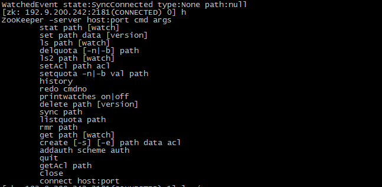

## 远程连接 

zkCli.sh -server 127.0.0.1:2181

## 基本命令

1. 显示根目录下、文件： ls / 使用 ls 命令来查看当前 ZooKeeper 中所包含的内容
2. 显示根目录下、文件： ls2 / 查看当前节点数据并能看到更新次数等数据
3. 创建文件，并设置初始内容： create /zk "test" 创建一个新的 znode节点“ zk ”以及与它关联的字符串
4. 获取文件内容： get /zk 确认 znode 是否包含我们所创建的字符串
5. 修改文件内容： set /zk "zkbak" 对 zk 所关联的字符串进行设置
6. 删除文件： delete /zk 将刚才创建的 znode 删除
7. 退出客户端： quit
8. 帮助命令： help

### 输入 h 显示所有命令

