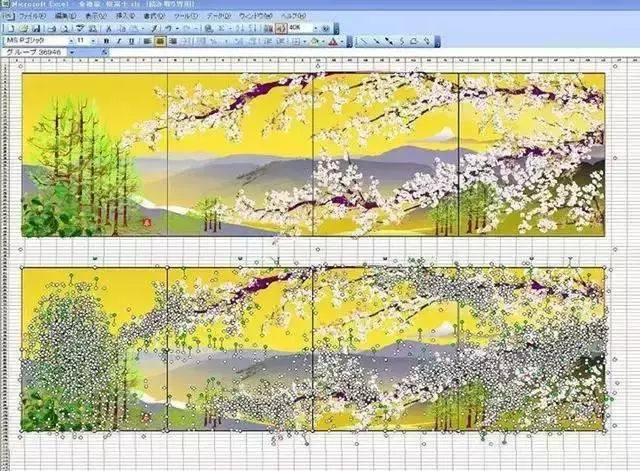
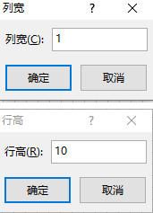
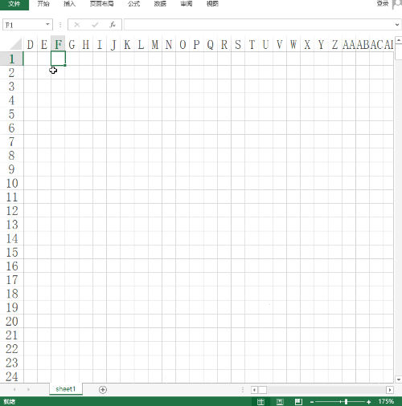

看了一个新闻说，日本有个老人坚持17年用Excel作画，效果非常惊艳。下面是几个作品，





相关新闻我在微信公众号里搜了一下，下面这个就是其中的一篇文章

---


突发奇想能不能利用程序把图片转成Excel，说干就干，下面说一下大概的思路。

首先，Excel作图其实就是把Excel单元格作为图片的一个像素，所以要先得到图片的像素值，然后在Excel里把对应的颜色填充到单元格里就行了。


## 获取图片的像素值

方法很简单，主要使用ImageIO和BufferedImage这两个类，最后得到了一个像素值按坐标顺序保存的集合，接下来只要在Excel里对应坐标填充上相应的颜色即可。

> 注意数据保存的逻辑，因为Excel是先创建一行再创建单元格，所以这里子表格是x坐标方向的像素值

```
import javax.imageio.ImageIO;
import java.awt.image.BufferedImage;
import com.google.common.collect.Lists;
import com.google.common.collect.Maps;

/**
* 获取一张图片的像素值，并把它存放到集合里
*/
public static ArrayList<List<int[]>> getImagePixel() {
    BufferedImage bi = null;
    try {
        bi = ImageIO.read(new File("/tmp/demo.jpg"));
    } catch (IOException e) {
        e.printStackTrace();
    }
    int width = bi.getWidth();
    int height = bi.getHeight();
    int minX = bi.getMinX();
    int minY = bi.getMinY();

    ArrayList<List<int[]>> list = Lists.newArrayList();
    ArrayList<int[]> subList;
    int[] rgb;
    for (int y = minY; y < height; y++) {
        subList = Lists.newArrayList();
        for (int x = minX; x < width; x++) {
            int pixel = bi.getRGB(x, y);

            rgb = new int[3];
            rgb[0] = (pixel & 0xff0000) >> 16;// r
            rgb[1] = (pixel & 0xff00) >> 8;// g
            rgb[2] = (pixel & 0xff);// b
            subList.add(rgb);
        }
        list.add(subList);
    }
    return list;
}

```


## Excel单元格颜色填充

这里是使用Apache的poi来生成Excel，在研究对单元格填充颜色的过程中发现了很多问题，下面是踩坑经过。

首先，单元格填充颜色的方法是

```
CellStyle cellStyle = workbook.createCellStyle();
cellStyle.setFillForegroundColor(IndexedColors.BLACK.getIndex());
```

看了源码后发现IndexedColors里面只提供65种颜色，这肯定无法满足我们绘图的要求。

那么有没有可以自定义颜色的方法呢？在网上查了一些资料，基本上都是下面这种写法，

```
//拿到palette颜色板
HSSFPalette palette = excel.getCustomPalette();

//这个是重点，具体的就是把之前的颜色 HSSFColor.LIME.index 替换为RGB(0,255,127) 这种颜色
palette.setColorAtIndex(HSSFColor.LIME.index, (byte) 0, (byte) 255, (byte) 127);

```

这种写法的逻辑是替换已有的颜色，但这种方法有两个问题，一个是替换颜色会把原来设置好的颜色给覆盖掉，另一个颜色还是最多只有65种颜色，所以这条路行不通。

继续看源码发现XSSFCellStyle这个类的setFillForegroundColor方法支持自定义任意的Color，这样就完美解决了上面的问题。
但这个类必须是XSSFWorkbook创建的CellStyle才有，SXSSFWorkbook和HSSFWorkbook是没有的，这个需要注意。

下面是自定义单元格填充颜色的代码，

```
XSSFCellStyle cellStyle = workbook.createCellStyle();
Color color = new Color(rgb[0], rgb[1], rgb[2]);
cellStyle.setFillForegroundColor(new XSSFColor(color));

```

在创建单元格样式XSSFCellStyle的过程中出现了一个异常，

```
Exception in thread "main" java.lang.IllegalStateException: The maximum number of Cell Styles was exceeded. You can define up to 64000 style in a .xlsx Workbook
at org.apache.poi.xssf.model.StylesTable.createCellStyle(StylesTable.java:815)
at org.apache.poi.xssf.usermodel.XSSFWorkbook.createCellStyle(XSSFWorkbook.java:730)
```

就是Workbook最多允许自定义单元格样式的个数为64000，超过这个就会报错，所以在创建单元格样式XSSFCellStyle之前要检查一下像素值去重后的个数，如果超过了64000，就要舍弃一部分像素才行。

> 我这里还加了一个简单的判断逻辑，因为单元格默认是白色的，所以如果像素值是白色就不需要再创建XSSFCellStyle样式了。
> 以后还可以加优化，对于rgb值很接近的就可以把它们合并成一个，例如，rgb(200,200,200) 和 rgb(201,201,201) 这两个就可以合并成一个，以减少创建样式过多的效率问题。

```
/**
* 生成单元格样式集合
*/
public static Map<String, XSSFCellStyle> getColorMap(List<List<int[]>> list, XSSFWorkbook workbook) {
    Map<String, int[]> rgbMap = Maps.newHashMap();
    for (List<int[]> sublist : list) {
        for (int[] rgb : sublist) {
            if (rgb[0] > 250 && rgb[1] > 250 && rgb[2] > 250) {
                continue;
            }
            String str = rgb[0] + "," + rgb[1] + "," + rgb[2];
            rgbMap.put(str, rgb);
        }
    }

    if (rgbMap.size() > 64000) {
        System.out.println("颜色值超过了64000");
        return null;
    }

    Map<String, XSSFCellStyle> colorMap = Maps.newHashMap();
    for (Map.Entry<String, int[]> entry : rgbMap.entrySet()) {
        String key = entry.getKey();
        int[] rgb = entry.getValue();
        byte[] rgbByte = new byte[3];
        rgbByte[0] = (byte) rgb[0];
        rgbByte[1] = (byte) rgb[1];
        rgbByte[2] = (byte) rgb[2];

        XSSFCellStyle cellStyle = workbook.createCellStyle();
        cellStyle.setFillForegroundColor(new XSSFColor(rgbByte, new DefaultIndexedColorMap()));
        cellStyle.setFillPattern(FillPatternType.SOLID_FOREGROUND);

        colorMap.put(key, cellStyle);
    }
    return colorMap;
}

```

上面这个方法是把图片的像素值生成对应的单元格样式，并存放在缓存中，后面生成单元格时直接从缓存中取即可。
另外，workbook.createCellStyle();方法运行效率很低，强烈建议使用poi最新版本，目前最新版本是4.1.0，跟老版本速度上会快差不多10倍。

## 生成Excel

最后一步就是生成Excel，需要注意的一点是，默认单元格是一个长方形的块，所以需要下面代码里面那样调整单元格的高宽。当然也可以在生成后打开Excel设置（如下图，这样更准确，列宽设置为1，行高设置为10）



Main方法：

```
 public static void main(String[] args) {
    XSSFWorkbook workbook = new XSSFWorkbook();
    XSSFSheet sheet = workbook.createSheet();

    // 调整单元格的高度和宽度，使其尽量变成一个正方形
    sheet.setDefaultColumnWidth(1);
    sheet.setDefaultRowHeightInPoints(12);

    ArrayList<List<int[]>> list = getImagePixel();
    Map<String, XSSFCellStyle> colorMap = getColorMap(list, workbook);
    if (colorMap == null) {
        return;
    }

    for (int i = 0; i < list.size(); i++) {
        XSSFRow row = sheet.createRow(i);
        List<int[]> subList = list.get(i);
        for (int j = 0; j < subList.size(); j++) {
            XSSFCell cell = row.createCell(j);
            int[] rgb = subList.get(j);

            if (rgb[0] > 250 && rgb[1] > 250 && rgb[2] > 250) {
                continue;
            }
            String str = rgb[0] + "," + rgb[1] + "," + rgb[2];
            XSSFCellStyle cellStyle = colorMap.get(str);

            cell.setCellStyle(cellStyle);
        }
    }

    try {
        FileOutputStream out = new FileOutputStream("/tmp/demo.xlsx");
        workbook.write(out);
        out.close();
    } catch (FileNotFoundException e) {
        e.printStackTrace();
    } catch (IOException e) {
        e.printStackTrace();
    }
}
```

最后效果如下，




更多代码可以去我的github上查看，

https://github.com/zhaoshuxue/springBoot/blob/master/code/code-demo/src/test/java/excel/Test222.java