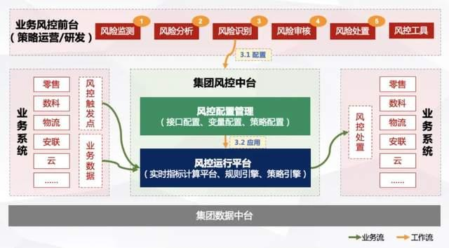

---
## STAR 情景 任务 行动 结果

## 概念
有序集（SortedSet）
列表（List）
列队（Queue）
双端队列（Deque）
阻塞队列（Blocking Queue）
有界阻塞列队（Bounded Blocking Queue）
阻塞双端列队（Blocking Deque）
阻塞公平列队（Blocking Fair Queue）
延迟列队（Delayed Queue）
优先队列（Priority Queue）
优先双端队列（Priority Deque）

可重入锁（Reentrant Lock）
公平锁（Fair Lock）
联锁（MultiLock）
红锁（RedLock）
读写锁（ReadWriteLock）

## Service-Oriented Architecture，SOA
面向服务的架构 

**名称**

基于无监督学习的主动风险识别
决策流
评分卡

