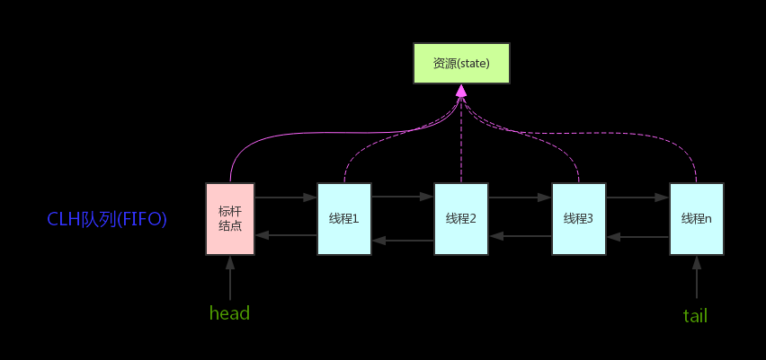
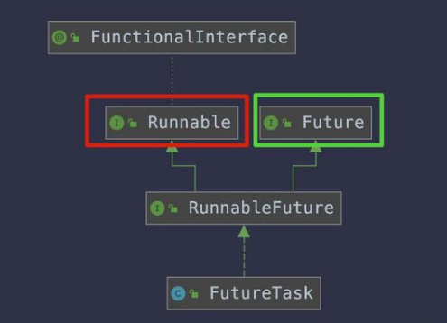

## 面向对象三大特性：继承、封装、多态


## 枚举

## 泛型擦除
> 泛型本质是指类型参数化。意思是允许在定义类、接口、方法时使用类型形参，当使用时指定具体类型，所有使用该泛型参数的地方都被统一化，保证类型一致。如果未指定具体类型，默认是Object类型。集合体系中的所有类都增加了泛型，泛型也主要用在集合。

> 泛型的好处是在编译的时候检查类型安全，并且所有的强制转换都是自动和隐式的，以提高代码的重用率。

**使用泛型的时候加上的类型参数，会在编译器在编译的时候去掉。这个过程就称为类型擦除。**


## synchronized

### 底层实现：
synchronized关键字经过编译之后会在同步块前后分别形成monitorenter和monitorexit这两个字节码指令，这两个字节码都需要指明一个reference类型的参数来指明要锁定和解锁的对象。如果没有明确指明，那就根据synchronized修饰的是实例方法还是类方法，去取对应的对象实例或Class对象来作为锁对象。

在执行monitorenter指令时，首先去尝试获取对象的锁，如果这个对象没被锁定，或者当前线程已经拥有那个对象的锁，把锁的计数器加1，相应的，在执行monitorexit指令时将锁计数器减1，当计数器为0时，锁就被释放了。如果获取锁失败了，那当前线程就要阻塞等待，直到对象锁被另一个线程释放为止。

> 参考文章：https://www.cnblogs.com/shoshana-kong/p/10877555.html

### 锁膨胀？？  锁升级？？

锁升级：从轻到重依次是：无锁状态 ---> 偏向锁 ---> 轻量级锁 ---> 重量级锁

## volatile

### 实现可见性的原理
加入volatile关键字时，会多出一个lock前缀指令，lock前缀指令实际上相当于一个内存屏障，它有三个功能：

1. 确保指令重排序时不会把其后面的指令重排到内存屏障之前的位置，也不会把前面的指令排到内存屏障后面，即在执行到内存屏障这句指令时，前面的操作已经全部完成；
2. 将当前处理器缓存行的数据立即写回系统内存（由volatile先行发生原则保证）；
3. 这个写回内存的操作会引起在其他CPU里缓存了该内存地址的数据无效。写回操作时要经过总线传播数据，而每个处理器通过嗅探在总线上传播的数据来检查自己缓存的值是不是过期了，当处理器发现自己缓存行对应的内存地址被修改，就会将当前处理器的缓存行设置为无效状态，当处理器要对这个值进行修改的时候，会强制重新从系统内存里把数据读到处理器缓存(也是由volatile先行发生原则保证)；

### volatile如何保证可见性
**CPU的缓存一致性协议MESI**
> 在多核CPU中，内存中的数据会在多个核心中存在数据副本，某一个核心发生修改操作，就产生了数据不一致的问题，而一致性协议正是用于保证多个CPU cache之间缓存共享数据的一致性。

### volatile如何保证有序性（内存屏障——lock前缀指令）


### CPU指令重排
> 当CPU**写缓存**时发现缓存区块正被其他CPU占用，为了提高CPU处理性能，可能将后面的**读缓存命令优先执行**。

### 内存屏障如何禁止指令重排

**内存屏障**
编译器和CPU可以保证输出结果一样的情况下对指令重排序，使性能得到优化，插入一个内存屏障，相当于告诉CPU和编译器限于这个命令的必须先执行，后于这个命令的必须后执行。

---

synchronized和volatile的区别（volatile是一种非锁机制，这种机制可以避免锁机制引起的线程上下文切换和调度问题。因此，volatile的执行成本比synchronized更低；volatile只能保证可见性有序性；synchronized可以保证原子性可见性有序性）

### volatile和synchronized的区别:

- volatile关键字解决的是变量在多个线程之间的可见性（对于用volatile修饰的变量，JVM虚拟机只是保证从主内存加载到线程工作内存的值是最新的）；而sychronized关键字解决的是多个线程之间访问共享资源的同步性。 
- volatile仅能使用在变量级别；synchronized则可以使用在变量、方法、和类级别的；
- volatile仅能实现变量的修改可见性，不能保证原子性；而synchronized则可以保证变量的修改可见性和原子性
- volatile不会造成线程的阻塞；synchronized可能会造成线程的阻塞。
- volatile修饰变量适合于一写多读的并发场景，而多写场景一定会产生线程安全问题（因此使用volatile而不是synchronized的唯一安全情况是类中只有一个可变的域）。
- 因为所有的操作都需要同步给内存变量，所以volatile一定会使线程的执行速度变慢。

---

### synchronized和lock区别：

1）Lock是一个接口，而synchronized是Java中的关键字，synchronized是内置的语言实现；
2）synchronized在发生异常时，会自动释放线程占有的锁，因此不会导致死锁现象发生；而Lock在发生异常时，如果没有主动通过unLock()去释放锁，则很可能造成死锁现象，因此使用Lock时需要在finally块中释放锁；
3）Lock可以让等待锁的线程响应中断，而synchronized却不行，使用synchronized时，等待的线程会一直等待下去，不能够响应中断；
4）通过Lock可以知道有没有成功获取锁，而synchronized却无法办到。
5）Lock可以提高多个线程进行读操作的效率（读写锁）。

> 在性能上来说，如果竞争资源不激烈，两者的性能是差不多的，而当竞争资源非常激烈时（即有大量线程同时竞争），此时Lock的性能要远远优于synchronized。所以说，在具体使用时要根据适当情况选择。 


## ReentrantLock  todo
Synchronized是依赖于JVM实现的，而ReenTrantLock是JDK实现的。
ReenTrantLock的实现是一种自旋锁，通过循环调用CAS操作来实现加锁。

### 区别
> 在Synchronized优化以前，synchronized的性能是比ReenTrantLock差很多的，但是自从Synchronized引入了偏向锁，轻量级锁（自旋锁）后，两者的性能就差不多了，在两种方法都可用的情况下，官方甚至建议使用synchronized，其实synchronized的优化我感觉就借鉴了ReenTrantLock中的CAS技术。都是试图在用户态就把加锁问题解决，避免进入内核态的线程阻塞。

> 便利性：很明显Synchronized的使用比较方便简洁，并且由编译器去保证锁的加锁和释放，而ReenTrantLock需要手工声明来加锁和释放锁，为了避免忘记手工释放锁造成死锁，所以最好在finally中声明释放锁。

> 锁的细粒度和灵活度：很明显ReenTrantLock优于Synchronized

### ReentrantLock 特点

1. ReenTrantLock可以指定是公平锁还是非公平锁。而synchronized只能是非公平锁。所谓的公平锁就是先等待的线程先获得锁。
2. ReenTrantLock提供了一个Condition（条件）类，用来实现分组唤醒需要唤醒的线程们，而不是像synchronized要么随机唤醒一个线程要么唤醒全部线程。
3. ReenTrantLock提供了一种能够中断等待锁的线程的机制，通过lock.lockInterruptibly()来实现这个机制。

---

## CountDownLatch  CyclicBarrier  Semaphore （信号量）

### CountDownLatch的实现原理

```
public class CountDownLatch {
   
    private static final class Sync extends AbstractQueuedSynchronizer {
        private static final long serialVersionUID = 4982264981922014374L;
        //设置同步状态
        Sync(int count) {
            setState(count);
        }
        //获取同步状态的值
        int getCount() {
            return getState();
        }
        //获取共享锁,1、getState>1返回1：表示获取到共享锁，-1：表示没有获取到共享锁
        protected int tryAcquireShared(int acquires) {
            return (getState() == 0) ? 1 : -1;
        }
        //释放共享锁
        protected boolean tryReleaseShared(int releases) {
            // Decrement count; signal when transition to zero
            for (;;) {
                int c = getState();
                if (c == 0)
                    return false;
                int nextc = c-1;
                //通过CAS设置同步状态值，如果设置失败则说明同一时刻有其它线程在设置，但是会通过自旋的方式最终设置成功
                if (compareAndSetState(c, nextc))
                    return nextc == 0;
            }
        }
    }
}
```


CountDownLatch如果有一个线程因为某种原因无法执行countDown()，则会导致await线程一直阻塞下去。

> CyclicBarrier [ˈsaɪklɪk] [ˈbæriər]  

### 区别

- CountDownLatch: 一个线程(或者多个)， 等待另外N个线程完成某个事情之后才能执行。
- CyclicBrrier: N个线程相互等待，任何一个线程完成之前，所有的线程都必须等待。

> CountDownLatch强调一个线程等多个线程完成某件事情。CyclicBarrier是多个线程互等，等大家都完成。 

1、CountDownLatch减计数。CyclicBarrier加计数，计数达到指定值时，计数置为0重新开始。
2、CountDownLatch是一次性的，CyclicBarrier可重复使用。

### Semaphore
两个构造方法，当第二个参数设置为false，则不保证线程获取许可的顺序，还允许插队。设置为true时，将保证按照FIFO的顺序获取许可。

#### 使用Semaphore做限流

（1）acquire();
作用：获取一个令牌，在获取到令牌、或者被其他线程调用中断之前线程一直处于阻塞状态。
（2）acquire(int permits);
作用：获取一个令牌，在获取到令牌、或者被其他线程调用中断、或超时之前线程一直处于阻塞状态。
（3）acquireUninterruptibly() 
作用：获取一个令牌，在获取到令牌之前线程一直处于阻塞状态（忽略中断）
（4）tryAcquire()
作用：尝试获得令牌，返回获取令牌成功或失败，不阻塞线程。
（5）tryAcquire(long timeout, TimeUnit unit)
作用：尝试获得令牌，在超时时间内循环尝试获取，直到尝试获取成功或超时返回，不阻塞线程。
（6）release()
作用：释放一个令牌，唤醒一个获取令牌不成功的阻塞线程。
（7）hasQueuedThreads()
作用：等待队列里是否还存在等待线程。
（8）getQueueLength()
作用：获取等待队列里阻塞的线程数。
（9）drainPermits()
作用：清空令牌把可用令牌数置为0，返回清空令牌的数量。


## Exchange

两个线程间的数据交换

## Unsafe类
Unsafe类提供了硬件级别的原子操作


## JUC包下面的原子类  见下面

## ThreadLocal

底层原理：ThreadLocal的本质就是一个内部的静态的map（ThreadLocalMap），key是当前线程的句柄，value是需要保持的值。

### key 是什么

是ThreadLocal类的实例对象，value是用户的值。而不是线程的名字或者标识。

### 为什么不直接用线程id来作为ThreadLocalMap的key

假如一个线程中有多个Threadlocal对象，那么这时候因为线程id是同一个，就无法区分具体是哪一个threadlocal对象了

### 内存泄露的原因

ThreadLocalMap使用ThreadLocal弱引用作为key，如果一个ThreadLocal没有外部强引用引用他，那么系统gc的时候，这个ThreadLocal势必会被回收，这样的话，ThreadLocalMap中就会出现key为null的Entry，就没有办法访问这些key为null的Entry，如果当前线程迟迟不结束的话，这些key为null的Entry的value就会一直存在一条强引用链。


---

## 	CAS  (Compare And Swap)

> CAS是通过unsafe类的compareAndSwap方法实现的 ??？？

CAS机制，会引发什么问题，如何解决ABA问题？（CAS会导致ABA问题，解决ABA问题是使用版本号机制）

使用AtomicStampedReference解决ABA问题


---

##  AQS原理   AbstractQueuedSynchronizer 是JDK下提供的一套用于实现基于FIFO等待队列的阻塞锁和相关的同步器的一个同步框架。



维护了一个volatile int state（代表共享资源）和一个FIFO线程等待队列（多线程争用资源被阻塞时会进入此队列）。
state的访问方式有三种:
getState()
setState()
compareAndSetState()

> 在AQS内部会保存一个状态变量state，通过CAS修改该变量的值，修改成功的线程表示获取到该锁，没有修改成功，或者发现状态state已经是加锁状态，则通过一个Waiter对象封装线程，添加到等待队列中，并挂起等待被唤醒……

### 设计思想：

- 持有一个volatile修饰的int型成员变量state，该state代表一种同步状态，具体代表什么由子类自行定义。并提供了getState()、setState()和compareAndSetState()三个方法用来读取或改变state的值。
- 定义了一个先进先出的同步队列，队列中的节点由AbstractQueuedSynchronizer中的一个静态内部类Node定义。无论是独占锁还是共享锁，都可以通过继承AbstractQueuedSynchronizer来实现，独占锁和共享锁的线程由Node类抽象。
- 借助LockSupport.park()方法和LockSupport.unpark()方法来使某线程等待和唤醒某线程。


### 工作机制：
AQS的等待队列是基于链表实现的FIFO的等待队列，队列每个节点只关心其前驱节点的状态，线程唤醒时只唤醒队头等待线程（即head的后继节点，并且等待状态不大于0）


### 两种资源共享方式
AQS定义两种资源共享方式：Exclusive（独占，只有一个线程能执行，如ReentrantLock）和Share（共享，多个线程可同时执行，如Semaphore/CountDownLatch）。

#### 独占
只有一个线程能执行，如 ReentrantLock。又可分为公平锁和非公平锁,ReentrantLock 同时支持两种锁,下面以 ReentrantLock 对这两种锁的定义做介绍：

**公平锁**  按照线程在队列中的排队顺序，先到者先拿到锁
**非公平锁**  当线程要获取锁时，先通过 **两次 CAS** 操作去抢锁，如果没抢到，当前线程再加入到队列中等待唤醒。


#### 共享
多个线程可同时执行，如 Semaphore/CountDownLatch。Semaphore、CountDownLatCh、CyclicBarrier、ReadWriteLock 我们都会在后面讲到。

ReentrantReadWriteLock 可以看成是组合式，因为ReentrantReadWriteLock 也就是读写锁允许多个线程同时对某一资源进行读。


执行过程？


## 锁  **各种锁**

悲观锁和乐观锁的区别，应用？（java中的Synchronized关键字和lock锁使用的都是悲观锁；CAS机制是乐观锁的一种实现方式）

### 公平锁和非公平锁
公平锁按照先来先服务，不会出现饥饿；
非公平锁会导致饥饿，但是效率更高，**默认的锁都是非公平的** 

自旋锁和互斥锁，
### 互斥锁：
用于保护临界区，确保同一时间只有一个线程访问数据。对共享资源的访问，先对互斥量进行加锁，如果互斥量已经上锁，调用线程会阻塞，直到互斥量被解锁。在完成了对共享资源的访问后，要对互斥量进行解锁。

### 自旋锁的优缺点
- 优点：减少上下文切换和用户态内核态的切换带来的开销，不会引起调用者睡眠，所以效率更高；
- 缺点：循环等待消耗CPU，如果不能在很短时间内获得锁，无疑会使CPU效率降低。


可重入锁和不可重入锁（不可重入锁容易导致死锁发生，大多数锁都是可重入的，例如Synchronized锁和ReentrantLock）

读写锁？？

### 偏向锁
主要目的是**在同一个线程多次获取某个锁的情况下尽量减少轻量级锁的执行路径。因为轻量级锁的获取及释放需要多次CAS（Compare and Swap）原子操作，而偏向锁只需要在切换ThreadId时执行一次CAS原子操作，一次可以提高锁的运行效率。**
在出现多线程竞争锁的情况时，JVM会自动撤销偏向锁，因此偏向锁的撤销操作耗时必须少于节省下来的CAS原子操作的耗时。

### 轻量级锁
是相对与重量级锁而言的，轻量级锁的核心设计实在没有多线程竞争的前提下，减少重量级锁的使用以提高系统性能。**轻量级锁适用于线程交替执行同步代码块的情况（既互斥操作），如果同一时刻与多个线程访问同一个锁，则将会导致轻量级锁膨胀为重量级锁。**

### 重量级锁
**是基于操作系统的互斥量（Mutex Lock）而实现的锁，会导致进程在用户态和内核态之间切换，相对开销较大。**
synchronized在内部基于监视器锁（monitor）实现，监视器锁基于底层的操作系统的Mutex Lock实现，因此synchronized属于重量级锁，重量级锁需要在用户态和核心态之间做转换，所以synchronized的运行效率不高。
jdk在1.6版本之后，为了减少获取锁和释放锁所带来的性能消耗及提高性能，引入了轻量级锁和偏向锁。


### 死锁产生的四个必要条件以及死锁的处理策略

1、互斥条件：一个资源每次只能被一个进程使用。
2、不可抢占：进程已获得的资源，在末使用完之前，不能强行剥夺，只能在进程使用完时由自己释放。
3、占有且申请：一个进程因请求资源而阻塞时，对已获得的资源保持不放。
4、循环等待：若干进程之间形成一种头尾相接的循环等待资源关系。


**死锁实现**
```java
Lock implements Runnable {
    run(){
        synchronized(obj1){
            ...
            synchronized(obj2){
                ...
            }
        }
    }
}
```

---


## Future 
Future代表的是异步执行的结果，意思是当异步执行结束之后，返回的结果将会保存在Future中。

### FutureTask


FutureTask可用于异步获取执行结果或取消执行任务的场景。通过传入Runnable或者Callable的任务给FutureTask，直接调用其run方法或者放入线程池执行，之后可以在外部通过FutureTask的get方法异步获取执行结果，因此，FutureTask非常适合用于耗时的计算，主线程可以在完成自己的任务后，再去获取结果。另外，FutureTask还可以确保即使调用了多次run方法，它都只会执行一次Runnable或者Callable任务，或者通过cancel取消FutureTask的执行等。


## 自动装箱和拆箱
简单一点说，装箱就是自动将基本数据类型转换为包装器类型；拆箱就是自动将包装器类型转换为基本数据类型。


## 对象的深浅复制

浅拷贝：基本数据类型的成员变量，会直接进行值传递，创建两个不同的数据，所以一个改变不会影响另一份数据。对于数据类型是引用数据类型的成员变量，会进行引用传递，只是将该成员变量的引用值复制一份给新的对象，这时候改变会影响到另一个对象的该成员变量值。

深拷贝：会新建一个对象空间，然后拷贝里面的内容，所以改变一个不会对另一个产生影响。

## java8新特性

- ## Lambda表达式和函数式接口

- ## 接口的默认方法和静态方法

- ## 方法引用

- ## 重复注解

  - 在Java 8中使用**@Repeatable**注解定义重复注解

- ## 拓宽注解的应用场景

  - Java 8拓宽了注解的应用场景。现在，注解几乎可以使用在任何元素上：局部变量、接口类型、超类和接口实现类，甚至可以用在函数的异常定义上。

- ## Optional

- ## Streams

- Date/Time API

  

- ## Nashorn JavaScript引擎

  - Java 8提供了新的[Nashorn JavaScript引擎](http://www.javacodegeeks.com/2014/02/java-8-compiling-lambda-expressions-in-the-new-nashorn-js-engine.html)，使得我们可以在JVM上开发和运行JS应用。Nashorn JavaScript引擎是javax.script.ScriptEngine的另一个实现版本，这类Script引擎遵循相同的规则，允许Java和JavaScript交互使用，

- ## Base64

  - [对Base64编码的支持](http://www.javacodegeeks.com/2014/04/base64-in-java-8-its-not-too-late-to-join-in-the-fun.html)已经被加入到Java 8官方库中，这样不需要使用第三方库就可以进行Base64编码

- ## 并行数组

  - Java8版本新增了很多新的方法，用于支持并行数组处理。最重要的方法是**parallelSort()**，可以显著加快多核机器上的数组排序。


优化了HashMap和ConcurrentHashMap


@FunctionalInterface 注解  ？？


---

## 注解的实现原理
**元注解**
- @Target：注解的作用目标
- @Retention：注解的生命周期
- @Documented：注解是否应当被包含在 JavaDoc 文档中
- @Inherited：是否允许子类继承该注解

通过反射获取了某个类的AnnotatedElement对象

### 注解生效的条件？？？

---

## Final, finally, finalize的区别

- final：他是用来进行修饰方法、类、以及属性变量的，如果修饰的是方法的话，表示方法不能够被覆盖，如果修饰的是类的话，就表示该类不能够被继承，如果修饰的是属性变量的话，就表示该属性变量不能够被修改。

- finally：他一般用来进行try 。。catch语句之后，主要是为了进行释放一些连接资源，无论怎么finally中的代码都会被执行。

- finalize：这个方法是Object对象的protected修饰的方法，当虚拟机在进行回收一个对象之前的时候，会去调用该对象的finalize（）方法，这个方法只能是被动的被调用，就算是我们主动去调用该方法去回收一个对象，也不会起到作用的，因为他是有虚拟机自己去决定的。


---

## 基本类型

### 整型 4

byte 8位  1个字节

short 16位  2个字节

int 32位  4个字节

long 64位  8个字节

### 浮点型 2

float 32位  4个字节

double 64位  8个字节

### 字符型 1  char  2个字节

### 布尔型 1   boolean   1个字节

---

String不可变

1. 缓存hash值，hash值经常被使用，例如HashMap的key，不可变这样只需计算一次hash值即可。

2. 字符串常量池 （String Pool），如果一个String对象已被创建过了，则直接从String Pool中取用即可。

   ```java
   System.out.println(new String("a") == new String("a")); // false
   System.out.println("a" == "a"); // true
   ```

   - "a" 这种字面量的形式创建字符串，会自动地将字符串放入 String Pool 中，所以==为true

   - new String("a")这种方式会创建两个字符串对象（前提是池子里没有"a"字符串对象）,一个是放到常量池中的“a”字符串字面量，一个是new方式在堆中创建的字符串对象。

   在 Java 7 之前，String Pool 被放在运行时常量池中，它属于永久代。而在 Java 7，String Pool 被移到堆中。这是因为永久代的空间有限，在大量使用字符串的场景下会导致 OutOfMemoryError 错误。

3. 线程安全，可以在多个线程中安全的使用。

---

## 参数传递（按值传递、按引用传递）

Java 的参数是以值传递的形式传入方法中，而不是引用传递。
以下代码中 Dog dog 的 dog 是一个指针，存储的是对象的地址。在将一个参数传入一个方法时，本质上是将对象的地址以值的方式传递到形参中。因此在方法中使指针引用其它对象，那么这两个指针此时指向的是完全不同的对象，在一方改变其所指向对象的内容时对另一方没有影响。

```
public class Dog {

    String name;

    Dog(String name) {
        this.name = name;
    }

    String getName() {
        return this.name;
    }

    void setName(String name) {
        this.name = name;
    }

    String getObjectAddress() {
        return super.toString();
    }
}
```


```
public class PassByValueExample {
    public static void main(String[] args) {
        Dog dog = new Dog("A");
        System.out.println(dog.getObjectAddress()); // Dog@4554617c
        func(dog);
        System.out.println(dog.getObjectAddress()); // Dog@4554617c
        System.out.println(dog.getName());          // A
    }

    private static void func(Dog dog) {
        System.out.println(dog.getObjectAddress()); // Dog@4554617c
        dog = new Dog("B");
        System.out.println(dog.getObjectAddress()); // Dog@74a14482
        System.out.println(dog.getName());          // B
    }
}
```

如果在方法中改变对象的字段值会改变原对象该字段值，因为改变的是同一个地址指向的内容。

```
class PassByValueExample {
    public static void main(String[] args) {
        Dog dog = new Dog("A");
        func(dog);
        System.out.println(dog.getName());          // B
    }

    private static void func(Dog dog) {
        dog.setName("B");
    }
}
```


## 并发包  JUC

> JUC包中的原子类如何保证原子性？（CAS机制和自旋锁）

根据操作的数据类型，可以将JUC包中的原子类分为4类

### 基本类型

使用原子的方式更新基本类型

AtomicInteger：整形原子类
AtomicLong：长整型原子类
AtomicBoolean ：布尔型原子类

### 数组类型

使用原子的方式更新数组里的某个元素

AtomicIntegerArray：整形数组原子类
AtomicLongArray：长整形数组原子类
AtomicReferenceArray ：引用类型数组原子类

### 引用类型

AtomicReference：引用类型原子类
AtomicStampedRerence：原子更新引用类型里的字段原子类
AtomicMarkableReference ：原子更新带有标记位的引用类型

### 对象的属性修改类型

AtomicIntegerFieldUpdater:原子更新整形字段的更新器
AtomicLongFieldUpdater：原子更新长整形字段的更新器
AtomicStampedReference ：原子更新带有版本号的引用类型。该类将整数值与引用关联起来，可用于解决原子的更新数据和数据的版本号，可以解决使用 CAS 进行原子更新时可能出现的 ABA 问题。


## JDK中的七大阻塞队列

ArrayBlockingQueue	一个由数组结构组成的有界阻塞队列。
LinkedBlockingQueue	一个由链表结构组成的有界阻塞队列。
PriorityBlockingQueue	一个支持优先级排序的无界阻塞队列。
DelayQueue	一个使用优先级队列实现的无界阻塞队列。
SynchronousQueue	一个不存储元素的阻塞队列。
LinkedTransferQueue	一个由链表结构组成的无界阻塞队列。
LinkedBlockingDeque	一个由链表结构组成的双向阻塞队列。


---

