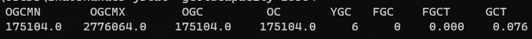

## 内存模型


### 程序计数器：一块较小的“线程私有”的内存空间，是当前线程所执行的字节码的行号指示器，每条线程都有一个独立的程序计数器。

### 虚拟机栈
虚拟机栈是Java执行方法的内存模型。每个方法被执行的时候，都会创建一个栈帧，把栈帧压人栈，当方法正常返回或者抛出未捕获的异常时，栈帧就会出栈。

### 本地方法栈
- 调用本地native的内存模型
- 线程独享。

### 方法区
用于存储已被虚拟机加载的类信息、常量、静态变量、即时编译后的代码等数据。

- 线程共享的
- 运行时常量池：

### 堆（Heap）
Java对象存储的地方

- Java堆是虚拟机管理的内存中最大的一块
- Java堆是所有线程共享的区域
- 在虚拟机启动时创建
- 此内存区域的唯一目的就是存放对象实例，几乎所有对象实例都在这里分配内存。存放new生成的对象和数组
- Java堆是垃圾收集器管理的内存区域，因此很多时候称为“GC堆”

---

## 判断对象是否存活的两种方式，引用计数法的缺点？（引用计数法、可达性分析法）

### 引用计数法
在对象中加入一个引用计数器，每当这个对象被引用，计数器就加一；当引用失效了，计数器就减一；当计数器为零时，就是不再被使用了。

### 可达性分析法
通过一系列称为“GC Roots”的根对象作为起始节点集，从这些节点开始跟进引用关系向下搜索，搜索过程所走过的路径称为“引用链”，如何一个对象到GC Roots没有任何引用链相连，就说明该对象不会再被使用了。

GC Roots对象包括：

- 虚拟机栈中引用的对象，如线程被调用方法的参数、局部变量、临时变量等。
- 类静态属性引用的对象。
- 常量引用的对象。
- 本地方法栈中JNI引用的对象。
- java虚拟机内部引用的对象。
- 所有被同步锁持有的对象。
- JMXBean、JVMTI中的回调、本地代码缓存等。


---


## 类的生命周期和加载过程


一个类在JVM里的生命周期有7个阶段，分别是加载(Loading)、验证 (Verification)、准备(Preparation)、解析(Resolution)、初始化 (Initialization)、使用(Using)、卸载(Unloading)。 其中前五个部分(加载，验证，准备，解析，初始化)统称为类加载过程。

## 类加载机制

一个类在jvm中分为7个阶段，分别是“加载、验证、准备、解析、初始化、使用、卸载”，其中“验证、准备、解析”又称为连接，7个阶段的顺序是固定的，必须按部就班进行，这就是规范。


### 类加载机制有三个特点:

- **双亲委托**:当一个自定义类加载器需要加载一个类，比如java.lang.String，它很懒，不会一上来就直接试图加载它，而是先委托自己的父加载器去加载，父加载 器如果发现自己还有父加载器，会一直往前找，这样只要上级加载器，比如启动类加载器已经加载了某个类比如java.lang.String，所有的子加载器都不需要自己加载了。如果几个类加载器都没有加载到指定名称的类，那么会抛出 ClassNotFountException异常。
- **负责依赖**:如果一个加载器在加载某个类的时候，发现这个类依赖于另外几个类或接口，也会去尝试加载这些依赖项。
- **缓存加载**:为了提升加载效率，消除重复加载，一旦某个类被一个类加载器加载，那么它会缓存这个加载结果，不会重复加载。

## 怎么实现自定义的类加载器？

## 垃圾回收


- 引用计数法：比较古老的回收算法。原理是此对象有一个引用，即增加一个计数，删除一个引用则减少一个计数。垃圾回收时，只用收集计数为0的对象。此算法最致命的是无法处理循环引用的问题。

- 标记-清除：此算法执行分两阶段。第一阶段从引用根节点开始标记所有被引用的对象，第二阶段遍历整个堆，把未标记的对象清除。此算法需要暂停整个应用，同时，会产生内存碎片。

- 复制：此算法把内存空间划为两个相等的区域，每次只使用其中一个区域。垃圾回收时，遍历当前使用区域，把正在使用中的对象复制到另外一个区域中。次算法每次只处理正在使用中的对象，因此复制成本比较小，同时复制过去以后还能进行相应的内存整理，不会出现“碎片”问题。当然，此算法的缺点也是很明显的，就是需要两倍内存空间。

- 标记-整理：此算法结合了“标记-清除”和“复制”两个算法的优点。也是分两阶段，第一阶段从根节点开始标记所有被引用对象，第二阶段遍历整个堆，把清除未标记对象并且把存活对象“压缩”到堆的其中一块，按顺序排放。此算法避免了“标记-清除”的碎片问题，同时也避免了“复制”算法的空间问题。

---


## 垃圾回收器

### CMS
是一款并发的、使用标记-清除算法的垃圾回收器，该回收器是针对老年代垃圾回收的，在初始化阶段会导致stw。cms通过参数-XX:+UseConcMarkSweepGC进行设置。

1）初始标记
2）并发标记
3）重新标记
4）并发清除

下面为更详细的过程描述：
1. 初始化标记(CMS-initial-mark) ,标记root，会**导致stw**；
2. 并发标记(CMS-concurrent-mark)，与用户线程同时运行；
3. 预清理（CMS-concurrent-preclean），与用户线程同时运行；
4. 重新标记(CMS-remark) ，会**导致stw**；
5. 并发清除(CMS-concurrent-sweep)，与用户线程同时运行；
6. 调整堆大小，设置CMS在清理之后进行内存压缩，目的是清理内存中的碎片；
7. 并发重置状态等待下次CMS的触发(CMS-concurrent-reset)，与用户线程同时运行；

CMS是基于标记-清除算法的，CMS只会删除无用对象，不会对内存做压缩，会造成内存碎片，这时候我们需要用到这个参数：-XX:CMSFullGCsBeforeCompaction=n


---

### G1
通过参数-XX:+UseG1GC来启用

在G1算法中，采用了另外一种完全不同的方式组织堆内存，堆内存被划分为多个大小相等的内存块（Region），每个Region是逻辑连续的一段内存（所以回收得到的空间是连续的，这就是避免了CMS回收器导致的空间不连续的问题），结构如下：


每个Region被标记了E、S、O和H，说明每个Region在运行时都充当了一种角色，其中H是以往算法中没有的，它代表Humongous，这表示这些Region存储的是巨型对象（humongous object，H-obj），当新建对象大小超过Region大小一半时，直接在新的一个或多个连续Region中分配，并标记为H。


#### G1中提供了三种模式垃圾回收模式，young gc、mixed gc 和 full gc，在不同的条件下被触发。

##### young gc

一般对象（除了巨型对象）都是在eden region中分配内存
和之前的young gc差不多，执行完一次young gc，活跃对象会被拷贝到survivor region或者晋升到old region中，空闲的region会被放入空闲列表中，等待下次被使用。

##### mixed gc
mixed gc中也有一个阈值参数 -XX:InitiatingHeapOccupancyPercent，当老年代大小占整个堆大小百分比达到该阈值时，会触发一次mixed gc.

##### full gc
如果对象内存分配速度过快，mixed gc来不及回收，导致老年代被填满，就会触发一次full gc，G1的full gc算法就是单线程执行的serial old gc，会导致异常长时间的暂停时间，需要进行不断的调优，尽可能的避免full gc.


---

频繁GC的原因？

---

top jps jstat jmap 定位问题

### jmap

#### 查看实例个数以及占用内存信息

`jmap -histo pid`


num：代表序号 instances：代表实例数量 bytes：代表占用空间大小 classname：代表类的名称

#### 查看堆的使用情况

`jmap -heap pid`

查看垃圾回收器，堆的参数以及堆的使用情况等信息。


#### 生成dump文件

```
jmap -dump:format=b,file=文件名 [pid]
jmap -dump:format=b,file=E:/demo.hprof pid
```


> 可以使用java自带可视化工具 jvisualvm 分析

通过Jvm参数可设置内存溢出后自动导出Dump文件：

```
-XX:+PrintGCDetails -XX:+HeapDumpOnOutOfMemoryError -XX:HeapDumpPath=D:\jvm.dump
```


### jstack

`jstack pid`

jstack命令主要用来查看Java线程的调用堆栈的，可以用来分析线程问题（如死锁）。

### jstat

jvm自带的调优工具，可以查看堆内存各部分的使用量，以及加载类的数量等。

- 垃圾回收统计

`jstat -gc pid`


参数解释如下：

```
S0C:第一个Survivor大小（kb）
S1C:第二个Survivor大小
S0U:第一个Survivor区的使用大小
S1U:第二个Survivor区的使用大小
EC:eden区大小
EU:eden区的使用大小
OC:老年代大小
OU:老年代使用大小
MC:方法区大小（元空间）
MU:方法区使用大小
CCSC:压缩类空间大小
CCSU:压缩类空间使用大小
YGC:YoungGC次数
YGCT:YoungGC时间（s）
FGC:FullGC次数
FGCT:FullGC时间（s）
GCT:总的GC时间（s）
```

- 垃圾回收比例统计

`jstat -gcutil pid`


```
S0：第一个Survivor区当前使用比例
S1：第二个Survivor区当前使用比例
E：eden区使用比例
O：老年代使用比例
M：元数据区使用比例
CCS：压缩使用比例
YGC：YoungGC次数
FGC：FullGC次数
FGCT：FullGC消耗时间
GCT：垃圾回收消耗总时间
```

- 堆内存统计

`jstat -gccapacity pid`


```
NGCMN：新生代最小容量
NGCMX：新生代最大容量
NGC：当前新生代容量
S0C：第一个Survivor区大小
S1C：第二个Survivor区的大小
EC：eden区的大小
OGCMN：老年代最小容量
OGCMX：老年代最大容量
OGC：当前老年代大小
OC：当前老年代大小
MCMN：最小元数据容量
MCMX：最大元数据容量
MC：当前元数据空间大小
CCSMN：最小压缩类空间大小
CCSMX：最大压缩类空间大小
CCSC：当前压缩类空间大小
YGC：YoungGC次数
FGC：FullGC次数
```

- 新生代垃圾回收统计

`jstat -gcnew pid`


```
S0C：第一个Survivor区的大小
S1C：第二个Survivor区的大小
S0U：第一个Survivor区的使用大小
S1U：第二个Survivor区的使用大小
TT：对象在新生代存活的次数
MTT：对象在新生代存活的最大次数
DSS：期望的幸存区大小
EC：eden区的大小
EU：eden区的使用大小
YGC：年轻代垃圾回收次数
YGCT：年轻代垃圾回收消耗时间
```

-  新生代内存统计

`jstat -gcnewcapacity pid`


```
NGCMN：新生代最小容量
NGCMX：新生代最大容量
NGC：当前新生代容量
S0CMX：第一个Survivor区最大容量
S0C：第一个Survivor区大小
S1CMX：第二个Survivor区最大容量
S1C：第二个Survivor区大小
ECMX：eden区最大容量
EC：当前eden区大小
YGC：年轻代垃圾回收次数
FGC：老年代回收次数
```

- 老年代垃圾回收统计

`jstat -gcold pid`


```
MC：方法区大小
MU：方法区使用大小
CCSC：压缩类空间大小
CCSU：压缩类空间使用大小
OC：老年代大小
OU：老年代使用大小
YGC：年轻代垃圾回收次数
FGC：老年代垃圾回收次数
FGCT：老年代垃圾回收消耗时间
GCT：垃圾回收消耗总时间
```

- 统计老年代内存的使用情况

`jstat -gcoldcapacity pid`



```
OGCMN：老年代最小容量
OGCMX：老年代最大容量
OGC：当前老年代大小
OC：老年代大小
YGC：年轻代垃圾回收次数
FGC：老年代垃圾回收次数
FGCT：老年代垃圾回收消耗时间
GCT：垃圾回收消耗总时间
```

- 统计元数据空间的情况

`jstat -gcmetacapacity pid`


```
MCMN：最小元数据容量
MCMX：最大元数据容量
MC：当前元数据空间大小
CCSMN：最小压缩类空间大小
CCSMX：最大压缩类空间大小
CCSC：当前压缩类空间大小
YGC：年轻代垃圾回收次数
FGC：老年代垃圾回收次数
FGCT：老年代垃圾回收消耗时间
GCT：垃圾回收消耗总时间
```


### 其他命令

- 查看正在运行的Java项目参数 查看jvm的参数：

`jinfo -flags pid `

- 查看Java系统参数

`jinfo -sysprops pid`

- 观察分析年轻代对象的增长情况

`jstat -gc pid 5000 10`

每5秒执行一次，共执行10次


### 打印gc日志

通过增加JVM参数的方式打印gc日志：

```
-XX:+PrintGCDetails -XX:+PrintGCTimeStamps -XX:+PrintGCDateStamps -Xloggc:./gc.log
```


---


---


## Groovy 

动态语言