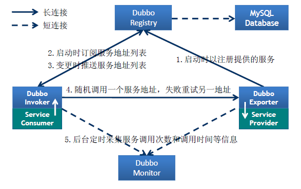

## CAP原则

CP：关注一致性
AP：关注可用性

## 服务高可用？

## Dubbo

服务暴露和引用过程

**参考文章**
https://developer.aliyun.com/article/38380

### 协议

- dubbo:// 推荐
- hessian:// 
- http://
- rmi://
- webservice://
- thrift://
- redis://

### 注册中心，怎么选择

### 序列化框架，默认hessian2

Hessian会把复杂的对象所有属性存储在一个Map中进行序列化。所以在父类、子类中存在同名成员变量的情况下，hessian序列化时，先序列化子类，然后序列化父类。因此，反序列化结果会导致子类同名成员变量被父类的值覆盖。

hession、hession2、java序列化

### SPI扩展服务发现机制 ？？

> SPI规范：约定在 Classpath 下的 META-INF/services/ 目录里创建一个以服务接口命名的文件，然后文件里面记录的是此 jar 包提供的具体实现类的全限定名。

### 负载均衡策略，有5种，缺省为 random 随机调用

1. Random 随机调用
2. Random LoadBalance
随机，按权重设置随机概率。
在一个截面上碰撞的概率高，但调用量越大分布越均匀，而且按概率使用权重后也比较均匀，有利于动态调整提供者权重。

3. RoundRobin LoadBalance
轮循，按公约后的权重设置轮循比率。
存在慢的提供者累积请求的问题，比如：第二台机器很慢，但没挂，当请求调到第二台时就卡在那，久而久之，所有请求都卡在调到第二台上。

4. LeastActive LoadBalance
最少活跃调用数，相同活跃数的随机，活跃数指调用前后计数差。
使慢的提供者收到更少请求，因为越慢的提供者的调用前后计数差会越大。

5. ConsistentHash LoadBalance
一致性 Hash，相同参数的请求总是发到同一提供者。
当某一台提供者挂时，原本发往该提供者的请求，基于虚拟节点，平摊到其它提供者，不会引起剧烈变动。

### 容错机制
1. Failover 失败自动切换  （**缺省**）
当出现失败，重试其它服务器，通常用于读操作（推荐使用）。 重试会带来更长延迟。

2. Failfast  快速失败
只发起一次调用，失败立即报错,通常用于非幂等性的写操作。 如果有机器正在重启，可能会出现调用失败 。

3. Failsafe 失败安全
出现异常时，直接忽略，通常用于写入审计日志等操作。 调用信息丢失 可用于生产环境 Monitor。

4. Failback  失败自动恢复
后台记录失败请求，定时重发。通常用于消息通知操作 不可靠，重启丢失。 可用于生产环境 Registry。

5. Forking  并行调用多个服务器
只要一个成功即返回，通常用于实时性要求较高的读操作。但需要浪费更多服务资源。可通过 forks="2" 来设置最大并行数。

6. Broadcast
广播调用，所有提供逐个调用，任意一台报错则报错。通常用于更新提供方本地状态 速度慢，任意一台报错则报错 。

---

### dubbo服务端和调用端超时时间设置和区别

**dubbo默认以consumer中配置的时间为准**

在dubbo的用户手册中，对配置有这样的推荐用法：

在Provider上尽量多配置Consumer端属性
原因如下：
1. 作服务的提供者，比服务使用方更清楚服务性能参数，如调用的超时时间，合理的重试次数，等等
2. 在Provider配置后，Consumer不配置则会使用Provider的配置值，即Provider配置可以作为Consumer的缺省值。否则，Consumer会使用Consumer端的全局设置，这对于Provider不可控的，并且往往是不合理的
3. PS: 配置的覆盖规则：1) 方法级配置别优于接口级别，即小Scope优先 2) Consumer端配置 优于 Provider配置 优于 全局配置，最后是Dubbo Hard Code的配置值（见配置文档）

> https://blog.csdn.net/lkforce/article/details/54380201

---

### 限流

参考文章：
https://cloud.tencent.com/developer/article/1502742
https://blog.csdn.net/u012965203/article/details/98253914

令牌桶
漏桶

1、线程池隔离，通过线程池的线程数量来限制并发调用，开销大，但可以做到超时提前返回。
2、Semaphore信号量，开销小，性能高，但无法做到超时返回。

---

### dubbo服务下线的过程？？

- 读服务开启重试，写服务设置 retries=“0” ，防止数据重复，也可以做接口幂等处理
- 直连 url=""

## gRPC

是Google开发的高性能、通用的开源RPC框架，其由Google主要面向移动应用开发并基于HTTP/2协议标准而设计，基于ProtoBuf(Protocol Buffers)序列化协议开发。本身它不是分布式的，所以要实现上面的框架的功能需要进一步的开发。

## thrift

最初是由 Facebook 开发的内部系统跨语言的高性能 RPC 框架，2007 年贡献给了 Apache 基金，成为 Apache 开源项目之一， 跟 gRPC 一样，Thrift 也有一套自己的接口定义语言 IDL，可以通过代码生成器，生成各种编程语言的 Client 端和 Server 端的 SDK 代码，支持多种语言。

---

## ZooKeeper   CP模型

它是一个基于ZAB协议实现的可靠的分布式协调系统，它是强一致（CP）、使用基于TCP的私有协议通信

watch监听通知原理

### 脑裂问题
过半选举机制  

**如何解决脑裂问题**
- 添加冗余的心跳线,尽量减少“脑裂”发生机会。
- 启用磁盘锁，在发生脑裂的时候可以协调控制对资源的访问。
- 设置仲裁机制。

## nacos ？？

与zk的区别？？
