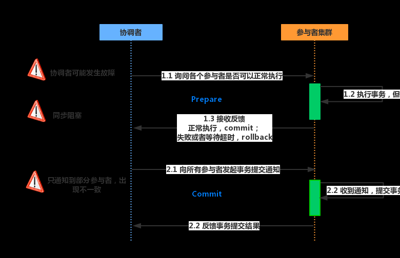
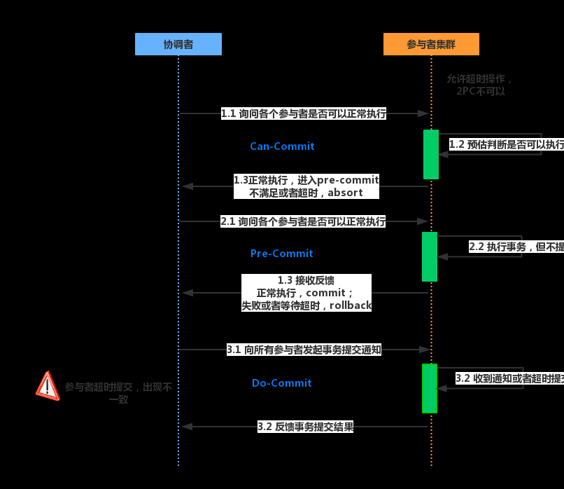

## 分布式事务

## BASE理论

BASE——Basically Available（基本可用），Soft state（软状态），Eventually consistent（最终一致性）

## 2PC 两阶段提交

两阶段提交协议中有两类节点：一个是中心化 **协调者节点** （coordinator）和 **N个参与者节点**（partcipant）。
两个阶段：**第一阶段：投票阶段** 和 **第二阶段：提交/执行阶段**。

### 缺点：
1、性能问题：不管是第一阶段还是第二阶段，所有的参与者资源和协调者资源都是被锁住的，只有所有提交后才会释放资源。
2、单节点故障：一旦 协调者 发送故障，参与者会一直阻塞下去。
3、数据不一致：如果在commit请求过程中协调者发生故障，导致只有一部分参与者接受到了commit请求。那么其他参与者未接到commit请求导致无法执行事务提交。于是出现了数据不一致的现象。

## 3PC 三阶段提交协议

主要是为了解决两阶段提交协议的阻塞问题，2pc存在的问题是当协作者崩溃时，参与者不能做出最后的选择。因此参与者可能在协作者恢复之前保持阻塞。三阶段提交（Three-phase commit），是二阶段提交（2PC）的改进版本。

与两阶段提交不同的是，三阶段提交有两个改动点。
- 1、引入超时机制。同时在协调者和参与者中都引入超时机制。
- 2、在第一阶段和第二阶段中插入一个准备阶段。保证了在最后提交阶段之前各参与节点的状态是一致的。

### CanCommit、PreCommit、DoCommit三个阶段

### 缺点：
如果进入PreCommit后，Coordinator发出的是abort请求，假设只有一个Cohort收到并进行了abort操作，
而其他对于系统状态未知的Cohort会根据3PC选择继续Commit，此时系统状态发生不一致性。

##

## TCC（Try-Confirm-Cancel）  补偿事务

- Try阶段：主要是对业务系统做检测及资源预留。
- Confirm阶段：确认执行业务操作。
- Cancel阶段：取消执行业务操作。

> TCC事务的处理流程与2PC两阶段提交类似，不过2PC通常都是在跨库的DB层面，而TCC本质上就是一个应用层面的2PC，需要通过业务逻辑来实现。这种分布式事务的实现方式的优势在于，可以让应用自己定义数据库操作的粒度，使得降低锁冲突、提高吞吐量成为可能。
> 而不足之处则在于对应用的侵入性非常强，业务逻辑的每个分支都需要实现try、confirm、cancel三个操作。此外，其实现难度也比较大，需要按照网络状态、系统故障等不同的失败原因实现不同的回滚策略。为了满足一致性的要求，confirm和cancel接口还必须实现幂等。

## CAP定理  Consistency，Availability和Partition Tolerance

**Consistency**：一致性，这个和数据库ACID的一致性类似，但这里关注的所有数据节点上的数据一致性和正确性，而数据库的ACID关注的是在在一个事务内，对数据的一些约束。系统在执行过某项操作后仍然处于一致的状态。在分布式系统中，更新操作执行成功后所有的用户都应该读取到最新值。

**Availability**：可用性，每一个操作总是能够在一定时间内返回结果。需要注意“一定时间”和“返回结果”。“一定时间”是指，系统结果必须在给定时间内返回。“返回结果”是指系统返回操作成功或失败的结果。

**Partition Tolerance**：分区容忍性，是否可以对数据进行分区。这是考虑到性能和可伸缩性。

## ali分布式框架 Seata  todo ??

## zookeeper的ZAB协议 ？  paxos

Paxos 和 Raft 的对比

## 分布式ID，雪花算法

雪花算法中的时钟回拨问题？

## ShardingSphere

基于XA两阶段协议和