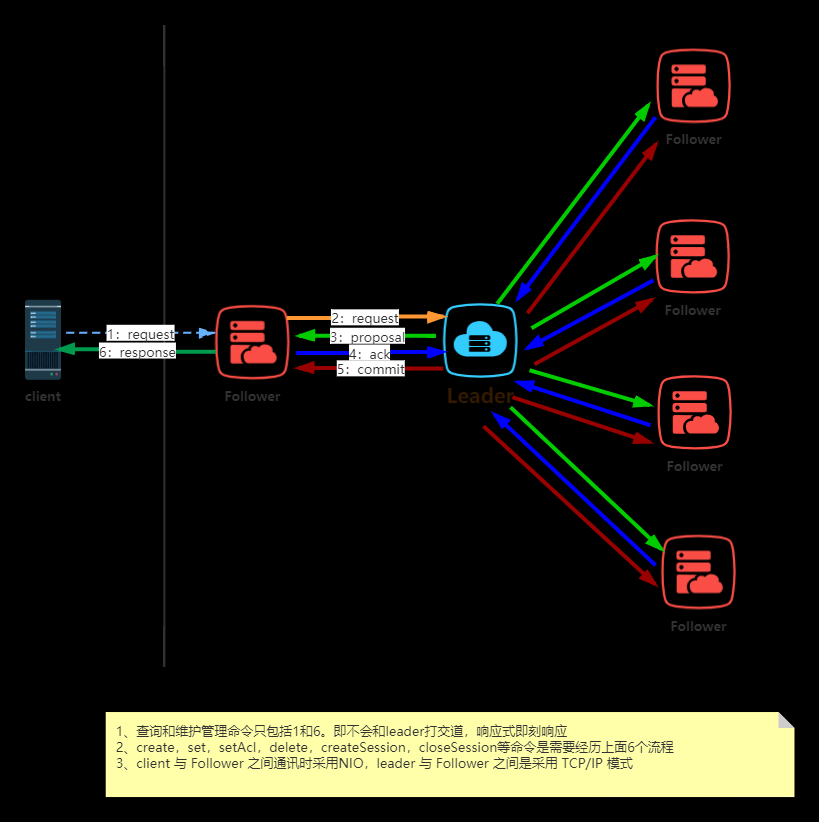
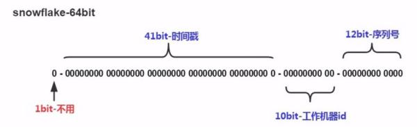

## 分布式事务

## BASE理论

BASE——Basically Available（基本可用），Soft state（软状态），Eventually consistent（最终一致性）

## 2PC 两阶段提交

两阶段提交协议中有两类节点：一个是中心化 **协调者节点** （coordinator）和 **N个参与者节点**（partcipant）。
两个阶段：**第一阶段：投票阶段** 和 **第二阶段：提交/执行阶段**。

### 缺点：
1、性能问题：不管是第一阶段还是第二阶段，所有的参与者资源和协调者资源都是被锁住的，只有所有提交后才会释放资源。
2、单节点故障：一旦 协调者 发送故障，参与者会一直阻塞下去。
3、数据不一致：如果在commit请求过程中协调者发生故障，导致只有一部分参与者接受到了commit请求。那么其他参与者未接到commit请求导致无法执行事务提交。于是出现了数据不一致的现象。

## 3PC 三阶段提交协议

主要是为了解决两阶段提交协议的阻塞问题，2pc存在的问题是当协作者崩溃时，参与者不能做出最后的选择。因此参与者可能在协作者恢复之前保持阻塞。三阶段提交（Three-phase commit），是二阶段提交（2PC）的改进版本。

与两阶段提交不同的是，三阶段提交有两个改动点。
- 1、引入超时机制。同时在协调者和参与者中都引入超时机制。
- 2、在第一阶段和第二阶段中插入一个准备阶段。保证了在最后提交阶段之前各参与节点的状态是一致的。

### CanCommit、PreCommit、DoCommit三个阶段

### 缺点：
如果进入PreCommit后，Coordinator发出的是abort请求，假设只有一个Cohort收到并进行了abort操作，
而其他对于系统状态未知的Cohort会根据3PC选择继续Commit，此时系统状态发生不一致性。

##

## TCC（Try-Confirm-Cancel）  补偿事务

- Try阶段：主要是对业务系统做检测及资源预留。
- Confirm阶段：确认执行业务操作。
- Cancel阶段：取消执行业务操作。

> TCC事务的处理流程与2PC两阶段提交类似，不过2PC通常都是在跨库的DB层面，而TCC本质上就是一个应用层面的2PC，需要通过业务逻辑来实现。这种分布式事务的实现方式的优势在于，可以让应用自己定义数据库操作的粒度，使得降低锁冲突、提高吞吐量成为可能。
> 而不足之处则在于对应用的侵入性非常强，业务逻辑的每个分支都需要实现try、confirm、cancel三个操作。此外，其实现难度也比较大，需要按照网络状态、系统故障等不同的失败原因实现不同的回滚策略。为了满足一致性的要求，confirm和cancel接口还必须实现幂等。

## CAP定理  Consistency，Availability和Partition Tolerance

**Consistency**：一致性，这个和数据库ACID的一致性类似，但这里关注的所有数据节点上的数据一致性和正确性，而数据库的ACID关注的是在在一个事务内，对数据的一些约束。系统在执行过某项操作后仍然处于一致的状态。在分布式系统中，更新操作执行成功后所有的用户都应该读取到最新值。

**Availability**：可用性，每一个操作总是能够在一定时间内返回结果。需要注意“一定时间”和“返回结果”。“一定时间”是指，系统结果必须在给定时间内返回。“返回结果”是指系统返回操作成功或失败的结果。

**Partition Tolerance**：分区容忍性，是否可以对数据进行分区。这是考虑到性能和可伸缩性。

## ali分布式框架 Seata  todo ??

## zookeeper的ZAB协议 ？  paxos

Paxos算法 和 Raft算法 的对比  ？？

### ZAB协议
Zookeeper Atomic Broadcast，协议是为分布式协调服务 Zookeeper 专门设计的一种支持崩溃恢复的原子广播协议。在 Zookeeper 中，主要依赖 ZAB 协议来实现分布式数据一致性，基于该协议，Zookeeper 实现了一种主备模式的系统架构来保持集群中各个副本之间的数据一致性。

### 消息广播的实现原理
> 消息广播的过程实际上是一个简化版本的二阶段提交过程

流程如下：
1. leader 接受到消息请求后，将消息赋予给一个全局唯一的64位自增id，叫：zxid，通过zxid的代销比较即可以实现因果有序的这个特征
2. leader 为每个follower 准备了一个FIFO队列（通过TCP协议来实现，以实现了全局有序这个特点）将带有zxid的消息作为一个提案（proposal）分发给所有的follower
3. 当follower接受到proposal，先把proposal写到磁盘，写入成功以后再向leader恢复一个ack
4. 当leader 接受到合法数量（超过半数节点）的 ack，leader 就会向这些follower发送commit命令，同时会在本地执行该消息
5. 当follower接受到消息的commit命令以后，就会提交该消息

》 https://blog.csdn.net/qq_39938758/article/details/105754198

---

## Zookeeper数据同步

zk通过三种不同的 集群角色来组成整个高性能集群，在zk中，客户端会随机连接到zk集群中的一个节点，如果是读请求，就直接从当前节点中读取数据，如果是写请求，那么请求会被转发给leader提交事务，然后leader会广播事务，只要超过半数节点写入成功，那么写请求就会被提交（类2PC事务，2PC是全数节点ok)

## 分布式ID，雪花算法

雪花算法是twitter提出的分布式id生成器方案，也叫发号器方案。这里简单介绍下雪花算法

这个就是原生的雪花算法分配
- 41bit时间戳：这里采用的就是当前系统的具体时间，单位为毫秒
- 10bit工作机器ID（workerId）：每台机器分配一个id，这样可以标示不同的机器，但是上限为1024，标示一个集群某个业务最多部署的机器个数上限
- 12bit序列号（自增域）：表示在某一毫秒下，这个自增域最大可以分配的bit个数，在当前这种配置下，每一毫秒可以分配2^12个数据(4096)，也就是说QPS可以到 409.6 w/s。

### 雪花算法中的时钟回拨问题
- 直接抛异常   不友好
- 延迟等待   阻塞3ms之后再获取时间，尽量减少影响时间
- 采用上次最大时间的最大序号之后的序号  继续使用
- 采用备用workerId方案， 

> https://www.jianshu.com/p/7680f88b990b

## ShardingSphere

基于XA两阶段协议和