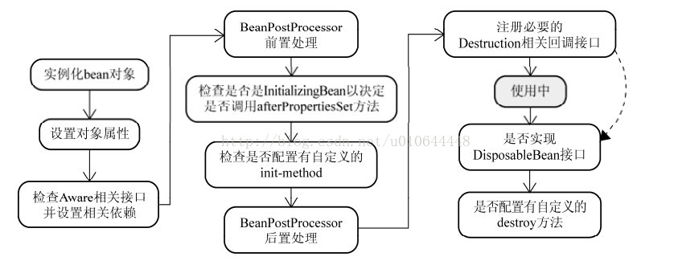

## bean生命周期

## bean的初始化过程

beandefinition

getBean

各种校验逻辑

判断是否是单例

- 后置处理器？

## bean

单例变多例
prototype ？

## 解决循环依赖

Spring是先将Bean对象实例化之后再设置对象属性

Spring先是用构造实例化Bean对象 ，此时Spring会将这个实例化结束的对象放到一个Map中，并且Spring提供了获取这个未设置属性的实例化对象引用的方法。   结合我们的实例来看，，当Spring实例化了StudentA、StudentB、StudentC后，紧接着会去设置对象的属性，此时StudentA依赖StudentB，就会去Map中取出存在里面的单例StudentB对象，以此类推，不会出来循环的问题

## 自定义注解

---

- 三级缓存
- applicationContext BeanFactory 的区别