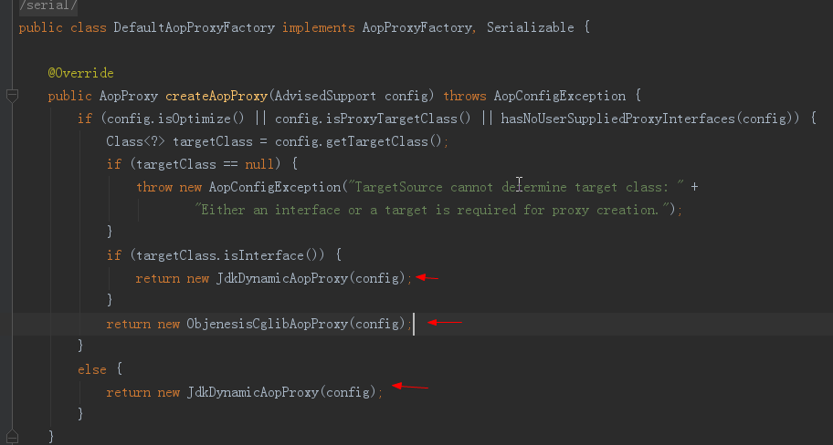
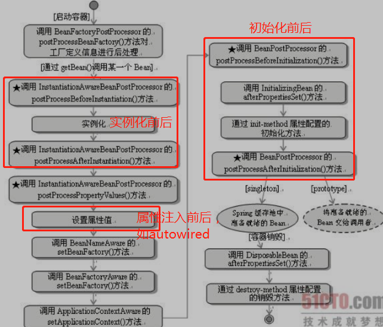

## spring框架
IOC 和 AOP，
IOC 可以帮助我们管理对象的依赖关系，极大减少对象的耦合性，
而 AOP 的切面编程功能可以更方面的使用动态代理来实现各种动态方法功能（如事务、缓存、日志等）。

## AOP

### Spring AOP的实现原理

基于动态代理模式，如果目标类实现了接口，那么使用基于接口的动态代理，否则使用基于子类/cglib的动态代理

查看spring源码，DefaultAopProxyFactory类

如果有接口,则使用Jdk代理,反之使用Cglib。
spring AOP综合两种代理方式的使用前提有会如下结论：如果目标类没有实现接口，且class为final修饰的，则不能进行spring AOP编程！

## 静态代理 和 动态代理

**动态代理**

### JDK动态代理

JDK动态代理是通过java.lang.reflect.Proxy 类来实现的，我们可以调用Proxy类的newProxyInstance()方法来创建代理对象。 **JDK动态代理动态代理必须要有接口**.

### CGLIB（Code Generation Library）动态代理  (基于继承的方式实现)

原理是生成目标类的子类, 这个子类对象就是代理对象, 代理对象是被增强过的. **代理的类不能为final的，否则报错**

ASM是一个java字节码操控框架，能够以二进制形式修改已有类或动态生成类。需要对class组织结构和JVM汇编指令有一定的了解。

Javassist是一个开源的分析、编辑和创建Java字节码的类库。优点是简单、快速。直接使用Java编码的形式，而不需要了解虚拟机指令，就能动态改变类的结构，或者动态生成类。

## bean

作用域

### bean生命周期

Bean的实例化—初始化Bean—使用Bean—Bean的销毁

## bean的初始化过程

### BeanDefinition  重要

getBean

各种校验逻辑

判断是否是单例

- 后置处理器？ 可以自定义很多逻辑处理

## bean

单例  singleton
多例  prototype

## 解决循环依赖

Spring是先将Bean对象实例化之后再设置对象属性

Spring先是用构造实例化Bean对象 ，此时Spring会将这个实例化结束的对象放到一个Map中，并且Spring提供了获取这个未设置属性的实例化对象引用的方法。   结合我们的实例来看，，当Spring实例化了StudentA、StudentB、StudentC后，紧接着会去设置对象的属性，此时StudentA依赖StudentB，就会去Map中取出存在里面的单例StudentB对象，以此类推，不会出来循环的问题

## 自定义注解

### @Autowired
默认按类型装配，默认情况下必须要求依赖对象存在，如果要允许null值，可以设置它的required属性为false。如果想使用名称装配可以结合@Qualifier注解进行使用。

### @Resource
默认按照名称进行装配，名称可以通过name属性进行指定，如果没有指定name属性，当注解写在字段上时，默认取字段名进行名称查找。如果注解写在setter方法上默认取属性名进行装配。当找不到与名称匹配的bean时才按照类型进行装配。但是需要注意的是，如果name属性一旦指定，就只会按照名称进行装配。

## 事务

在TransactionDefinition定义

### 5种事务隔离级别  

1. ISOLATION_DEFAULT 这是一个PlatfromTransactionManager默认的隔离级别，使用数据库默认的事务隔离级别.另外四个与JDBC的隔离级别相对应 

2. ISOLATION_READ_UNCOMMITTED 这是事务最低的隔离级别，它充许别外一个事务可以看到这个事务未提交的数据。这种隔离级别会产生脏读，不可重复读和幻像读

3. ISOLATION_READ_COMMITTED 保证一个事务修改的数据提交后才能被另外一个事务读取。另外一个事务不能读取该事务未提交的数据。这种事务隔离级别可以避免脏读出现，但是可能会出现不可重复读和幻像读。

4. ISOLATION_REPEATABLE_READ 这种事务隔离级别可以防止脏读，不可重复读。但是可能出现幻像读。它除了保证一个事务不能读取另一个事务未提交的数据外，还保证了避免下面的情况产生(不可重复读)。

5. ISOLATION_SERIALIZABLE 这是花费最高代价但是最可靠的事务隔离级别。事务被处理为顺序执行。除了防止脏读，不可重复读外，还避免了幻像读。

### 7种事务传播行为   

1） PROPAGATION_REQUIRED ，默认的spring事务传播级别，使用该级别的特点是，如果上下文中已经存在事务，那么就加入到事务中执行，如果当前上下文中不存在事务，则新建事务执行。所以这个级别通常能满足处理大多数的业务场景。

2）PROPAGATION_SUPPORTS ，从字面意思就知道，supports，支持，该传播级别的特点是，如果上下文存在事务，则支持事务加入事务，如果没有事务，则使用非事务的方式执行。所以说，并非所有的包在transactionTemplate.execute中的代码都会有事务支持。这个通常是用来处理那些并非原子性的非核心业务逻辑操作。应用场景较少。

3）PROPAGATION_MANDATORY ， 该级别的事务要求上下文中必须要存在事务，否则就会抛出异常！配置该方式的传播级别是有效的控制上下文调用代码遗漏添加事务控制的保证手段。比如一段代码不能单独被调用执行，但是一旦被调用，就必须有事务包含的情况，就可以使用这个传播级别。

4）PROPAGATION_REQUIRES_NEW ，从字面即可知道，new，每次都要一个新事务，该传播级别的特点是，每次都会新建一个事务，并且同时将上下文中的事务挂起，执行当前新建事务完成以后，上下文事务恢复再执行。

这是一个很有用的传播级别，举一个应用场景：现在有一个发送100个红包的操作，在发送之前，要做一些系统的初始化、验证、数据记录操作，然后发送100封红包，然后再记录发送日志，发送日志要求100%的准确，如果日志不准确，那么整个父事务逻辑需要回滚。
怎么处理整个业务需求呢？就是通过这个PROPAGATION_REQUIRES_NEW 级别的事务传播控制就可以完成。发送红包的子事务不会直接影响到父事务的提交和回滚。

5）PROPAGATION_NOT_SUPPORTED ，这个也可以从字面得知，not supported ，不支持，当前级别的特点就是上下文中存在事务，则挂起事务，执行当前逻辑，结束后恢复上下文的事务。

这个级别有什么好处？可以帮助你将事务极可能的缩小。我们知道一个事务越大，它存在的风险也就越多。所以在处理事务的过程中，要保证尽可能的缩小范围。比如一段代码，是每次逻辑操作都必须调用的，比如循环1000次的某个非核心业务逻辑操作。这样的代码如果包在事务中，势必造成事务太大，导致出现一些难以考虑周全的异常情况。所以这个事务这个级别的传播级别就派上用场了。用当前级别的事务模板抱起来就可以了。

6）PROPAGATION_NEVER ，该事务更严格，上面一个事务传播级别只是不支持而已，有事务就挂起，而PROPAGATION_NEVER传播级别要求上下文中不能存在事务，一旦有事务，就抛出runtime异常，强制停止执行！这个级别上辈子跟事务有仇。

7）PROPAGATION_NESTED ，字面也可知道，nested，嵌套级别事务。该传播级别特征是，如果上下文中存在事务，则嵌套事务执行，如果不存在事务，则新建事务。

---

- 三级缓存

##  applicationContext BeanFactory 的区别
1. BeanFactory是基础，管理bean的加载，实例化，维护bean之间的依赖关系，负责bean的生命周期。BeanFactory和它的子接口定义的API满足了spring环境中对bean管理和配置的需求；
2. ApplicationContext是扩展，以BeanFactory为主线，通过继承的方式综合了环境、国际化、资源、事件等多条支线，自己又规定了一些扩展服务（如返回context的id，应用名称等），而所有支线都以bean服务为基础；

