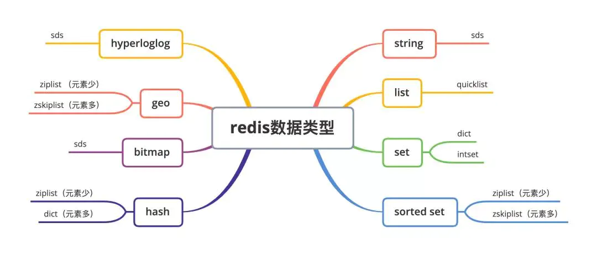
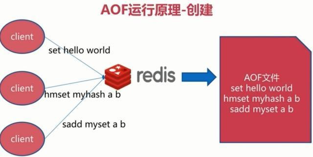
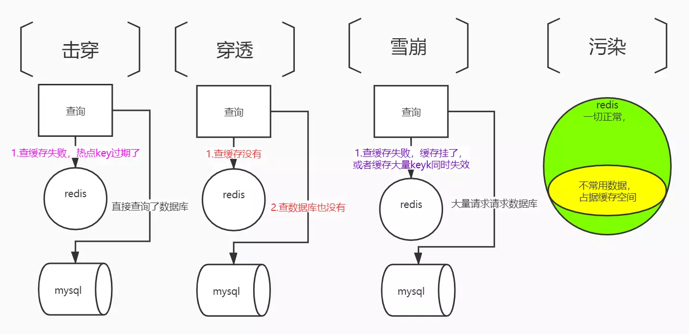

## 数据类型

- string 没有直接使用C语音传统的字符串，而是自己实现的叫作简单动态字符串SDS的抽象类型。SDS能够保存长度信息，这样获取字符串长度的时间由O(N)降低到了O(1)，同时可以避免缓冲区溢出和减少修改字符串长度时所需的内存重分配次数。

- 链表linkedlist 是一个双向无环链表结构，很多发布订阅、慢查询、监视器功能都是使用链表实现，每个链表的节点由一个listNode结构来表示，每个节点都有指向前置节点和后置节点的指针，同时表示节点的前置和后置节点都指向NULL。


### bitmap  todo

布隆过滤器
> Bloom Filter使用k个相互独立的哈希函数（Hash Function），它们分别将集合中的每个元素映射到{1,…,m}的范围中。对任意一个元素x，第i个哈希函数映射的位置hi(x)就会被置为1（1≤i≤k）。注：如果一个位置多次被置为1，那么只有第一次会起作用，后面几次将没有任何效果。 Bloom Filter 在判断y是否属于这个集合时，对y应用k次哈希函数，若所有hi(y)的位置都是1（1≤i≤k），就认为y是集合中的元素，否则就认为y不是集合中的元素。

---

Redis中保存的键值对是保存在一个字典中的（和Java中的HashMap类似，也是通过数组+链表的方式实现的），key的类型都是string，value的类型可以是string，set，list等

### hash结构介绍



dict 字典
ziplist 压缩列表
zskiplist 跳表
quicklist 快速列表
intset 整数集合


- zset底层实现 **跳跃表**

```js

- zrange key 5 10 (区间查找5到10的value)

- zcard 计算集合中元素的数量

- zrank key "name" (排名) 返回有序集中指定成员的排名。其中有序集成员按分数值递增(从小到大)顺序排列。

- ZREVRANk key member  返回元素的逆序排名

```

## 单线程

单线程优点：
- 1.没有了线程切换的性能开销
- 2.各种操作不用加锁（如果采用多线程，则对共享资源的访问需要加锁，增加开销）
- 3.方便调试，可维护性高

redis6.0开始就不是单线程了，但并非是完全摒弃单线程，redis还是使用单线程模型来处理客户端的请求，只是使用多线程来处理数据的读写和协议解析，执行命令还是使用单线程。
这样做的目的是因为redis的性能瓶颈在于网络IO而非CPU，使用多线程能提升IO读写的效率，从而整体提高redis的性能。

## redis的io模型

IO多路复用

## 持久化机制（两种：RDB（默认） 和  AOF ）

### RDB快照
RDB持久化是指在指定的时间间隔内将内存中的数据集快照写入磁盘。也是默认的持久化方式，这种方式是就是将内存中数据以快照的方式写入到二进制文件中,默认的文件名为dump.rdb。

优点：
- 数据文件小，恢复快

缺点：
- 每隔一段时间持久化，如果宕机会丢失一段时间的数据

### AOF日志
全量备份总是耗时的，有时候我们提供一种更加高效的方式AOF，工作机制很简单，redis会将每一个收到的写命令都通过write函数追加到文件中。通俗的理解就是日志记录。
每当有一个写命令过来时，就直接保存在我们的AOF文件中。

优点：
- 可以设置追加时间为1s,这样及时宕机也只会丢失1s的数据，数据完整性高

缺点：
- 文件大，恢复慢



### 4.0新增混合持久化
将 rdb 文件的内容和增量的 AOF 日志文件存在一起。这里的 AOF 日志不再是全量的日志，而是自持久化开始到持久化结束的这段时间发生的增量 AOF 日志，通常这部分 AOF 日志很小。相当于：
- 大量数据使用粗粒度（时间上）的rdb快照方式，性能高，恢复时间快。
- 增量数据使用细粒度（时间上）的AOF日志方式，尽量保证数据的不丢失。
在 Redis 重启的时候，可以先加载 rdb 的内容，然后再重放增量 AOF 日志就可以完全替代之前的 AOF 全量文件重放，重启效率因此大幅得到提升。

---

## Redis 与 memcached 相比有哪些优势？

- memcached 所有的值均是简单的字符串，redis 作为其替代者，支持更为丰富的数据类型
- redis 的速度比 memcached 快很多 
- redis 可以持久化其数据 

---

## 三种集群方式

### 主从模式

**主从复制原理：**

- 从服务器连接主服务器，发送SYNC命令； 
- 主服务器接收到SYNC命名后，开始执行BGSAVE命令生成RDB文件并使用缓冲区记录此后执行的所有写命令； 
- 主服务器BGSAVE执行完后，向所有从服务器发送快照文件，并在发送期间继续记录被执行的写命令； 
- 从服务器收到快照文件后丢弃所有旧数据，载入收到的快照； 
- 主服务器快照发送完毕后开始向从服务器发送缓冲区中的写命令； 
- 从服务器完成对快照的载入，开始接收命令请求，并执行来自主服务器缓冲区的写命令；（**从服务器初始化完成**）
- 主服务器每执行一个写命令就会向从服务器发送相同的写命令，从服务器接收并执行收到的写命令（**从服务器初始化完成后的操作**）

**优点：**

- 支持主从复制，主机会自动将数据同步到从机，可以进行读写分离
- 为了分载Master的读操作压力，Slave服务器可以为客户端提供只读操作的服务，写服务仍然必须由Master来完成
- Slave同样可以接受其它Slaves的连接和同步请求，这样可以有效的分载Master的同步压力。
- Master Server是以非阻塞的方式为Slaves提供服务。所以在Master-Slave同步期间，客户端仍然可以提交查询或修改请求。
- Slave Server同样是以非阻塞的方式完成数据同步。在同步期间，如果有客户端提交查询请求，Redis则返回同步之前的数据

**缺点：**

- Redis不具备自动容错和恢复功能，主机从机的宕机都会导致前端部分读写请求失败，需要等待机器重启或者手动切换前端的IP才能恢复。
- 主机宕机，宕机前有部分数据未能及时同步到从机，切换IP后还会引入数据不一致的问题，降低了系统的可用性。
- Redis较难支持在线扩容，在集群容量达到上限时在线扩容会变得很复杂。

### 哨兵模式

当主服务器中断服务后，可以将一个从服务器升级为主服务器，以便继续提供服务，但是这个过程需要人工手动来操作。 为此，Redis 2.8中提供了哨兵工具来实现自动化的系统监控和故障恢复功能。

哨兵的作用就是监控Redis系统的运行状况。它的功能包括以下两个。

  （1）监控主服务器和从服务器是否正常运行。 
  （2）主服务器出现故障时自动将从服务器转换为主服务器。

**哨兵的工作方式：**

- 每个Sentinel（哨兵）进程以每秒钟一次的频率向整个集群中的Master主服务器，Slave从服务器以及其他Sentinel（哨兵）进程发送一个 PING 命令。
- 如果一个实例（instance）距离最后一次有效回复 PING 命令的时间超过 down-after-milliseconds 选项所指定的值， 则这个实例会被 Sentinel（哨兵）进程标记为主观下线（SDOWN）
- 如果一个Master主服务器被标记为主观下线（SDOWN），则正在监视这个Master主服务器的所有 Sentinel（哨兵）进程要以每秒一次的频率确认Master主服务器的确进入了主观下线状态
- 当有足够数量的 Sentinel（哨兵）进程（大于等于配置文件指定的值）在指定的时间范围内确认Master主服务器进入了主观下线状态（SDOWN）， 则Master主服务器会被标记为客观下线（ODOWN）
- 在一般情况下， 每个 Sentinel（哨兵）进程会以每 10 秒一次的频率向集群中的所有Master主服务器、Slave从服务器发送 INFO 命令。
- 当Master主服务器被 Sentinel（哨兵）进程标记为客观下线（ODOWN）时，Sentinel（哨兵）进程向下线的 Master主服务器的所有 Slave从服务器发送 INFO 命令的频率会从 10 秒一次改为每秒一次。
- 若没有足够数量的 Sentinel（哨兵）进程同意 Master主服务器下线， Master主服务器的客观下线状态就会被移除。若 Master主服务器重新向 Sentinel（哨兵）进程发送 PING 命令返回有效回复，Master主服务器的主观下线状态就会被移除。

 **哨兵模式的优缺点**

**优点：**

- 哨兵模式是基于主从模式的，所有主从的优点，哨兵模式都具有。
- 主从可以自动切换，系统更健壮，可用性更高。

**缺点：**

- Redis较难支持在线扩容，在集群容量达到上限时在线扩容会变得很复杂。


### 集群模式

redis的哨兵模式基本已经可以实现高可用，读写分离 ，但是在这种模式下每台redis服务器都存储相同的数据，很浪费内存，所以在redis3.0上加入了cluster模式，实现的redis的分布式存储，也就是说每台redis节点上存储不同的内容。

 Redis-Cluster采用无中心结构,它的特点如下：

- 所有的redis节点彼此互联(PING-PONG机制),内部使用二进制协议优化传输速度和带宽。
- 节点的fail是通过集群中超过半数的节点检测失效时才生效。
- 客户端与redis节点直连,不需要中间代理层.客户端不需要连接集群所有节点,连接集群中任何一个可用节点即可。

**工作方式：**

在redis的每一个节点上，都有这么两个东西，一个是插槽（slot），它的的取值范围是：0-16383。还有一个就是cluster，可以理解为是一个集群管理的插件。当我们的存取的key到达的时候，redis会根据crc16的算法得出一个结果，然后把结果对 16384 求余数，这样每个 key 都会对应一个编号在 0-16383 之间的哈希槽，通过这个值，去找到对应的插槽所对应的节点，然后直接自动跳转到这个对应的节点上进行存取操作。

为了保证高可用，redis-cluster集群引入了主从模式，一个主节点对应一个或者多个从节点，当主节点宕机的时候，就会启用从节点。当其它主节点ping一个主节点A时，如果半数以上的主节点与A通信超时，那么认为主节点A宕机了。如果主节点A和它的从节点A1都宕机了，那么该集群就无法再提供服务了。

---

cluster的出现是为了解决单机Redis容量有限的问题，将Redis的数据根据一定的规则分配到多台机器。

cluster可以说是sentinel和主从模式的结合体，通过cluster可以实现主从和master重选功能，所以如果配置两个副本三个分片的话，就需要六个Redis实例。
因为Redis的数据是根据一定规则分配到cluster的不同机器的，当数据量过大时，可以新增机器进行扩容
　　这种模式适合数据量巨大的缓存要求，当数据量不是很大使用sentinel即可。

---

---


## 节点

Redis Cluster为整个集群定义了一共16384个slot，并通过CRC16的hash算法计算key对应的slot，然后路由到该slot所在的redis节点

#### 1.将节点加入Redis Cluster中
#### 2.为集群中的节点分配slot(分配完成后，每个即诶单不仅直到自己的slot列表，还需要知道别的节点的slot列表)
#### 3.分配完成后，key会根据crc16计算出得结果和16384取模进行slot定位，从而定位到具体节点。

### 重新分配slot
所有分片的算法都会面对一个问题，就是当节点增加或减少时怎么处理,Redis Cluster也不例外
当有节点D加入进来原本的A,B,C节点需要拿出一部分slot给到D，这样的操作就叫做slot重新分配。

### redis-trib todo
redis Cluster 是使用redis-trib来自动实现的slot重新分配

---
## 分布式锁

### “占坑”原理

同时去请求，占到则处理逻辑，否则通过自旋锁方式等待重试

> 问题：如果拿到锁之后，出现异常，导致未删除锁，则造成死锁

### 给锁设置过期时间

即使业务出现问题，没有主动删除，也会自动过期删除

> 问题：如果执行expire命令设置过期时间时，出现异常，则依然会出现死锁

### 获取锁和设置锁过期时间，必须是原子操作

redis支持setNxEx命令

> 问题：拿到锁之后执行业务逻辑，如果正好要删除锁时，锁又过期了，另一个线程拿到了锁并且设置了新value，那么这时再删除就是删除别人的锁了。

### 确保加锁和解锁都是原子操作

使用redis+Lua脚本

保证加锁【占位+过期时间】和删除锁【判断+删除】的原子性


## 锁的自动续期 todo
---




## 一、缓存击穿

缓存击穿是当某个key在过期的瞬间，有大量的请求查询redis查不到而涌向持久层数据库的问题，会导使数据库瞬间压力过大。


> **区别**：
> 缓存穿透与缓存击穿的区别是：穿透是一直查redis查不到数据，而击穿是瞬间的查redis数据查不到。
> 相同点：都会给持久化层数据库造成压力。

### 1、设置热点数据永不过期

### 2、加互斥锁，即保证对于每个key同时只有一个线程去查询后端服务，其他线程没有获得分布式锁的权限，因此只需要等待即可。这种方式将高并发的压力转移到了分布式锁，因此对分布式锁的考验很大。


## 二、缓存穿透

缓存穿透的概念很简单，用户想要查询一个数据，发现 redis 内存数据库没有，于是向持久层数据库查询。
当用户很多的时候，缓存都没有命中，于是都去请求了持久层数据库。
这会给持久层数据库造成很大的压力，这时候就出现了缓存穿透。

### 1、布隆过滤器
布隆过滤器是一种数据结构，对所有可能查询的参数以 hash 形式存储，在控制层先行校验，不符合则丢弃，减小了对底层存储系统的查询压力。

### 2、缓存空对象
当持久层数据库未查询到时，即使返回的空对象也将其缓存起来，同时会设置一个过期时间，之后再访问这个数据将会从缓存中获取，保护了持久层数据库。

注意：缓存空对象会存在两个问题：
- 如果空值能够被缓存起来，这当中可能会有很多储存了空值的键。
- 即使对空值设置了过期时间，还是会存在缓存层和存储层的数据会有一段时间窗口的不一致，这对于需要保持一致性的业务会有影响。

### 

## 3、缓存雪崩
缓存雪崩，是指在某一个时间段，缓存集中过期失效，也可能是redis集群全部宕机。
大量的请求都涌向持久化数据库，数据库的调用量会暴增，造成数据库也会挂掉的情况。

其实集中过期，倒不是非常致命，比较致命的缓存雪崩，是缓存服务器某个节点宕机或断网。因为自然形成的缓存雪崩，一定是在某个时间段集中创建缓存，这个时候，数据库也是可以顶住压力的。无非就是对数据库产生周期性的压力而已。而缓存服务节点的宕机，对数据库服务器造成的压力是不可预知的，很有可能瞬间就把数据库压垮

> 大量可以同时失效的解决方案： 给key的过期时间加上随机数，避免同时过期

### 1、Redis 高可用，搭建集群
这个思想的含义是，既然redis有可能挂掉，那我多增设几台redis，这样一台挂掉之后其他的还可以继续工作，也就是搭建集群。
### 2、限流降级
这个解决方案的思想是，在缓存失效后，通过加锁或者队列来控制读数据库写缓存的线程数量。比如对某个key只允许一个线程查询数据和写缓存，其他线程等待。
### 3、数据预热
数据加热的含义就是在正式部署之前，我先把可能的数据先预先访问一遍，这样部分可能大量访问的数据就会加载到缓存中。在即将发生大并发访问前手动触发加载缓存不同的key，设置不同的过期时间，让缓存失效的时间点尽量均匀。

---

## redis 键过期的删除策略 （定时删除+定期删除+惰性删除）

### 定时删除
创建一个定时器，当key设置有过期时间，且过期时间到达时，由定时器任务立即执行对键的删除操作

### 惰性删除
客户端在访问key的时候，对key的过期时间进行校验，如果过期了就立即删除

### 定期删除
Redis会将设置了过期时间的key放在一个独立的字典中，定时遍历这个字典来删除过期的key，遍历策略如下

- 1.每秒进行10次过期扫描，每次从过期字典中随机选出20个key
- 2.删除20个key中已经过期的key
- 3.如果过期key的比例超过1/4，则进行步骤一
- 4.每次扫描时间的上限默认不超过25ms，避免线程卡死

**因为Redis中过期的key是由主线程删除的，为了不阻塞用户的请求，所以删除过期key的时候是少量多次**
为了避免主线程一直在删除key，我们可以采用如下两种方案

1. 给同时过期的key增加一个随机数，打散过期时间，降低清除key的压力
2. 如果你使用的是redis4.0版本以上的redis，可以开启lazy-free机制（lazyfree-lazy-expire yes），当删除过期key时，把释放内存的操作放到后台线程中执行

---

## Redis 有哪几种数据淘汰策略

6+2种，包括分成三大类：

### 不淘汰数据

noeviction ，不进行数据淘汰，当缓存被写满后，Redis不提供服务直接返回错误。

### 在设置过期时间的键值对中，

- volatile-random ，在设置过期时间的键值对中随机删除
- volatile-ttl ，在设置过期时间的键值对，基于过期时间的先后进行删除，越早过期的越先被删除。
- volatile-lru ， 基于LRU(Least Recently Used) 算法筛选设置了过期时间的键值对， 最近最少使用的原则来筛选数据
- volatile-lfu ，使用 LFU( Least Frequently Used ) 算法选择设置了过期时间的键值对, 使用频率最少的键值对,来筛选数据。

### 在所有的键值对中，

- allkeys-random， 从所有键值对中随机选择并删除数据
- allkeys-lru， 使用 LRU 算法在所有数据中进行筛选
- allkeys-lfu， 使用 LFU 算法在所有数据中进行筛选

> LRU( 最近最少使用，Least Recently Used)算法， LRU维护一个双向链表 ，链表的头和尾分别表示 MRU 端和 LRU 端，分别代表最近最常使用的数据和最近最不常用的数据。
> LRU 算法在实际实现时，需要用链表管理所有的缓存数据，这会带来额外的空间开销。而且，当有数据被访问时，需要在链表上把该数据移动到 MRU 端，如果有大量数据被访问，就会带来很多链表移动操作，会很耗时，进而会降低 Redis 缓存性能。

---

## redis事务


## redis和本地缓存保持数据一致性

使用redis的发布与订阅来实现消息队列，缓存更新广播给集群所有节点

对于更新频率很高的数据尽量不要使用本地缓存


## 其它

- scan命令的时间复杂度？（每次请求都是O(1)，完成所有迭代需要O(N)，N是元素数量；）


