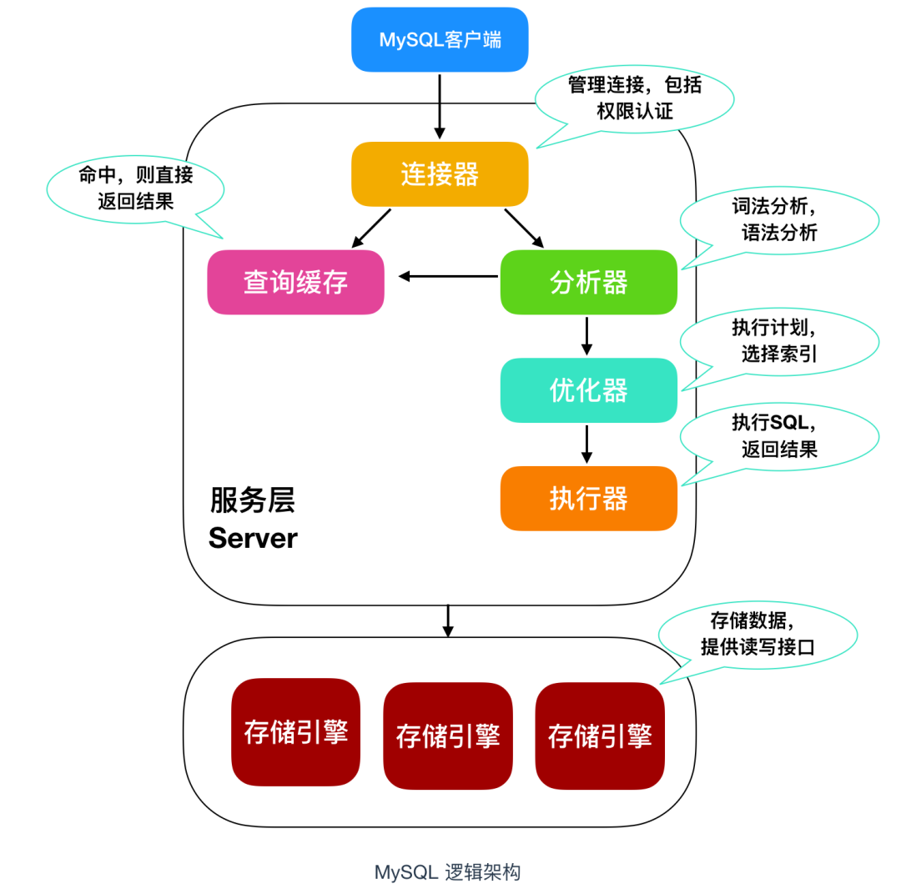
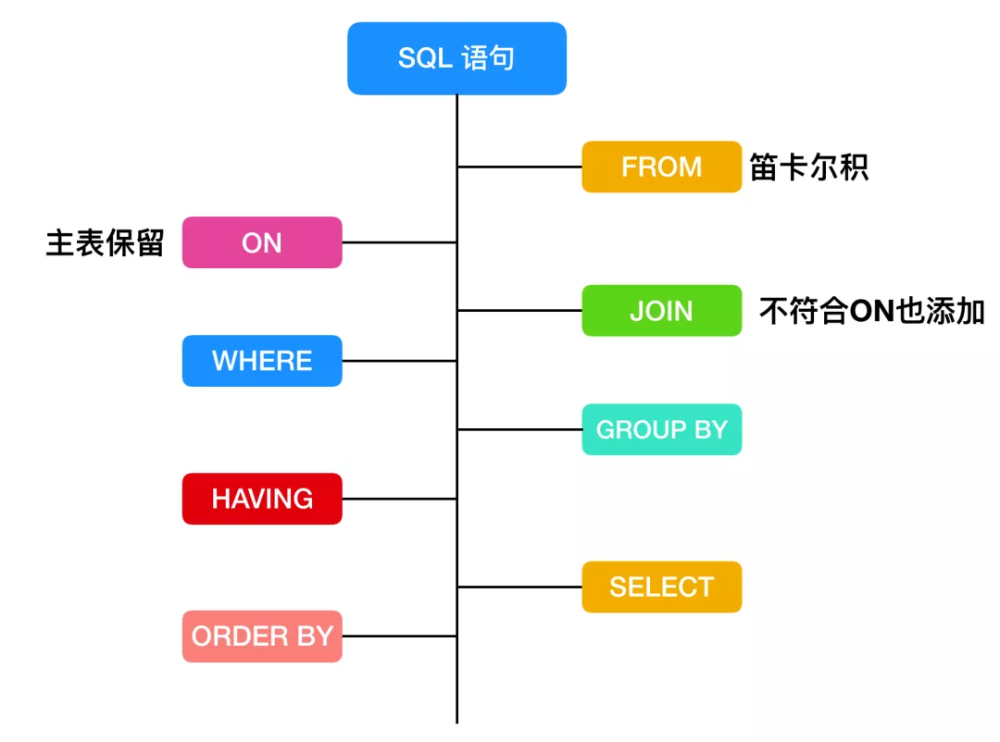
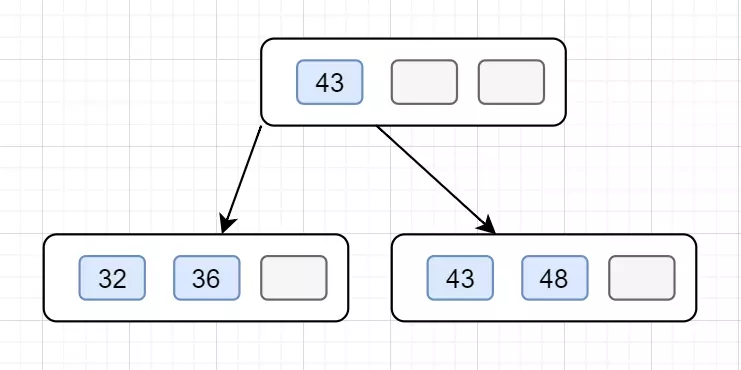
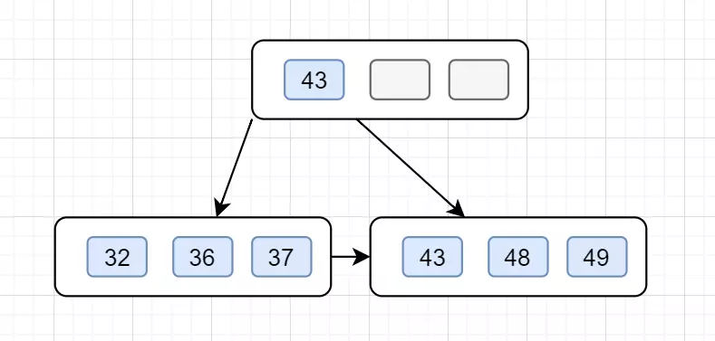

mysql三大范式（1NF即原子性，2NF即消除部分依赖，3NF即消除传递依赖）



## 执行计划？

## SQL 的执行顺序

```sql
SELECT DISTINCT
    < select_list >
FROM
    < left_table > < join_type >
JOIN < right_table > ON < join_condition >
WHERE
    < where_condition >
GROUP BY
    < group_by_list >
HAVING
    < having_condition >
ORDER BY
    < order_by_condition >
LIMIT < limit_number >
```

### SQL 语句执行的过程如下


---

## MySQL高可用方案

### MMM (mysql主主复制)

需两个以上Master，同时只有一个Master对外提供服务

主1出现故障时，自动切换到主2节点，提供服务

缺点：容易丢失事务，已停止维护，不推荐

## MHA（Master High Availability）

MHA包括 Manager节点和Node节点，管理节点一般单独一台机器，Node节点一般和每台MySQL Server在一起。

Node节点通过解析各MySQL日志来进行一些操作，Manager节点将和每个Node节点通信，判断其Node上的MySQL是否正常。若发现故障，则直接把他的Slave提升为Master，其他Slave都挂到新Master上，此过程过程对用户透明。

## MGR （MySQL Group Replication）

1. 5.7.17 版本后官方正式推出的一种组复制机制
2. 核心解决异步复制和半同步复制数据一致性问题
3. 原理：若干节点组成复制组，一个事务发起提交，必须经过半数节点以上的决议通过，才可正常提交。
4. 依靠分布式一致性协议，Paxos的一个变种
5. 实现分布式场景下，数据最终一致
6. 支持多主，但官方推荐单主模式
   - 多主：客户端可随机向MySQL节点写入数据
   - 单主：集群选出主节点复制写，主和其他节点提供读
7. 优点：几乎无延迟，相比异步复制小很多，数据强一致性，可保证实物不丢失。
8. 不足：仅支持Innodb，每个表必须有主键，且只能在GTID模式下使用，总体上目前还不够成熟，未经太多大型生产环境验证
9. 适用场景：对主从延迟敏感，希望提供些服务高可用，希望数据强一致性。


---


## 优化

- 逻辑表超过5000万-到1亿的，可以适当拆分表，一般情况下，mysql建议单表数量维持在10万以上到1000万一下性能最好
- 单库建议，一般来说建议维持在1T以内，超过1T的最好采取分库策略
- TPS/QPS :一般来说建议单库TPS不超过1500，QPS不超过3000，如果业务量持续超过，可以考虑分库

## 存储引擎

### Myisam和InnoDB存储引擎的区别
> 在 5.1 版本之前，MyISAM 是 MySQL 的默认存储引擎

1. Myisam不支持外键也不支持事务，支持的是表锁，当执行select操作时，自动给涉及的表加表锁，当执行增删改操作，自动给涉及的表加写锁；

2. InnoDB支持外键也支持事务，支持的是行锁，当执行select操作时，不加任何锁，当执行增删改操作，自动给涉及的行加写锁

3. 和 MyISAM 一样的是，InnoDB 存储引擎也有 **.frm文件存储表结构** 定义，但是不同的是，InnoDB 的表数据与索引数据是存储在一起的，都位于 B+ 数的叶子节点上，而 MyISAM 的表数据和索引数据是分开的。

4. InnoDB 有安全的日志文件，这个日志文件用于恢复因数据库崩溃或其他情况导致的数据丢失问题，保证数据的一致性。如果宕机，MyISAM 的数据文件容易损坏，而且难以恢复。

5. 查询性能上：MyISAM 要优于 InnoDB，因为 InnoDB 在查询过程中，是需要维护数据缓存，而且查询过程是先定位到行所在的数据块，然后在从数据块中定位到要查找的行；而 MyISAM 可以直接定位到数据所在的内存地址，可以直接找到数据。


---

## 事务四大特性  ACID

### 原子性（atomicity)
要么全部成功、要么全部失败回滚

### 一致性（consistency)
一致性指的是一个事务在执行前后其状态一致。
> 比如 A 和 B 加起来的钱一共是 1000 元，那么不管 A 和 B 之间如何转账，转多少次，事务结束后两个用户的钱加起来还得是 1000，这就是事务的一致性。

### 隔离性（isolation）
对应下面四种隔离级别

### 持久性（durability）


## 隔离级别

- 读未提交（read uncommitted RU）： 一个事务还没提交时，它做的变更就能被别的事务看到
- 读提交（read committed RC）： 一个事务提交之后，它做的变更才会被其他事务看到。
- 可重复读（repeatable read RR）： 一个事务执行过程中看到的数据，总是跟这个事务在启动时看到的数据是一致的。当然在可重复读隔离级别下，未提交变更对其他事务也是不可见的。
- 串行化（serializable ）： 顾名思义是对于同一行记录，“写”会加“写锁”，“读”会加“读锁”。当出现读写锁冲突的时候，后访问的事务必须等前一个事务执行完成，才能继续执行。

并发事务处理带来的四种问题和事务的隔离级别（丢失更新、脏读、不可重复读、幻读；读未提交、读已提交、可重复读、串行化）


注：√代表可能发生，×代表不可能发生

隔离级别越高，越能够保证数据的完整性和一致性，但是对并发的性能影响越大。大多数数据库的默认级别是读已提交(Read committed)，比如 Sql Server、Oracle ，但是 **MySQL 的默认隔离级别是 可重复读(repeatable-read)**。

## 事务中常见的问题

- **脏读（dirty read）**：就是一个A事务即便没有提交，它对数据的修改也可以被其他事务B事务看到，B事务读到了A事务还未提交的数据，这个数据有可能是错的，有可能A不想提交这个数据，这只是A事务修改数据过程中的一个中间数据，但是被B事务读到了，这种行为被称作脏读，这个数据被称为脏数据

- **不可重复读（non-repeatable read）**：在A事务内，多次读取同一个数据，但是读取的过程中，B事务对这个数据进行了修改，导致此数据变化了，那么A事务再次读取的时候，数据就和第一次读取的时候不一样了，这就叫做不可重复读

- **幻读（phantom read）**：A事务多次查询数据库，结果发现查询的数据条数不一样，A事务多次查询的间隔中，B事务又写入了一些符合查询条件的多条数据（这里的写入可以是update，insert，delete），A事务再查的话，就像发生了幻觉一样，怎么突然改变了这么多，这种现象这就叫做幻读

> 参考文章：https://mp.weixin.qq.com/s?__biz=Mzg5OTU4ODc0Mg==&mid=2247484174&idx=1&sn=75e3dd926f4d4cc655f2d4b216b3247e&chksm=c051b4e7f7263df1c89385c0ca7ac23dd8888999132efc6155911bd099901a5fc8f5201e52e4&scene=178&cur_album_id=1783698918074040322#rd

### 幻读怎么解决？？

> 可重复读无法彻底解决幻读的问题

原因：行锁只能锁住行,即使把所有的行记录都上锁,也阻止不了新插入的记录

表现：一个事务(同一个read view)在前后两次查询同一范围的时候，后一次查询看到了前一次查询没有看到的行。

影响：产生数据一致性问题

解决：将两行记录间的空隙加上锁，阻止新记录的插入；这个锁称为间隙锁。

## 间隙锁 Gap Lock

session_1执行update t_user set name ='哈哈' where id>8 and id<18;则其他session无法在这个**范围包含的所有行记录以及行记录所在的间隙**里插入或修改任何数据

**间隙锁在可重复读隔离级别下才会生效**


## 事务

### 事务的ACID属性是如何实现的？
原子性通过回滚日志undo log实现；

持久性通过重做日志redo log实现；

隔离性通过锁和MVCC实现；

而一致性则是通过原子性、隔离性、持久性来实现，只有满足这三个特性，才能实现事务的一致性

## 锁

### 死锁


### 锁分类

从性能上分为：乐观锁（用版本对比来实现）和悲观锁；

从对数据库操作类型分：读写和写锁（悲观锁）；

    读锁（共享锁，S锁（Shared））：针对同一份数据，多个读操作可以同时进行而不会互相影响；
    
    写锁（排它锁，X锁（exclusive））:当前写操作没有完成前，阻断其他写锁和读锁；

从对数据库操作的粒度分：表锁和行锁

    表锁：每次操作锁住整张表，开销小，加锁快；不会出现死锁；锁定粒度大，发生锁冲突的概率最高，并发度最低；一般用在整表数据迁移的场景。
    
    ```
    # 手动增加表锁
    lock table 表名称 read(write),表名称2 read(write);
    # 查看表上加过的锁
    show open tables;
    # 删除表锁
    unlock tables;
    ```
    
    行锁：每次操作锁住一行数据。开销大，加锁慢；会出现死锁；锁定粒度最小，发生锁冲突的概率最低，并发度最高。


---


## 索引

### 聚簇索引（也叫聚集索引）

> 定义：数据行的物理顺序与列值（一般是主键的那一列）的逻辑顺序相同，一个表中只能拥有一个聚集索引。

### 非聚簇索引  （分成普通索引，唯一索引，全文索引）

> 定义：该索引中索引的逻辑顺序与磁盘上行的物理存储顺序不同，一个表中可以拥有多个非聚集索引。

#### 非聚集索引的二次查询问题
非聚集索引叶节点仍然是索引节点，只是有一个指针指向对应的数据块，此如果使用非聚集索引查询，而查询列中包含了其他该索引没有覆盖的列，那么他还要进行第二次的查询，查询节点上对应的数据行的数据。

#### 如何解决非聚集索引的二次查询问题
**复合索引（覆盖索引）**
建立两列以上的索引，即可查询复合索引里的列的数据而不需要进行回表二次查询，如index(col1, col2)，执行下面的语句
```sql
select col1, col2 from t1 where col1 = '213';
```
要注意使用复合索引需要满足最左侧索引的原则，也就是查询的时候如果where条件里面没有最左边的一到多列，索引就不会起作用。


执行计划
count1*区别？

联合索引？？

主键（聚集）索引，非聚集索引


### 


## 索引失效的情况
- 违反最左前缀法则

- 范围查询右边的列索引失效

- 字符串不加单引号

- 对索引列进行运算

- 头部模糊匹配

- 使用不等于！=或者<>

- 列与列对比
某个表中，有两列（id和c_id）都建了单独索引，下面这种查询条件不会走索引
```
select * from test where id=c_id;
```
这种情况会被认为还不如走全表扫描。

- 存在NULL值条件
- 查询条件包含：`<>、NOT、in、not exists`
- 条件上包括函数
查询条件上尽量不要对索引列使用函数，比如下面这个SQL
```sql
select * from test where upper(name)='SUNYANG';
```
这样是不会走索引的，因为索引在建立时会和计算后可能不同，无法定位到索引。但如果查询条件不是对索引列进行计算，那么依然可以走索引。比如
```sql
select * from test where name=upper('sunyang');
```
- 数据类型的转换
当查询条件存在隐式转换时，索引会失效。比如在数据库里id存的number类型，但是在查询时，却用了下面的形式：
```sql
select * from sunyang where id='123';
```


## 查询优化？？

## explain ??
## explain分析执行计划、SQL语句的优化
关注的列？


---

> B 就是 Balance 的意思，BTree 是一种平衡树，它有很多变种，最常见的就是 B+ Tree

## B+树


#### B+树和B树的主要区别如下：

- B树内部节点是保存数据的;而B+树内部节点是不保存数据的，只作索引作用，它的叶子节点才保存数据。
- B+树相邻的叶子节点之间是通过链表指针连起来的，B树却不是。
- 查找过程中，B树在找到具体的数值以后就结束，而B+树则需要通过索引找到叶子结点中的数据才结束
- B树中任何一个关键字出现且只出现在一个结点中，而B+树可以出现多次。

（B+树IO次数更少、更适合范围查询、查询效率更加稳定）

（哈希表不支持范围查找）

### B+树的插入

B+树插入要记住这几个步骤：

- 1.B+树插入都是在叶子结点进行的，就是插入前，需要先找到要插入的叶子结点。
- 2.如果被插入关键字的叶子节点，当前含有的关键字数量是小于阶数m，则直接插入。
- 3.如果插入关键字后，叶子节点当前含有的关键字数目等于阶数m，则插，该节点开始 **「分裂」**为两个新的节点，一个节点包含⌊m/2⌋ 个关键字，另外一个关键字包含⌈m/2⌉个关键值。（⌊m/2⌋表示向下取整，⌈m/2⌉表示向上取整，如⌈3/2⌉=2）。
- 4.分裂后，需要将第⌈m/2⌉的关键字上移到父结点。如果这时候父结点中包含的关键字个数小于m，则插入操作完成。
- 5.分裂后，需要将⌈m/2⌉的关键字上移到父结点。如果父结点中包含的关键字个数等于m，则继续分裂父结点。

以一颗4阶的B+树为例子吧，4阶的话，关键值最多3（m-1）个。假设插入以下数据43，48，36，32,37,49,28.

1. 在空树中插入43


这时候根结点就一个关键值，此时它是根结点也是叶子结点。

2. 依次插入48，36


这时候跟节点拥有3个关键字，已经满了

3. 继续插入 32，发现当前节点关键字已经不小于阶数4了，于是分裂 第⌈4/2⌉=2（下标0,1,2）个，也即43上移到父节点。



4. 继续插入37，49，前节点关键字都是还没满的，直接插入，如下：



5. 最后插入28，发现当前节点关键字也是不小于阶数4了，于是分裂，于是分裂， 第 ⌈4/2⌉=2个，也就是36上移到父节点，因父子节点只有2个关键值，还是小于4的，所以不用继续分裂，插入完成


### 3层B+树大概能存多少数据？


### 红黑树：红黑树是一颗特殊的二叉查找树，每个节点都是黑色或者红色，根节点、叶子节点是黑色。如果一个节点是红色的，则它的子节点必须是黑色的。

## binlog  归档日志

> 作用：用于复制，在主从复制中，从库利用主库上的binlog进行重播，实现主从同步。 
用于数据库的基于时间点的还原。

## redo log 重做日志
是InnoDB存储引擎层的日志，又称重做日志文件，用于记录事务操作的变化，记录的是数据修改之后的值，不管事务是否提交都会记录下来。

> 作用： 确保事务的持久性。防止在发生故障的时间点，尚有脏页未写入磁盘，在重启mysql服务的时候，根据redo log进行重做，从而达到事务的持久性这一特性。

持久性依赖 redo log实现

### redo log和binlog区别

- redo log是属于innoDB层面，binlog属于MySQL Server层面的，这样在数据库用别的存储引擎时可以达到一致性的要求。
- redo log是物理日志，记录该数据页更新的内容；binlog是逻辑日志，记录的是这个更新语句的原始逻辑
- redo log是循环写，日志空间大小固定；binlog是追加写，是指一份写到一定大小的时候会更换下一个文件，不会覆盖。
- binlog可以作为恢复数据使用，主从复制搭建，redo log作为异常宕机或者介质故障后的数据恢复使用。

## undo log 回滚日志

> 作用：保存了事务发生之前的数据的一个版本，可以用于回滚，同时可以提供多版本并发控制下的读（MVCC），也即非锁定读


## MVCC机制  （Multi-Version Concurrency Control）多版本并发控制

是用来在数据库中控制并发的方法，实现对数据库的并发访问用的。在MySQL中，MVCC只在**读已提交（Read Committed）**和**可重复读（Repeatable Read）**两个事务级别下有效。其是通过Undo日志中的**版本链**和ReadView**一致性视图**来实现的。MVCC就是在多个事务同时存在时，SELECT语句找寻到具体是版本链上的哪个版本，然后在找到的版本上返回其中所记录的数据的过程。

> 版本链是一条链表，链接的是每条数据曾经的修改记录

### MySQL InnoDB下的当前读 和 快照读

- **当前读**
像select lock in share mode(共享锁), select for update ; update, insert ,delete(排他锁)这些操作都是一种当前读，为什么叫当前读？就是它读取的是记录的最新版本，读取时还要保证其他并发事务不能修改当前记录，会对读取的记录进行加锁。

- **快照读**
像不加锁的select操作就是快照读，即不加锁的非阻塞读；快照读的前提是隔离级别不是串行级别，串行级别下的快照读会退化成当前读；之所以出现快照读的情况，是基于提高并发性能的考虑，快照读的实现是基于多版本并发控制，即MVCC,可以认为MVCC是行锁的一个变种，但它在很多情况下，避免了加锁操作，降低了开销；既然是基于多版本，即快照读可能读到的并不一定是数据的最新版本，而有可能是之前的历史版本

> 参考：https://www.jianshu.com/p/8845ddca3b23

## 临时表

### 什么是临时表？
MySQL 在执行 SQL 语句的过程中，通常会临时创建一些存储中间结果集的表，临时表只对当前连接可见，在连接关闭时，临时表会被删除并释放所有表空间。

### 什么情况产生临时表
- 使用 UNION 查询
- ORDER BY 和 GROUP BY 的子句不一样时也会产生临时表。
- DISTINCT 查询并且加上 ORDER BY 时；
- SQL 用到 SQL_SMALL_RESULT 选项时；如果查询结果比较小的时候，可加上 SQL_SMALL_RESULT 来优化，产生临时表
- FROM 中的子查询；
## 分库分表

从拆分角度，可分为水平拆分与垂直拆分。

- 垂直拆分：按业务进行归类，将数据拆分到不同库或表中。不可彻底解决大数据量存储瓶颈。
- 水平拆分：根据业务逻辑，将数据通过某些字段，分散存储到多个库或表中，每个分片斤包括一部分数据。

常用分片策略：

- 取模：数据均匀分布，扩容麻烦
- 按范围：比较好扩容，数据不够均衡
- 按时间：容易区分弱点数据
- 按枚举：如按地区
- 按目标字段前缀


## 异步复制、全同步复制与半同步复制

### 一、异步复制（Asynchronous replication）
1、逻辑上

MySQL默认的复制即是异步的，主库在执行完客户端提交的事务后会立即将结果返给给客户端，并不关心从库是否已经接收并处理，这样就会有一个问题，主如果crash掉了，此时主上已经提交的事务可能并没有传到从库上，如果此时，强行将从提升为主，可能导致新主上的数据不完整。

2、技术上

主库将事务 Binlog 事件写入到 Binlog 文件中，此时主库只会通知一下 Dump 线程发送这些新的 Binlog，然后主库就会继续处理提交操作，而此时不会保证这些 Binlog 传到任何一个从库节点上。

### 二、全同步复制（Fully synchronous replication）

1、逻辑上

指当主库执行完一个事务，所有的从库都执行了该事务才返回给客户端。因为需要等待所有从库执行完该事务才能返回，所以全同步复制的性能必然会收到严重的影响。

2、技术上

当主库提交事务之后，所有的从库节点必须收到、APPLY并且提交这些事务，然后主库线程才能继续做后续操作。但缺点是，主库完成一个事务的时间会被拉长，性能降低。

### 三、半同步复制（Semisynchronous replication）

1、逻辑上

是介于全同步复制与全异步复制之间的一种，主库只需要等待至少一个从库节点收到并且 Flush Binlog 到 Relay Log 文件即可，主库不需要等待所有从库给主库反馈。同时，这里只是一个收到的反馈，而不是已经完全完成并且提交的反馈，如此，节省了很多时间。

2、技术上

介于异步复制和全同步复制之间，主库在执行完客户端提交的事务后不是立刻返回给客户端，而是等待至少一个从库接收到并写到relay log中才返回给客户端。相对于异步复制，半同步复制提高了数据的安全性，同时它也造成了一定程度的延迟，这个延迟最少是一个TCP/IP往返的时间。所以，半同步复制最好在低延时的网络中使用。

## todo

mysql行锁最大并发数？（秒杀项目指出）


## MySQL8.0有哪些新特性

1. 默认字符集由latin1变为utf8mb4
2. MyISAM系统表全部换成InnoDB表
3. 自增变量持久化
在8.0之前的版本，自增主键AUTO_INCREMENT的值如果大于max(primary key)+1，在MySQL重启后，会重置AUTO_INCREMENT=max(primary key)+1，这种现象在某些情况下会导致业务主键冲突或者其他难以发现的问题。自增主键重启重置的问题很早就被发现(https://bugs.mysql.com/bug.php?id=199)，一直到8.0才被解决，8.0版本将会对AUTO_INCREMENT值进行持久化，MySQL重启后，该值将不会改变。
4. DDL原子化

InnoDB表的DDL支持事务完整性，要么成功要么回滚，将DDL操作回滚日志写入到data dictionary 数据字典表 mysql.innodb_ddl_log 中用于回滚操作，该表是隐藏的表，通过show tables无法看到。通过设置参数，可将ddl操作日志打印输出到mysql错误日志中。

mysql> set global log_error_verbosity=3;

mysql> set global innodb_print_ddl_logs=1;

mysql> create table t1(c int) engine=innodb;

来看另外一个例子，库里只有一个t1表，drop table t1,t2;

试图删除t1,t2两张表,在5.7中，执行报错，但是t1表被删除，在8.0中执行报错，但是t1表没有被删除，证明了8.0 DDL操作的原子性，要么全部成功，要么回滚。
5. 参数修改持久化

MySQL 8.0版本支持在线修改全局参数并持久化，通过加上PERSIST关键字，可以将修改的参数持久化到新的配置文件（mysqld-auto.cnf）中，重启MySQL时，可以从该配置文件获取到最新的配置参数。

例如执行：

set PERSIST expire_logs_days=10 ;

系统会在数据目录下生成一个包含json格式的 mysqld-auto.cnf 的文件，格式化后如下所示，当 my.cnf 和 mysqld-auto.cnf 同时存在时，后者具有更高优先级。


6. 新增降序索引

MySQL在语法上很早就已经支持降序索引，但实际上创建的仍然是升序索引，

如下MySQL 5.7 所示，c2字段降序，但是从show create table看c2仍然是升序。

8.0可以看到，c2字段降序。

再来看降序索引在执行计划中的表现，在t1表插入10万条随机数据，

查看select * from t1 order by c1 , c2 desc;的执行计划。从执行计划上可以看出，

5.7的扫描数100113远远大于8.0的5行，并且使用了filesort。


7. group by 不再隐式排序

mysql 8.0 对于group by 字段不再隐式排序，如需要排序，必须显式加上order by 子句。


8. JSON特性增强

MySQL 8 大幅改进了对 JSON 的支持，添加了基于路径查询参数从 JSON 字段中抽取数据的 JSON_EXTRACT() 函数，以及用于将数据分别组合到 JSON 数组和对象中的 JSON_ARRAYAGG() 和 JSON_OBJECTAGG() 聚合函数。

在主从复制中，新增参数 binlog_row_value_options，

控制JSON数据的传输方式，允许对于Json类型部分修改，在binlog中只记录修改的部分，减少json大数据在只有少量修改的情况下，对资源的占用。


9. redo & undo & binlog 日志加密

增加以下三个参数，用于控制redo、undo日志的加密。

innodb_undo_log_encrypt

innodb_undo_log_truncate

binlog_encryption


10. innodb select for update跳过锁等待

select ... for update，select ... for share(8.0新增语法) 添加 NOWAIT、SKIP LOCKED语法，跳过锁等待，或者跳过锁定。

在5.7及之前的版本，select...for update，如果获取不到锁，会一直等待，直到innodb_lock_wait_timeout超时。


在8.0版本，通过添加nowait，skip locked语法，能够立即返回。

如果查询的行已经加锁，那么nowait会立即报错返回，

而skip locked也会立即返回，只是返回的结果中不包含被锁定的行。


11. 增加SET_VAR语法

在sql语法中增加SET_VAR语法，动态调整部分参数，有利于提升语句性能。

SELECT /*+ SET_VAR(sort_buffer_size = 16M) */ id FROM test ORDER id ;

INSERT /*+ SET_VAR(foreign_key_checks=OFF) */ INTO test(NAME) VALUES(1);


12. 支持不可见索引

使用INVISIBLE关键字在创建表或者进行表变更中设置索引是否可见。

索引不可见只是在查询时优化器不使用该索引，即使使用force index，

优化器也不会使用该索引，同时优化器也不会报索引不存在的错误，因为索引仍然真实存在，在必要时，也可以快速的恢复成可见。

# 创建不可见索引

CREATE TABLE t2(c1 INT,c2 INT,INDEX idx_c1_c2(c1,c2 DESC) invisible );

# 索引可见

ALTER TABLE t2 ALTER INDEX idx_c1_c2 visible;

# 索引不可见

ALTER TABLE t2 ALTER INDEX idx_c1_c2 invisible;


13. 新增innodb_dedicated_server参数

能够让InnoDB根据服务器上检测到的内存大小自动配置innodb_buffer_pool_size，innodb_log_file_size，innodb_flush_method三个参数。


14. 日志分类更详细

在错误信息中添加了错误信息编号[MY-010311]和错误所属子系统[Server]


15. undo空间自动回收

innodb_undo_log_truncate参数在8.0.2版本默认值由OFF变为ON，默认开启undo日志表空间自动回收。

innodb_undo_tablespaces参数在8.0.2版本默认为2，当一个undo表空间被回收时，还有另外一个提供正常服务。

innodb_max_undo_log_size参数定义了undo表空间回收的最大值，当undo表空间超过这个值，该表空间被标记为可回收。


15. 增加资源组

MySQL 8.0新增了一个资源组功能，用于调控线程优先级以及绑定CPU核。

MySQL用户需要有 RESOURCE_GROUP_ADMIN权限才能创建、修改、删除资源组。

在Linux环境下，MySQL进程需要有CAP_SYS_NICE 权限才能使用资源组完整功能。

默认提供两个资源组，分别是USR_default，SYS_default

创建资源组：

create resource group test_resouce_group type=USER vcpu=0,1 thread_priority=5;

将当前线程加入资源组：

SET RESOURCE GROUP test_resouce_group;

将某个线程加入资源组：

SET RESOURCE GROUP test_resouce_group FOR thread_id;

查看资源组里有哪些线程：

select * from Performance_Schema.threads where

RESOURCE_GROUP='test_resouce_group';

修改资源组：

alter resource group test_resouce_group vcpu = 2,3 THREAD_PRIORITY = 8;

删除资源组 ：

drop resource group test_resouce_group;


16. 增加角色管理

角色可以认为是一些权限的集合，为用户赋予统一的角色，权限的修改直接通过角色来进行，无需为每个用户单独授权。


17、MySQL8.0现在支持窗口函数（over）和公用表表达式（with）

毫无疑问，这是两个最重要的Post-SQL-92功能。


18、DDL新增算法

8.0.12的优化是，新增了一个算法 ALGORITHM=INSTANT，专门处理只需要修改元数据就可以完成的变更，这个就可以相对比较方便地直接使用了，不需要担心从库延迟。

目前支持的操作是：

　　1.添加新列。已知限制条件如下：

　　    不能与其他不支持INSTANT算法的alter子语句合并在一起。

　　    只能添加在表列的末尾。

　　    不能用于innodb的压缩表（ROW_FORMAT=COMPRESSED）。

　　    目标表不能包含全文索引。

　　    目标表不能是临时表。

　　    目标表不能是数据字典表。

　　    这种添加方式下，不会计算行长度是否合适，这个计算会在发生insert或者update的时候处理。

       2. 添加或者删除虚拟列。
    
       3. 添加或者去掉列的默认值。
    
       4. 修改 enum，set 列类型的定义（题外话，有多少人知道并在用这个？）
    
       5. 修改索引类型。
    
       6. 重命名表名称。

20、克隆功能

用于自动搭建从节点，也可用于备份innodb表，增强了MySQL InnoDB Cluster。

21、其他新特性

    binlog日志压缩（binlog_transaction_compression=off，binlog_transaction_compression_level_zstd=3）；
    
    取消Query Cache；
    
    hash join；
    
    在线修改undo数量；
    
    额外的admin连接，DBA专用端口；
    
    8.0.20开始，redolog格式变化，xtrabackup备份工具目前不支持（2020-05-15）；
    
    新增TempTable引擎；
    
    新增double write相关参数，可以独立设置大小和存放目录，性能得到极大提升。
    
    MySQL shell提供相关的集群管理工具集，便于MySQL集群管理。

