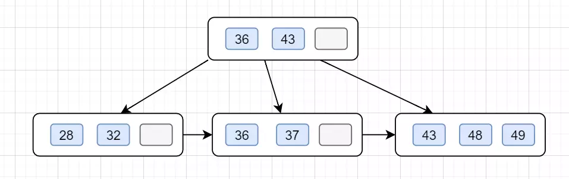

mysql三大范式（1NF即原子性，2NF即消除部分依赖，3NF即消除传递依赖）

## 优化

- 逻辑表超过5000万-到1亿的，可以适当拆分表，一般情况下，mysql建议单表数量维持在10万以上到1000万一下性能最好
- 单库建议，一般来说建议维持在1T以内，超过1T的最好采取分库策略
- TPS/QPS :一般来说建议单库TPS不超过1500，QPS不超过3000，如果业务量持续超过，可以考虑分库

## 存储引擎

Myisam和InnoDB存储引擎的区别？（Myisam不支持外键也不支持事务，支持的是表锁，当执行select操作时，自动给涉及的表加表锁，当执行增删改操作，自动给涉及的表加写锁；InnoDB支持外键也支持事务，支持的是行锁，当执行select操作时，不加任何锁，当执行增删改操作，自动给涉及的行加写锁）

## 四大特性？

## 隔离级别

- 读未提交
- 读提交
- 可重复读
- 串行化

并发事务处理带来的四种问题和事务的隔离级别（丢失更新、脏读、不可重复读、幻读；读未提交、读已提交、可重复读、串行化）

## 事务

事务的ACID属性是如何实现的？（原子性通过回滚日志undo log实现；持久性通过重做日志redo log实现；隔离性通过锁和MVCC实现；而一致性则是通过原子性、隔离性、持久性来实现，只有满足这三个特性，才能实现事务的一致性）

## 锁

## 索引

索引失效的情况？（违反最左前缀法则、范围查询右边的列索引失效、字符串不加单引号、对索引列进行运算、头部模糊匹配、使用不等于！=或者<>）

explain分析执行计划、SQL语句的优化

## B+树

#### B+树和B-树的主要区别如下：

- B-树内部节点是保存数据的;而B+树内部节点是不保存数据的，只作索引作用，它的叶子节点才保存数据。
- B+树相邻的叶子节点之间是通过链表指针连起来的，B-树却不是。
- 查找过程中，B-树在找到具体的数值以后就结束，而B+树则需要通过索引找到叶子结点中的数据才结束
- B-树中任何一个关键字出现且只出现在一个结点中，而B+树可以出现多次。

（B+树IO次数更少、更适合范围查询、查询效率更加稳定）

（哈希表不支持范围查找）

### B+树的插入

B+树插入要记住这几个步骤：

- 1.B+树插入都是在叶子结点进行的，就是插入前，需要先找到要插入的叶子结点。
- 2.如果被插入关键字的叶子节点，当前含有的关键字数量是小于阶数m，则直接插入。
- 3.如果插入关键字后，叶子节点当前含有的关键字数目等于阶数m，则插，该节点开始 **「分裂」**为两个新的节点，一个节点包含⌊m/2⌋ 个关键字，另外一个关键字包含⌈m/2⌉个关键值。（⌊m/2⌋表示向下取整，⌈m/2⌉表示向上取整，如⌈3/2⌉=2）。
- 4.分裂后，需要将第⌈m/2⌉的关键字上移到父结点。如果这时候父结点中包含的关键字个数小于m，则插入操作完成。
- 5.分裂后，需要将⌈m/2⌉的关键字上移到父结点。如果父结点中包含的关键字个数等于m，则继续分裂父结点。

以一颗4阶的B+树为例子吧，4阶的话，关键值最多3（m-1）个。假设插入以下数据43，48，36，32,37,49,28.

1. 在空树中插入43

这时候根结点就一个关键值，此时它是根结点也是叶子结点。

2. 依次插入48，36

这时候跟节点拥有3个关键字，已经满了

3. 继续插入 32，发现当前节点关键字已经不小于阶数4了，于是分裂 第⌈4/2⌉=2（下标0,1,2）个，也即43上移到父节点。

4. 继续插入37，49，前节点关键字都是还没满的，直接插入，如下：

5. 最后插入28，发现当前节点关键字也是不小于阶数4了，于是分裂，于是分裂， 第 ⌈4/2⌉=2个，也就是36上移到父节点，因父子节点只有2个关键值，还是小于4的，所以不用继续分裂，插入完成

### 红黑树：红黑树是一颗特殊的二叉查找树，每个节点都是黑色或者红色，根节点、叶子节点是黑色。如果一个节点是红色的，则它的子节点必须是黑色的。

## redo log

持久性依赖 redo log实现

## MVCC机制