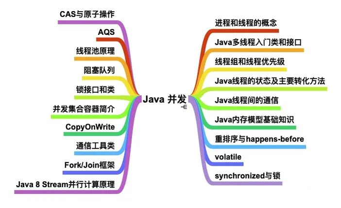
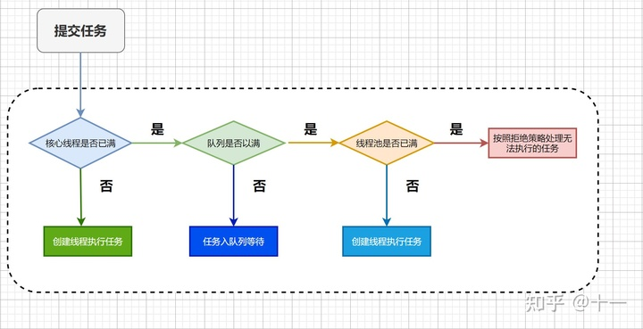

## Runable 和 Callable 的区别

- Callable接口实现线程方法是call， Runable接口实现线程方法是run
- Callable有返回值， Runable接口不能有返回值
- Callable接口方法call返回值可以设置泛型，如下例子中使用String数据类型
- Callable接口方法call方法可以抛出异常，Runable接口run方法不可以抛出异常
- Callable接口方法通过new Thread(futureTask).start()运行，FutureTask的get方法可以获取Callable接口方法call方法的返回值
- 如果Callable接口方法call方法异常，在FutureTask的get方法调用时也会抛出同样的异常

## 多线程

Java多线程的调度方法有：setPriority（设置优先级），sleep（睡眠），join（加入），yield（让步）；

### 守护线程和非守护线程 ？？

## 协程 
loom
Quasar

## 父子线程怎么共享数据

InternalThreadLocal

### 线程的6种状态 

- 1) NEW：初始状态，线程被构建，但是还没有调用 start 方法;

- 2）RUNNABLED：运行状态，JAVA 线程把操作系统中的就绪和运行两种状态统一称为“运行中” ；

- 3）BLOCKED：阻塞状态，表示线程进入等待状态,也就是线程因为某种原因放弃了 CPU 使用权，阻塞也分为几种情况 ：

    - 等待阻塞：运行的线程执行了 Thread.sleep 、wait()、 join() 等方法JVM 会把当前线程设置为等待状态，当 sleep 结束、join 线程终止或者线程被唤醒后，该线程从等待状态进入到阻塞状态，重新抢占锁后进行线程恢复；

    - 同步阻塞：运行的线程在获取对象的同步锁时，若该同步锁被其他线程锁占用了，那么jvm会把当前的线程放入到锁池中 ；

    - 其他阻塞：发出了 I/O请求时，JVM 会把当前线程设置为阻塞状态，当 I/O处理完毕则线程恢复；

- 4）WAITING：等待状态，没有超时时间，要被其他线程或者有其它的中断操作；

执行wait()、join()、LockSupport.park()；

- 5）TIME_WAITING：超时等待状态，超时以后自动返回；

执行 Thread.sleep(long)、wait(long)、join(long)、LockSupport.park(long)、LockSupport.parkNanos(long)、LockSupport.parkUntil(long)

- 6）TERMINATED：终止状态，表示当前线程执行完毕 。

> 线程状态存储在什么地方？

---

## 线程池

### 说说线程池创建需要的那几个核心参数的含义

ThreadPoolExecutor 最多包含以下七个参数：

- corePoolSize：线程池中的核心线程数
- maximumPoolSize：线程池中最大线程数
- keepAliveTime：闲置超时时间
- unit：keepAliveTime 超时时间的单位（时/分/秒等）
- workQueue：线程池中的任务队列
- threadFactory：为线程池提供创建新线程的线程工厂
- rejectedExecutionHandler：线程池任务队列超过最大值之后的拒绝策略

1. corePoolSize 核心线程数

核心池的大小，这个参数跟后面讲述的线程池的实现原理有非常大的关系。在创建了线程池后，默认情况下，线程池中并没有任何线程，而是等待有任务到来才创建线程去执行任务，除非调用了prestartAllCoreThreads()或者prestartCoreThread()方法，从这2个方法的名字就可以看出，是预创建线程的意思，即在没有任务到来之前就创建corePoolSize个线程或者一个线程。默认情况下，在创建了线程池后，线程池中的线程数为0，当有任务来之后，就会创建一个线程去执行任务，当线程池中的线程数目达到corePoolSize后，就会把到达的任务放到缓存队列当中；

2. maximumPoolSize 最大线程数
3. keepAliveTime 线程存活时间， 表示线程没有任务执行时最多保持多久时间会终止。

默认情况下，只有当线程池中的线程数大于corePoolSize时，keepAliveTime才会起作用，直到线程池中的线程数不大于corePoolSize，即当线程池中的线程数大于corePoolSize时，如果一个线程空闲的时间达到keepAliveTime，则会终止，直到线程池中的线程数不超过corePoolSize。但是如果调用了allowCoreThreadTimeOut(boolean)方法，在线程池中的线程数不大于corePoolSize时，keepAliveTime参数也会起作用，直到线程池中的线程数为0；

4. unit 时间单位 ， 参数keepAliveTime的时间单位
5. workQueue  阻塞队列
6. threadFactory 线程工厂，用来创建线程，主要是为了给线程起名字，默认工厂的线程名字 pool-1-thread-3。
7. Handler 拒绝策略
- AbortPolicy：直接抛出 RejectedExecutionException 异常(默认)。
- DiscardPolicy：丢弃掉该任务，不进行处理，也不抛异常。
- DiscardOldestPolicy：丢弃队列里最前面的一个任务，然后重新尝试执行任务（重复此过程）。
- CallerRunsPolicy：既不抛弃任务也不抛出异常，直接使用主线程来执行此任务。

### 工作流程

线程池的五种状态（Running、Shutdown、Stop、Tidying、Terminated）

任务通常分为两类：cpu密集型、io密集型

- **cpu 密集型任务**，需要线程长时间进行的复杂的运算，这种类型的任务需要少创建线程，过多的线程将会频繁引起上文切换，降低任务处理处理速度。
- **io 密集型任务**，由于线程并不是一直在运行，可能大部分时间在等待 IO 读取/写入数据，增加线程数量可以提高并发度，尽可能多处理任务。

因为原生线程池，任务数量大于核心线程数之后，会先把任务放到队列中，等待核心线程处理，这样对于io密集型任务的处理就不合理了，所以需要扩展线程池。

Tomcat扩展线程池，继承ThreadPoolExecutor，重写核心方法execute的处理逻辑，新增TaskQueue继承
LinkedBlockingQueue，重写offer方法。

---

## ThreadPoolExecutor 的内部工作原理
Doug Lea 的整个思路总结起来就是 5 句话：
1. 如果当前池大小 poolSize 小于 corePoolSize ，则创建新线程执行任务。
2. 如果当前池大小 poolSize 大于 corePoolSize ，且等待队列未满，则进入等待队列
3. 如果当前池大小 poolSize 大于 corePoolSize 且小于 maximumPoolSize ，且等待队列已满，则创建新线程执行任务
4. 如果当前池大小 poolSize 大于 corePoolSize 且大于 maximumPoolSize ，且等待队列已满，则调用拒绝策略来处理该任务。
5. 线程池里的每个线程执行完任务后不会立刻退出，而是会去检查下等待队列里是否还有线程任务需要执行，如果在 keepAliveTime 里等不到新的任务了，那么线程就会退出。

---

### submit() 和 execute()方法的区别

他们都可以开启线程池中的任务。

submit的功能是提交指定的任务去执行并且返回Future对象，即执行的结果。

主要是submit方便Exception处理，如果在任务中抛出了异常希望外部调用者能够感知这些异常并做出处理，那么就需要用submit，通过捕获Future.get抛出的异常。

## 创建线程的五种方法

### 1、继承Thread类

A extends Thread

运行
new A().start();

### 2、实现Runnable接口

A implements Runnable

new Thread(new A()).start()

### 3、实现Callable接口

A implements Callable<String>

FutureTask<String> futureTask = new FutureTask<>(new A());
new Thread(futureTask).start();
//阻塞方法，获取call方法返回值
System.out.println(futureTask.get());  //打印：Callable接口带返回值，可以抛出异常

### 4、线程池+execute

threadPool.execute(new A());

### 5、线程池+submit

Future<String> future = threadPool.submit(new A());

todo

---

## Netty ？？？

线程模型

## IO多路复用

### epoll ？？

netty为什么快？

## 零拷贝 ？？
原理：

