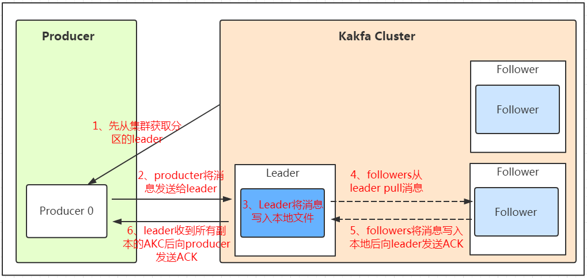

<!-- TOC -->

- [各个mq的比较  *****](#各个mq的比较--)
  - [RabbitMQ](#rabbitmq)
  - [RocketMQ](#rocketmq)
  - [Kafka](#kafka)
- [方式不同](#方式不同)
  - [rabbitmq与rocketmq都支持push和pull，kafka只支持pull。](#rabbitmq与rocketmq都支持push和pullkafka只支持pull)
- [Kafka](#kafka-1)
  - [特性](#特性)
  - [消息写入流程](#消息写入流程)
  - [Kafka高吞吐的原理](#kafka高吞吐的原理)
    - [写入数据](#写入数据)
    - [读取数据](#读取数据)
  - [broker 副本同步？？ isr ack？？](#broker-副本同步-isr-ack)
    - [isr ？？](#isr-)
- [重复消费](#重复消费)
- [消息丢失](#消息丢失)
  - [怎么解决消息不丢失](#怎么解决消息不丢失)
- [消息重试](#消息重试)
- [死信队列](#死信队列)
- [mq如何保证顺序](#mq如何保证顺序)
- [消息积压](#消息积压)
- [mq持久化](#mq持久化)
  - [怎么实现 Exactly-Once  恰好一次](#怎么实现-exactly-once--恰好一次)

<!-- /TOC -->

## 各个mq的比较  *****

### RabbitMQ

RabbitMQ 开始是用在电信业务的可靠通信的，也是少有的几款支持AMQP协议的产品之一。

优点：

1、轻量级，快速，部署使用方便
2、支持灵活的路由配置。RabbitMQ中，在生产者和队列之间有一个交换器模块。根据配置的路由规则，生产者发送的消息可以发送到不同的队列中。路由规则很灵活，还可以自己实现。
3、RabbitMQ的客户端支持大多数的编程语言。

缺点：

1、如果有大量消息堆积在队列中，性能会急剧下降
2、RabbitMQ的性能在Kafka和RocketMQ中是最差的，每秒处理几万到几十万的消息。如果应用要求高的性能，不要选择RabbitMQ。
3、RabbitMQ是Erlang开发的，功能扩展和二次开发代价很高。

---

### RocketMQ

RocketMQ 是一个开源的消息队列，使用 java 实现。借鉴了 Kafka 的设计并做了很多改进。

优点：

1、RocketMQ 主要用于有序，事务，流计算，消息推送，日志流处理，binlog分发等场景。经过了历次的双11考验，性能，稳定性可可靠性没的说。
2、RocketMQ 几乎具备了消息队列应该具备的所有特性和功能。
3、java 开发，阅读源代码、扩展、二次开发很方便。
4、对电商领域的响应延迟做了很多优化。在大多数情况下，响应在毫秒级。如果应用很关注响应时间，可以使用RocketMQ。
5、性能比RabbitMQ高一个数量级，每秒处理几十万的消息。

缺点：

1、跟周边系统的整合和兼容不是很好。

---

### Kafka

Kafka的可靠性，稳定性和功能特性基本满足大多数的应用场景。跟周边系统的兼容性是数一数二的，尤其是大数据和流计算领域，几乎所有相关的开源软件都支持Kafka。Kafka是Scala和Java开发的，对批处理和异步处理做了大量的设计，因此Kafka可以得到非常高的性能。它的异步消息的发送和接收是三个中最好的，但是跟RocketMQ拉不开数量级，每秒处理几十万的消息。如果是异步消息，并且开启了压缩，Kafka最终可以达到每秒处理2000w消息的级别。

优点：

1、支持多个生产者和消费者
2、支持broker的横向拓展
3、副本集机制，实现数据冗余，保证数据不丢失
4、通过topic将数据进行分类
5、通过分批发送压缩数据的方式，减少数据传输开销，提高吞高量
6、支持多种模式的消息
7、基于磁盘实现数据的持久化
8、高性能的处理信息，在大数据的情况下，可以保证亚秒级的消息延迟
9、一个消费者可以支持多种topic的消息
10、对CPU和内存的消耗比较小
11、对网络开销也比较小
12、支持跨数据中心的数据复制
13、支持镜像集群

缺点：

1、由于是批量发送，所以数据达不到真正的实时
2、对于mqtt协议不支持
3、不支持物联网传感数据直接接入
4、只能支持统一分区内消息有序，无法实现全局消息有序
5、监控不完善，需要安装插件
6、需要配合zookeeper进行元数据管理
7、会丢失数据，并且不支持事务
8、可能会重复消费数据，消息会乱序，可用保证一个固定的partition内部的消息是有序的，但是一个topic有多个partition的话，就不能保证有序了，需要zookeeper的支持，topic一般需要人工创建，部署和维护一般都比mq高

---

## 方式不同

### rabbitmq与rocketmq都支持push和pull，kafka只支持pull。

- push优点：服务端主动推给客户端，及时性很高，几乎实时
- push缺点：当客户端消费能力远低于服务端生产能力，一旦服务端推送大量消息到客户端时，就会导致客户端消息堆积，处理缓慢，甚至服务崩溃。(如何解决？ Mq提供流控制，也就是依据客户端消费能力做流控，比如rabbitmq限制消费数量)

服务端需要维护每次传输的状态，以防消息传递失败进行重试。

- Pull优点：客户端可以根据自己消费能力进行消费
- pull缺点：主动到服务端拉取消息。拉取消息的间隔不太好设置，间隔太短对服务器请求压力太大。间隔时间过长，会造成一部分数据的延迟。

---

## Kafka

### 特性
1. **高吞吐量、低延迟**   每秒处理几十万消息
2. **可扩展性**    集群支持热扩展
3. **持久性、可靠性**    消息被持久化到磁盘，并且支持备份防止数据丢失
4. **容错性**    允许节点失败
5. **高并发**    支持数千个客户端同时读写

内部原理？工作流程？

1. **Producer** : 消息生产者，就是向kafka broker发消息的客户端；
2. **Consumer** : 消息消费者，向kafka broker取消息的客户端;
3. **Topic** : 可以理解为一个队列, 消息的分类。
4. **Broker** : 一台kafka**服务器**就是一个broker。一个集群由多个broker组成。一个broker可以容纳多个topic；

> broker存储topic的数据。如果某topic有N个partition，集群有N个broker，那么每个broker存储该topic的一个partition。
> 如果某topic有N个partition，集群有(N+M)个broker，那么其中有N个broker存储该topic的一个partition，剩下的M个broker不存储该topic的partition数据。
> 如果某topic有N个partition，集群中broker数目少于N个，那么一个broker存储该topic的一个或多个partition。在实际生产环境中，尽量避免这种情况的发生，这种情况容易导致Kafka集群数据不均衡。

5. **Partition** : 为了实现扩展性，一个非常大的topic可以分布到多个broker（即服务器）上，一个topic可以分为多个partition，每个partition是一个有序的队列。partition中的每条消息都会被分配一个有序的id（offset）。kafka只保证按一个partition中的顺序将消息发给consumer，不保证一个topic的整体（多个partition间）的顺序；
6. **Replication** 每一个分区都有多个副本，副本的作用是做备胎。当主分区（Leader）故障的时候会选择一个备胎（Follower）上位，成为Leader。在kafka中默认副本的最大数量是10个，且副本的数量不能大于Broker的数量，follower和leader绝对是在不同的机器，同一机器对同一个分区也只可能存放一个副本（包括自己）。
7. **Offset**：kafka的存储文件都是按照offset.kafka来命名，用offset做名字的好处是方便查找。例如你想找位于2049的位置，只要找到2048.kafka的文件即可。当然the first offset就是00000000000.kafka。
8. **Consumer Group** （CG）：这是kafka用来实现一个topic消息的广播（发给所有的consumer）和单播（发给任意一个consumer）的手段。一个topic可以有多个CG。topic的消息会复制（不是真的复制，是概念上的）到所有的CG，但每个partion只会把消息发给该CG中的一个consumer。如果需要实现广播，只要每个consumer有一个独立的CG就可以了。要实现单播只要所有的consumer在同一个CG。用CG还可以将consumer进行自由的分组而不需要多次发送消息到不同的topic； **各个consumer可以组成一个组，每个消息只能被组中的一个consumer消费，如果一个消息可以被多个consumer消费的话，那么这些consumer必须在不同的组。**

### 消息写入流程

除了消息顺序追加、页缓存等技术，Kafka 还使用零拷贝技术来进一步提升性能。所谓的零拷贝是指将数据直接从磁盘文件复制到网卡设备中，而不需要经由应用程序之手。零拷贝大大提高了应用程序的性能，减少了内核和用户模式之间的上下文切换。对 Linux 操作系统而言，零拷贝技术依赖于底层的 sendfile() 方法实现。对应于 Java 语言，FileChannal.transferTo() 方法的底层实现就是 sendfile() 方法。

### Kafka高吞吐的原理

#### 写入数据
为了优化写入速度Kafka采用了两个技术， **顺序写入**和**MMFile** 。
- 为了提高读写硬盘的速度，Kafka就是使用顺序I/O，Kafka在写入数据时， 每一个Partition其实都是一个文件 ，收到消息后Kafka会把数据插入到文件末尾。
- Memory Mapped Files （内存映射文件），通过MMFile，进程像读写硬盘一样读写内存（当然是虚拟机内存）。这种方式可以获取很大的I/O提升，省去了用户空间到内核空间复制的开销（调用文件的read会把数据先放到内核空间的内存中，然后再复制到用户空间的内存中。）但也有一个很明显的缺陷——**不可靠**，写到mmap中的数据并没有被真正的写到硬盘，操作系统会在程序主动调用flush的时候才把数据真正的写到硬盘。

#### 读取数据

- 基于sendfile实现Zero Copy
- 批量压缩

### broker 副本同步？？ isr ack？？

#### isr ？？

## 重复消费

避免

## 消息丢失

### 怎么解决消息不丢失

rabbitmq
生产者采用confirm机制，异步模式，mq接收成功后会回调一个生产者的回调函数，失败的时候在该回调函数里进行重试操作。

mq 持久化

消费者关闭autoack机制，需要消费者确认消息处理完之后再发送ack给mq，否则mq收不到ack就会把消息重新分配给其他的消费者。

kafka
生产者 需要mq确认ack后生产成功

mq 多分区多备份，至少一个成功后才表示成功

消费者 offset

RocketMQ
生产者  默认使用同步阻塞方式发送，失败后会重试

mq 持久化，同步刷盘，异步刷盘

消费者 offset

## 消息重试
非顺序消息消费失败重试，消费失败的消息发回服务器，应用可以指定这条失败消息下次到达Consumer的时间。消费失败重试次数有限制，通常线上为每个订阅组每条失败消息重试16次（每次消息都会定时重试，定时时间随着重试次数递增，此过程应用可干预）。超过重试次数，消息进入死信队列，死信队列数据无法读取

## 死信队列
消息一旦进入死信队列，则不再向应用投递
由于消息一旦进入死信队列，则不能再被订阅，建议应用在最后一次重试消费时，将失败消息保存到DB

## mq如何保证顺序

kafka同一个partition下的场景，可以保证FIFO的顺序。不同partition之间不能保证顺序。多partition下无法保障消息的顺序性

Kafka 中发送1条消息的时候，可以指定(topic, partition, key) 3个参数。partiton 和 key 是可选的。如果你指定了 partition，那就是所有消息发往同1个 partition，就是有序的。并且在消费端，Kafka 保证，1个 partition 只能被1个 consumer 消费。或者你指定 key（比如 order id），具有同1个 key 的所有消息，会发往同1个 partition。也是有序的。

## 消息积压

## mq持久化

---

### 怎么实现 Exactly-Once  恰好一次

> exactly-once定义为: 不管在处理的时候是否有错误发生，计算的结果（包括所有所改变的状态）都一样。

要么都做，要么都不做。做什么呢？体现在：（1）写出所有的计算结果 （计算结果写入到kafka指定的topic中）.（2）所有状态的更新。（3）把输入的消息标记为已消费（这里的输入数据理解为kafka的消费者从broker中pull数据）。对上面这三个，kafka使用另一种具有相同语义的方式表示，分别为：（1）将计算结果写入输出topic中（2）把更新操作写入“更新日志changelog”中（注意，操作的状态能够根据“更新日志”进行回滚，类似于MySQL的更新日志，这个有别于普通的系统操作日志）（3）把消费的消息偏移量写入相应的topic中。这也就是Apache Kafka实现“要么都做，要么都不做”和exactly-once的总体设计思路。
