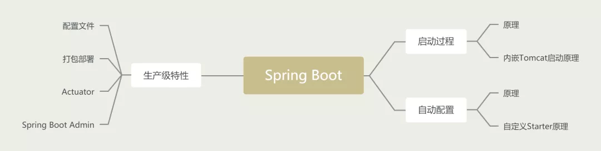
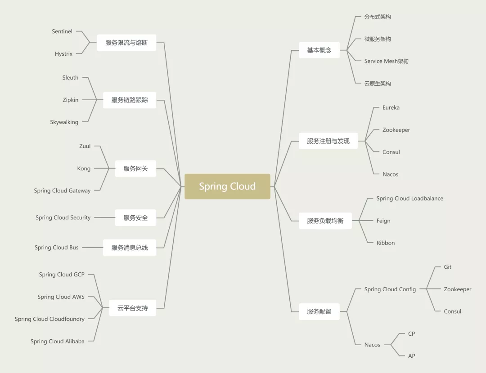
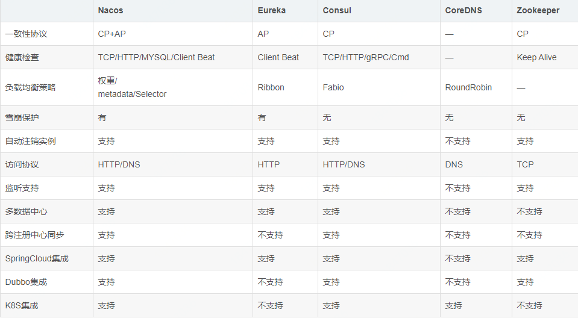

## SpringBoot主要是为了简化使用 Spring 框架的难度，简省繁重的配置。
Spring Boot提供了各种组件的启动器（starters），开发者只要能配置好对应组件参数，Spring Boot 就会自动配置，让开发者能快速搭建依赖于 Spring 组件的 Java 项目。

## 优点

- 独立运行
- 简化maven配置
- 自动配置
- 无代码生成和XML配置，借助注解完成
- 应用监控

## 缺点

- 需要非常了解核心原理，不然遇到问题很棘手，找问题无从下手
- 老spring项目很难迁移到SpringBoot框架，有一些XML配置无法通过配置实现，还有内置的tomcat等容器的调优也需要深入研究才可以。

## SpringBoot 启动过程？？

## SpringBoot自动装配原理

扫描所有具有`META-INF/spring.factories`的`jar`包

## 自定义starter的步骤？？

类添加`@Configuration`
也可以添加一些条件`@ConditionalOnClass` `@ConditionalOnMissingBean`

---
---
---

## SpringCloud

### Eureka 微服务注册与发现

### Actuator 微服务监控

### RestTemplate 服务器远程调用 

### Ribbon 客户端的负载均衡
- RoundRobinRule  默认是轮询
- WeightedRsponseTimeRule  权重值
- RandomRule  随机
- ZoneAvoidanceRule  以区域，可用的服务器为基础进行服务器的选择，使用Zone对服务器进行分类
- AvailabilityFilteringRule  是否可用性，在默认情况下连接失败3次，这个服务器就会被置为"短路"状态，这个状态将持续30秒。如果再连不上，那么这个状态的持续时间将会持续增加。

### OpenFeign 声明式服务调用  ——  dubbo

### Hystrix 微服务熔断、降级、资源隔离

### HystrixDashboard

### Zuul 微服务网关   ——  Spring Cloud Gateway

### Config 微服务配置中心

## Nacos

Nacos除了服务的注册发现之外，还支持动态配置服务。
动态监听配置更新 Listener

## 几个注册中心的比较

### Nacos ??
- 可选择 CP 或 AP，  **raft算法???**

### Eureka
- 一致性协议：AP

### Consul
- 一致性协议：CP

### Zookeeper
- 一致性协议：CP

## Hystrix

### Hystrix设计目标：

- 对来自依赖的延迟和故障进行防护和控制，这些依赖通常都是通过网络访问的。
- 阻止失败并迅速恢复
- 回退并优雅降级
- 提供近实时的监控与告警

### Hystrix遵循的设计原则：

- 防止任何单独的依赖耗尽资源（线程）
- 过载立即切断并快速失败，防止排队
- 尽可能提供回退以保护用户免受故障
- 使用隔离技术（例如隔板、泳道和断路器模式）来限制任何一个依赖的影响
- 通过近实时的指标，监控和告警，确保故障被及时发现
- 通过动态修改配置属性，确保故障及时恢复
- 防止整个依赖客户端执行失败，而不仅仅是网络通信

### Hystrix如何实现这些设计目标？

- 使用命令模式将所有对外部服务（或依赖关系）的调用包装在HystrixCommand或 HystrixObservableCommand对象中，并将该对象放在单独的线程中执行。
- 每个依赖都维护着一个线程池（或信号量），线程池被耗尽则拒绝请求（而不是让请求排队）。
- 记录请求成功，失败，超时和线程拒绝。
- 服务错误百分比超过了阈值，熔断器开关自动打开，一段时间内停止对该服务的所有请求。
- 请求失败，被拒绝，超时或熔断时执行降级逻辑。
- 近实时地监控指标和配置的修改。

---

Sentinel底层滑动时间窗限流算法？？

---