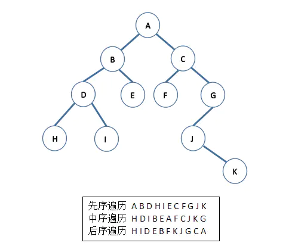

- 股票利润最大化

## DCL单例模式   Double Check Lock，双重检查锁定

```java
public class Singleton {
    private volatile static Singleton singleton;

    private Singleton(){}

    public static Singleton getInstance(){
        if (singleton == null) {
            synchronized (Singleton.class) {
                if (singleton == null) {
                    singleton = new Singleton();
                }
            }
        }
        return singleton;
    }
}
```


## 栈 的方法 ？？


---

## 二叉树遍历

(1) 前序遍历 若二叉树为空，则空操作，否则先访问根节点，再先序遍历左子树，最后先序遍历右子树。 
(2) 中序遍历 若二叉树为空，则空操作，否则先中序遍历左子树，再访问根节点，最后中序遍历右子树。
(3) 后序遍历 若二叉树为空，则空操作，否则先后序遍历左子树访问根节点，再后序遍历右子树，最后访问根节点。
(4) 层次遍历 




## 堆排序？？todo


## 二分查找


PriorityQueue
DelayQueue