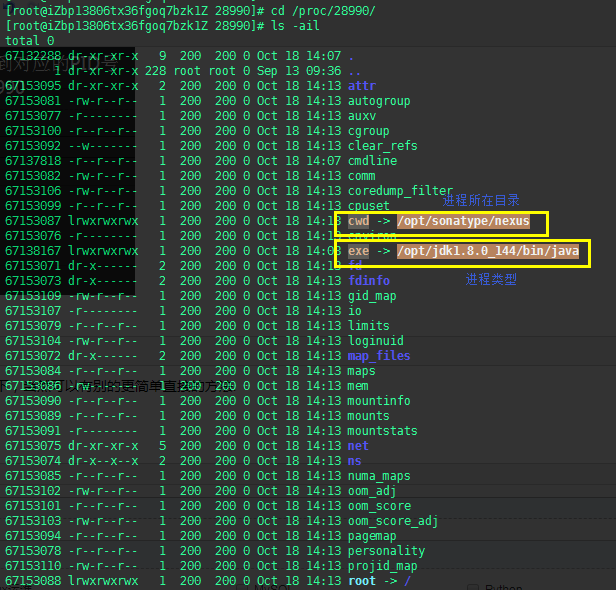

## 查看进程占用的端口号

ps -ef | grep qdp-monitor|grep -v grep|awk '{print $2}'

## 安装 ifconfig

apt-get install net-tools

## 安装ping

apt-get install inetutils-ping

或者 

apt-get install iputils-ping

### ping常用参数

- ping -n 10 github.com  默认情况下只发送4个数据包，-n 可以自定义发送的个数，通过返回的统计信息来衡量网络速度

- ping -l size github.com 默认情况下发送数据包的size=32byt，最大能发送65500byt。可指定发送包的size用于测试网速。

## 安装ip

apt-get install iproute2


## 查看IP

cat /etc/hosts


## 查看用户列表

cat /etc/passwd

## 查看用户组

cat /etc/group

## 查看端口占用

netstat -ano | findstr 22

## 查看端口占用

首先用lsof -i:80看下80端口被什么程序占用


## 查看linux网络流量
> iftop类似于top的实时流量监控工具，可以用来监控网卡的实时流量（可以指定网段）、反向解析IP、显示端口信息等。
查看流量是从哪些端口发送出去的：
iftop -P


## linux命令行终端设置tab补全文件名或路径不区分大小写（大小写不敏感）

在 inputrc 文件中增加一行配置

```
echo "set completion-ignore-case on">>~/.inputrc
```

当前用户重新登录后生效(不用重启)

当然了，这只是改变当前用户的操作配置，如果要改变全局（对所有用户都生效）的配置，需要在 /etc/inputrc 文件中增加相同的配置，重启后生效。

```
vim /etc/inputrc

# 增加一行新的配置

set completion-ignore-case on

# 退出编辑 :wq

reboot
```

在 ~/.inputrc 文件(我的ubuntu 默认没有此文件，我新建的)里面加上如下两行:

```
"\e[A": history-search-backward
"\e[B": history-search-forward
```

能够让你在命令行输入字符之后，就可以用方向键Up，Down来搜索以该串字符开头的历史命令。


## Linux强制踢出用户命令

- 输入w命令查看已登录用户信息（或者who）

```
登陆用户信息说明：

USER：显示登陆用户帐号名。用户重复登陆，该帐号也会重复出现。

TTY：用户登陆所用的终端。

FROM：显示用户在何处登陆系统。

LOGIN@：是LOGIN AT的意思，表示登陆进入系统的时间。

IDLE：用户空闲时间，从用户上一次任务结束后，开会记时。

JCPU：一终端代号来区分，表示在摸段时间内，所有与该终端相关的进程任务所耗费的CPU时间。

PCPU：指WHAT域的任务执行后耗费的CPU时间。

WHAT：表示当前执行的任务。
```

- 使用命令pkill -kill -t 用户

```
pkill -kill -t pts/2
```

## Linux中怎么通过PID号找到对应的进程名及所在目录

- 首先需要知道PID号，可以通过top命令获取

然后我们可以用ps看以下大致信息（ps出来的信息个人觉得比较乱，不是很方便查找）

```
# ps -aux |grep -v grep|grep 28990
```

- 当然可以有别的更简单直接的方法.

　　得知PID之后可以直接进入/proc/28990

再输入 `ls -ail`




## 查看目录下有多少个文件及文件夹

ls | wc -w


## 查看目录下有多少个文件

ls | wc -c

## 查看文件夹下有多少个文件，多少个子目录

ls -l |wc -l

若只想知道文件的个数，则需在终端输入

ls -l |grep ^-|wc -l

## 查看 Linux 版本

cat /etc/issue


## 查看文件夹大小

du -h --max-depth=1

## 文件大小排序

du -sh * | sort -hr


## 内存使用情况

df -h


## 设置ll命令时间显示格式

1. 若只是在当前终端那修改，可以执行
export TIME_STYLE='+%Y-%m-%d %H:%M:%S'，此方法仅在当前终端有效；
2. 若在当前用户并且长期有效，可以执行
echo "export TIME_STYLE='+%Y-%m-%d %H:%M:%S'" >> ~/.bash_profile && source ~/.bash_profile；
3. 如系统内全局生效，需要使用root或者sudo执行
sudo echo "export TIME_STYLE='+%Y-%m-%d %H:%M:%S'" >> /etc/profile && source /etc/profile


## 查看磁盘空间

df -h

#### 显示内容参数说明：

- Filesystem：文件系统
- Size： 分区大小
- Used： 已使用容量
- Avail： 还可以使用的容量
- Use%： 已用百分比
- Mounted on： 挂载点　
#### 相关命令：

+ df -hl：查看磁盘剩余空间
+ df -h：查看每个根路径的分区大小
+ du -sh [目录名]：返回该目录的大小
+ du -sm [文件夹]：返回该文件夹总M数
+ du -h [目录名]：查看指定文件夹下的所有文件大小（包含子文件夹）


du

du 命令用于查看当前目录的总大小：

- -s：对每个Names参数只给出占用的数据块总数。
- -a：递归地显示指定目录中各文件及子目录中各文件占用的数据块数。若既不指定-s，也不指定-a，则只显示Names中的每一个目录及其中的各子目录所占的磁盘块数。
- -b：以字节为单位列出磁盘空间使用情况（系统默认以k字节为单位）。
- -k：以1024字节为单位列出磁盘空间使用情况。
- -c：最后再加上一个总计（系统默认设置）。
- -l：计算所有的文件大小，对硬链接文件，则计算多次。
- -x：跳过在不同文件系统上的目录不予统计。
- -h：以K，M，G为单位，提高信息的可读性。


