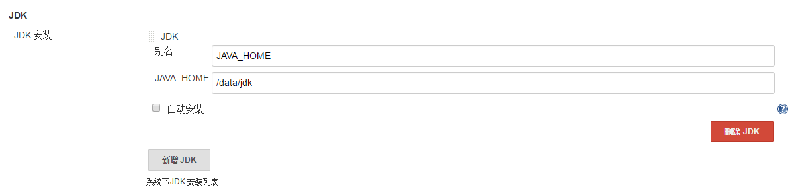
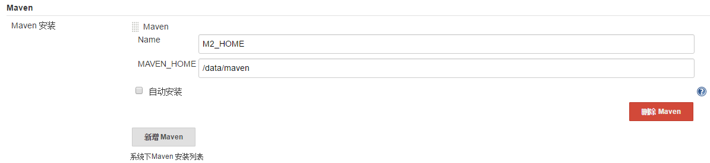
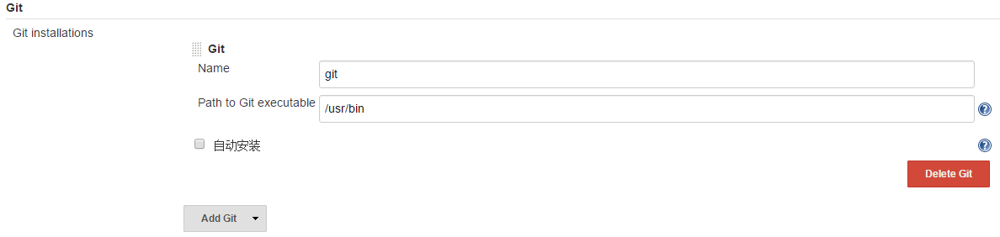

## 官网

[https://jenkins.io/](https://jenkins.io/)


# 删除jenkins 构建历史 jobs

```

rm -rf `find */builds/* -mtime +7 -type d`

```


## 初始化

cat /root/.jenkins/secrets/initialAdminPassword


## 安装插件

两种方式

- 在线

- 离线 

## 设置管理员账号

## 配置

系统管理——Global Tool Configuration

## 安装jdk



## 安装maven



## 安装git

apt-get install git

git --version




ssh-keygen -t rsa -C "zhaoshuxue@163.com" 

cat /root/.ssh/id_rsa.pub

第一次需要执行一次

git clone git仓库地址
根据提示yes即可


## 添加节点

现在


## 多种部署方式

- 脚本

- tomcat

## scm触发

