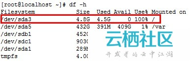
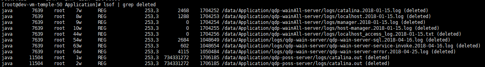
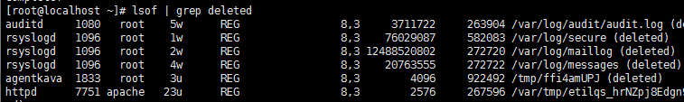

##  df -h

服务器硬盘满了。把日志文件都删掉了，可硬盘空间依旧满。于是df -h查看了下各个挂载点的状况（如下图）。



/dev/sda3占用了100%


**以下为该问题的解答：**

在apache/tomcat服务在运行状态下，清空了运行服务的日志，从而导致了/dev/sda3 满了的问题。一般情况下，大多数服务（包括脚本）在运行时，是不能删除当前正在写入的日志文件的。

**原理分析：**

1. 当前access.log日志正在被apache进程占用。
2. 通过rm命令删除access.log，实际只删除了文件名（该日志文件应用记数不为0，因此空间不会被释放）。
3. 通过rm命令删除了access.log后，apache依然写日志到access.log中，当开启apache进程时，已经通过access.log定位到该文件的inode了，就是说再写日志是不通过access.log，因此即使删除了access.log，apache依然写日志到access.log所在的inode节点，所以导致硬盘空间增加。
4. 因为删除了access.log，所以我们就找不到该文件了，du也查不到，就会出现硬盘满了但看不到究竟是哪些文件占用的。
（写的不甚详细，不明白的大家再google下。）

**解决方法：**

重启该日志文件的相关服务或程序，如：为apache日志文件则重启apache（如下图，重启后才硬盘空间占用正常）。


## 步骤

- 1. 安装lsof
```
yum install lsof
```

- 2. 通过lsof | grep deleted 查看到己删除但仍占用空间的文件句柄




- 3.发现rsyslog占用的最大，就把它重启了
```
service rsyslog restart
```
重启后原来/dev/sda3 18G占用了17.6G左右的空间释放出12G左右

空间被占用问题解决。


---
