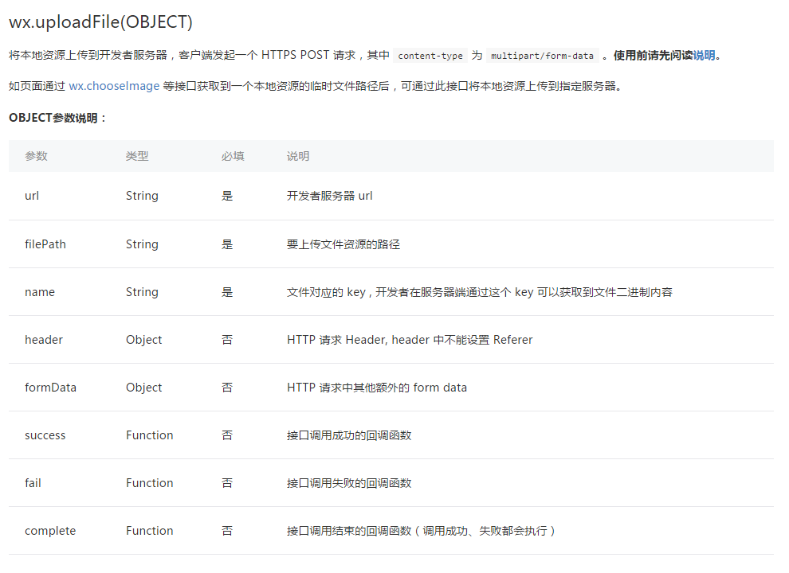
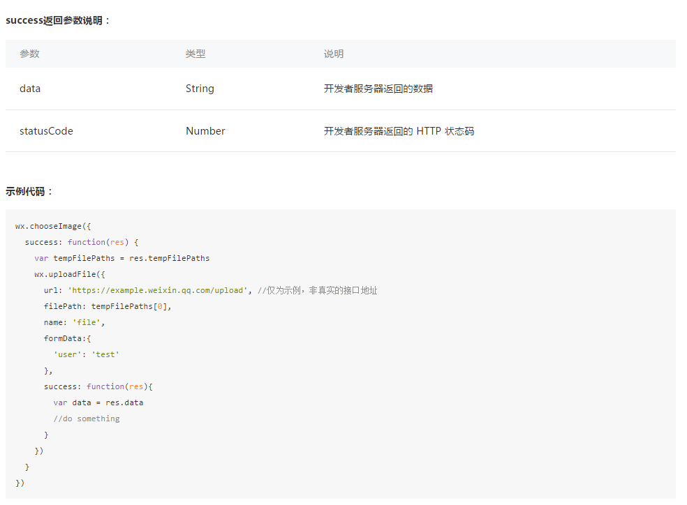
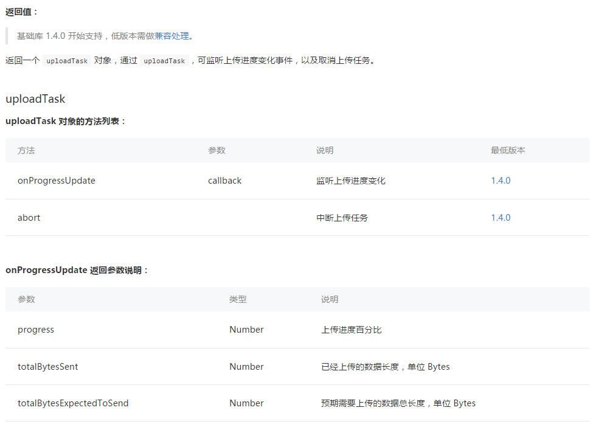

## 上传图片的方法

> 主要注意几个关键参数： url、filePath、name

filePath 是一个本地的文件资源路径，可以通过wx.chooseImage来获取，下面会有具体的示例

```
upload: function () {
    var that = this;
    wx.uploadFile({
      url: 'https://{{url}}/upload',
      filePath: that.data.imgSrc,
      name: 'tupian',
      formData: {
        'filename': 'test.png'
      },
      success: function (res) {
        var data = res.data
        if (data) {
            wx.showToast({
                title: '上传成功',
                icon: 'success',
                duration: 2000
            })
            that.setData({
              imgUrl: data
            })
        }
      }
    })
}
```  

## 后台接收文件的controller

这里是java的代码，其它语言请自行编写

```
@RequestMapping(value = "upload")
@ResponseBody
public String upload(
        @RequestParam(value = "tupian", required = true) MultipartFile file,
        HttpServletRequest request) {
    try {
        if (!file.isEmpty()) {
            String originalFilename = file.getOriginalFilename();
            String fileNameSuffix = originalFilename.substring(originalFilename.lastIndexOf("."));
//                统一为小写
            fileNameSuffix = fileNameSuffix.toLowerCase();
            String uuid = UUID.randomUUID().toString();
            String tempFileName = uuid + fileNameSuffix;

//              临时存储路径
            String videoPath = "/tmp/";
//              暂存
            file.transferTo(new File(videoPath + tempFileName));
//              临时文件
            File tempFile = new File(videoPath + tempFileName);

//              上传至文件服务器，并得到对应的url
            String url = "";
            return url;
        }
    } catch (Exception e) {
        e.printStackTrace();
    } finally {

    }
    return null;
}

```


## 选择图片并得到它的资源路径

```
choose: function () {
    var that = this;
    wx.chooseImage({
      count: 1, // 默认9
      sizeType: ['original', 'compressed'], // 可以指定是原图还是压缩图，默认二者都有
      sourceType: ['album', 'camera'], // 可以指定来源是相册还是相机，默认二者都有
      success: function (res) {
        // 返回选定照片的本地文件路径列表，tempFilePath可以作为img标签的src属性显示图片
        var tempFilePaths = res.tempFilePaths
        console.log(tempFilePaths)
        that.setData({
          imgSrc: tempFilePaths[0]
        })
      }
    })
  }

```  


## wxml布局文件


```

<button bindtap='choose' > 请选择一张图片 </button>
<image src='{{imgSrc}}'></image>
<button bindtap='upload' > 上传 </button>
<image src='{{imgUrl}}'></image>

```

## 页面的初始数据

```

data: {
    imgSrc: '',
    imgUrl: ''
}

```


## 下面是官方提供的api文档






---
