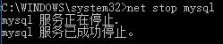
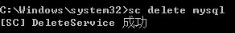
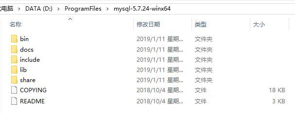
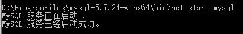
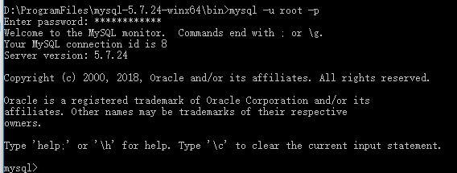

## 卸载MySQL

以管理员身份进入命令行：

- 1、停止mysql服务

```
net stop mysql
```


- 2、删除服务

继续输入命令：

```
sc delete mysql
```


- 3、删除相关注册表信息

打开运行（Win+R组合键）输入：`regedit` 进入注册表编辑器（在cmd下输入此命令也是可以打开的）

找到下面路径

```
\HKEY_LOCAL_MACHINE\SYSTEM\ControlSet001\services\eventlog\Application\MySQL
```

删除整个MySQL文件夹即可

至此，MySQL服务彻底清除干净了，可以重新安装了。

---

## 安装MySQL

> 这里安装的是5.7.24版本

### 下载和解压安装包

下载好zip压缩包，解压到磁盘的某个目录（注意路径不要有中文和空格），如下图：



### 添加环境变量

在系统环境变量PATH中，添加：
```
D:\ProgramFiles\mysql-5.7.24-winx64\bin
```

### 配置文件my.ini

在`D:\ProgramFiles\mysql-5.7.24-winx64`目录下新建一个文件，名为`my.ini`，内容如下：

```
[client]
# 设置mysql客户端的字符集
default-character-set=utf8

[mysqld]
port=3306
# 设置为MYSQL的安装目录
basedir=D:\ProgramFiles\mysql-5.7.24-winx64

# 设置为MYSQL的数据目录
datadir=D:\ProgramFiles\mysql-5.7.24-winx64\data

# 设置服务器段的字符集
character_set_server=utf8

# 允许最大连接数
max_connections=200

# 创建新表时将使用的默认存储引擎
default-storage-engine=INNODB
```

>  注意： my.ini文件的编码格式必须为 ANSI 格式。(以记事本方式打开该文件，另存为的方式，确认其是否为ANSI格式。否则后续会报错)

### 初始化MySQL

以管理员身份打开cmd，进入到mysql的bin目录，在该目录执行命令：

- 初始化数据库：
```
mysqld --initialize --console
```
输出结果如下：
```
D:\ProgramFiles\mysql-5.7.24-winx64\bin>mysqld --initialize --console
2019-01-11T14:27:56.035806Z 0 [Warning] TIMESTAMP with implicit DEFAULT value is deprecated. Please use --explicit_defaults_for_timestamp server option (see documentation for more details).
2019-01-11T14:28:00.397576Z 0 [Warning] InnoDB: New log files created, LSN=45790
2019-01-11T14:28:01.003477Z 0 [Warning] InnoDB: Creating foreign key constraint system tables.
2019-01-11T14:28:01.215578Z 0 [Warning] No existing UUID has been found, so we assume that this is the first time that this server has been started. Generating a new UUID: 19754c14-15ad-11e9-9d89-20474777652c.
2019-01-11T14:28:01.256898Z 0 [Warning] Gtid table is not ready to be used. Table 'mysql.gtid_executed' cannot be opened.
2019-01-11T14:28:01.264966Z 1 [Note] A temporary password is generated for root@localhost: gQ>oTe8BesH?
```
执行完成后，会输出 root 用户的初始默认密码，如：root@localhost: gQ>oTe8BesH?

**记住这个密码，需要用它登录，登录后记得修改它**

### 安装命令

输入：
```
mysqld install
```
输出：
```
D:\ProgramFiles\mysql-5.7.24-winx64\bin>mysqld install
Service successfully installed.
```

### 启动mysql

启动输入以下命令即可：
```
net start mysql
```


### 登录mysql

输入：
```
mysql -u root -p
```
然后输入上面的初始默认密码即可登录成功。


### 修改root密码

在mysql命令行输入下面的命令就能把root用户的密码改为`root`
```
mysql> set password for root@localhost = password('root');
Query OK, 0 rows affected, 1 warning (0.00 sec)
```


---
