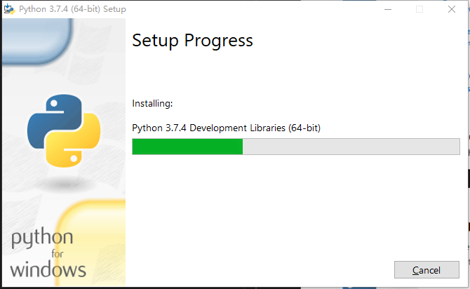
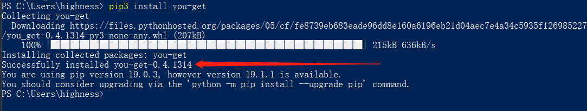

# 教你如何下载各大视频网站中的视频

平时看视频网站时，例如爱奇艺、优酷、腾讯、搜狐等，有可能想把视频下载到本地的需要，但一般这些网站不提供下载功能，即使像爱奇艺优酷这样提供下载功能的，也只能安装它们的客户端后在客户端里面才能看，所以这里教大家如何使用you-get一个简单的小工具，即可下载市面上所有视频网站上的视频。

you-get是基于Python的视频下载工具，所以首先我们需要安装Python的运行环境。

## 安装Python

> Python是一款跨平台编程语言，Windows以及Mac OS下都可以使用，这里用Windows10做演示

在浏览器打开Python的官网下载地址，
[https://www.python.org/downloads/windows/](https://www.python.org/downloads/windows/)
在这个页面我们可以看到很多下载链接，首先要选择适合自己系统的版本，（在我的电脑——属性里面可以查看系统是多少位的操作系统），然后选择 `executable installer` 这个可执行的安装包，下载到本地。


下载后得到如下图所示的安装文件，双击启动安装程序


可以看到如下图的安装界面，如果不需要指定安装目录，可以直接选择`Install Now`。如果需要自定义安装目录则点击下面的`Customize installation`，进入下一步安装操作。

**注意最好把最下面的`Add Python 3.7 to PATH`勾选上，这样会把python加入到系统环境变量，不需要再手动进行设置了。**


在这一步中是否全部勾选上，其中第二个pip一定要勾选，后面需要它安装you-get。全部勾选上后点击`Next`进入下一步操作。


在这个界面可以在红框的位置修改Python的安装目录，修改完毕后点击`Install`开始安装。


如下图，等待安装完成


安装程序结束后，会出现如下界面，点击红框中的`Disable path length limit`，在弹出框点击确认后，最后点击右下角`Close`即完成了安装。


### 接下来检查一下Python是否安装成功

打开cmd（命令提示符）或者powerShell， 在键盘上按 `Win键+R键`打开运行，输入cmd或者powerShell后点击确定，如下图


在打开界面中输入`python`，出现如下图所示的字样即表示python安装成功。


在`>>>`后面输入 `quit()` 便可以退出python运行命令（如上图）。


## 安装you-get

在powerShell命令行中，输入`pip3 install you-get`，如下图所示



等待安装完成，出现图中的 `Successfully installed` 字样，you-get便安装成功了。

## 下载视频

打开爱奇艺随便找一个视频，打开播放页面，如下图所示


把浏览器地址栏中的视频播放地址复制出来，
[https://www.iqiyi.com/v_19rs1t6ues.html](https://www.iqiyi.com/v_19rs1t6ues.html)

**注意，不要复制后面的一长串字母，就到.html即可**

首先在powerShell里输入下面的命令：

```
you-get -i https://www.iqiyi.com/v_19rs1t6ues.html
```

这样便可以得到视频的各种信息，像图中红圈圈住的是 代表不同的清晰度，还有提示了各个清晰度的下载的命令。


在powerShell中输入下面的命令，即可开始下载视频

```
you-get --format=TD https://www.iqiyi.com/v_19rs1t6ues.html
```

默认下载视频到当前执行命令的目录。像这里就是 `C:\Users\highness`。
当然可以指定下载目录，在原先的命令中添加`-o 指定目录`，如下命令会把视频下载到D盘的video文件夹下面。

```
you-get --format=TD -o D:/video https://www.iqiyi.com/v_19rs1t6ues.html
```

最后只需要等待下载完成即可。


最后总结一下，
- 首先，找到要下载视频的网址，注意不要复制html后面跟的那一大串字母
- 然后执行命令：`you-get -i 视频网址` ，得到视频播放信息，选择要下载的清晰度格式
- 接着执行命令：`you-get --format=清晰度格式 -o 视频存放目录 视频网址` ，即可把视频下载到本地指定目录

所以，使用you-get下载视频很简单，只需要执行两步命令就行了，而且you-get支持几乎所有的视频网址，下图罗列了支持的网站。


另外you-get还可以下载图片、mp3等，更多有趣的功能如果感兴趣的话可以访问：

[https://github.com/soimort/you-get](https://github.com/soimort/you-get)

---

最后说一下，有时候发现执行下载命令报错的问题，一般原因都是you-get需要升级到最新版本即可解决这个问题。
升级命令如下：

```
pip3 install --upgrade you-get
```


---

最后再推荐一个最近发现的一个下载工具`Annie`

> Github地址是：[https://github.com/iawia002/annie](https://github.com/iawia002/annie)


可以在这里[https://github.com/iawia002/annie/releases](https://github.com/iawia002/annie/releases)下载最新的Windows可执行文件。

下载后解压可得到下面exe文件。


下载视频很简单，只需要powerShell切换到annie.exe所在的文件夹，然后执行下面命令即可，视频会自动下载到当前目录。

`annie 视频网址`


好了，如何下载视频网站中的视频的教程到此就结束了，最后悄悄的告诉大家，you-get还可以下载需要VIP才能看的视频哦。