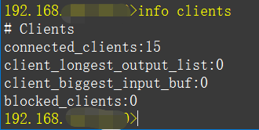

## redis显示中文

redis-cli.exe --raw


## 查询key过期时间

keys *          --查询所有key
type keyname    --查询一个key的类型
ttl keyname     --查询一个key的过期剩余秒数，-1表示没有过期时间，-2表示没有这个keyh
pttl keyname    --查询一个key的过期剩余毫秒数
persist keyname --移除key的过期设置


expire keyname seconds                 -- 设置一个key在当前时间"seconds"(秒)之后过期。返回1代表设置成功，返回0代表key不存在或者无法设置过期时间。
pexpire keyname milliseconds           -- 设置一个key在当前时间"milliseconds"(毫秒)之后过期。返回1代表设置成功，返回0代表key不存在或者无法设置过期时间。
expireat keyname timestamp             -- 设置一个key在"timestamp"(时间戳(秒))之后过期。返回1代表设置成功，返回0代表key不存在或者无法设置过期时间。
pexpireat key milliseconds-timestamp   -- 设置一个key在"milliseconds-timestamp"(时间戳(毫秒))之后过期。返回1代表设置成功，返回0代表key不存在或者无法设置过期时间　


setex key "seconds" "value"            -- SETEX在逻辑上等价于SET和EXPIRE合并的操作，区别之处在于SETEX是一条命令，而命令的执行是原子性的，所以不会出现并发问题。


---

client list
命令用于返回所有连接到服务器的客户端信息和统计数据。

```
命令返回多行字符串，这些字符串按以下形式被格式化：

每个已连接客户端对应一行（以 LF 分割）
每行字符串由一系列 属性=值 形式的域组成，每个域之间以空格分开
以下是域的含义：

addr ： 客户端的地址和端口
fd ： 套接字所使用的文件描述符
age ： 以秒计算的已连接时长
idle ： 以秒计算的空闲时长
flags ： 客户端 flag
db ： 该客户端正在使用的数据库 ID
sub ： 已订阅频道的数量
psub ： 已订阅模式的数量
multi ： 在事务中被执行的命令数量
qbuf ： 查询缓冲区的长度（字节为单位， 0 表示没有分配查询缓冲区）
qbuf-free ： 查询缓冲区剩余空间的长度（字节为单位， 0 表示没有剩余空间）
obl ： 输出缓冲区的长度（字节为单位， 0 表示没有分配输出缓冲区）
oll ： 输出列表包含的对象数量（当输出缓冲区没有剩余空间时，命令回复会以字符串对象的形式被入队到这个队列里）
omem ： 输出缓冲区和输出列表占用的内存总量
events ： 文件描述符事件
cmd ： 最近一次执行的命令
```


查看redis当前连接数: info clients




## 统计key的总数

redis-cli keys "*" | wc -l

---

