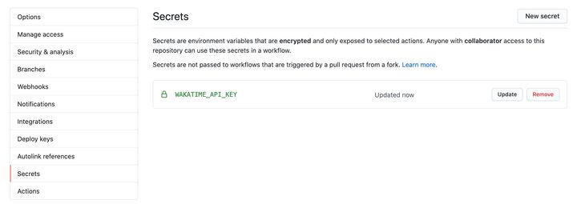

## 仓库统计信息


注意将 username 后面的参数改为自己的用户名。


## 使用徽标

可以在  https://shield.io  搜索


## 编码统计

利用 GitHub Action + WakaTime 

### 在github仓库的 `Settings/Secrets` 添加 wakatime 的apiKey，我这里命名为 WAKATIME_API_KEY。



### 新建一个 Action，粘贴下面的代码：

```YAML
name: Waka Readme

on:
  push:
    branches: [ main ]
  schedule:
    - cron: "55 12,20-23 * * *"

jobs:
  update-wakatime:
    name: test
    runs-on: ubuntu-latest

    steps:
      - uses: athul/waka-readme@master
        with:
          WAKATIME_API_KEY: ${{ secrets.WAKATIME_API_KEY }}
          BLOCKS: ⚪⚫
```

创建好后，GitHub 会根据 cron 配置的定时任务，定时运行上面的 Action，更新 README。