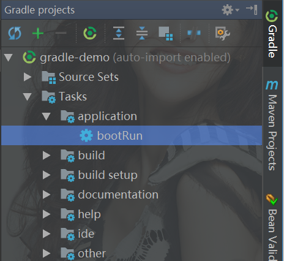

## 下载地址

http://services.gradle.org/distributions

## windows安装

下载好的文件 gradle-4.6-bin.zip 解压

在环境变量里面配置


GRADLE_HOME=解压包地址

然后把 %GRADLE_HOME%\bin  添加到环境变量PATH里面


在cmd里面输入 gradle -v 检查是否配置成功


> 需要注意的是，gradle会在当前用户的文件中生成一个.gradle目录(C:\Users\account_name\.gradle)，如果该目录已存在可能会导致配置失败

## gradle替换国内仓库

如果gradle仓库连接慢,可以通过改变连接的地址提高效率,方法是在C:\Users\“你的用户”\ .gradle 下创建init.gradle文件,内容如下:

```
allprojects{  
  repositories {  
    def REPOSITORY_URL = 'http://maven.aliyun.com/nexus/content/groups/public/'  
      all { ArtifactRepository repo ->  
        if(repo instanceof MavenArtifactRepository){  
          def url = repo.url.toString()  
          if (url.startsWith('https://repo1.maven.org/maven2') || url.startsWith('https://jcenter.bintray.com/')) {  
            project.logger.lifecycle "Repository ${repo.url} replaced by $REPOSITORY_URL."  
            remove repo  
          }  
       }  
    }  
    maven {  
      url REPOSITORY_URL  
    }  
  }  
}

```

##

- 编译

在项目根目录下，命令行执行   gradle build 进行编译

编译成功后输出build successful

- 启动

在命令行中输入 gradle bootrun 进行启动项目

或者在idea里面

也可以使用左侧的 gradle 中 Task 下的 application 中的 bootRun 按钮启动




## 遇到的错误

idea gradle构建项目报错 Unsupported major.minor version 52.0. Please use JDK 8 or newer

升级了idea2017，jdk8，使用gradle一直报错，困扰了半天。

org/jetbrains/kotlin/kapt/idea/KaptGradleModel : Unsupported major.minor version 52.0. Please use JDK 8 or newer.

解决办法file-setting，搜索gradle 把gradle的jvm改为jdk8，就ok了


---

- 参考文章：

- https://blog.csdn.net/u013360850/article/details/53166043

- https://blog.csdn.net/u013360850/article/details/53415005

- idea gradle构建项目报错 Unsupported major.minor version 52.0. Please use JDK 8 or newer - CSDN博客
https://blog.csdn.net/zpz_123123/article/details/79149658

- **重点推荐** 使用 IntelliJ IDEA + Gradle + SpringBoot 搭建Hello World工程 - CSDN博客
https://blog.csdn.net/ywfyywq/article/details/71055044

---


## Gradle下载的依赖jar包路径位置
Mac系统默认下载到：C:/Users/(用户名)/.gradle/caches/modules-2/files-2.1
Windows系统默认下载到：C:\Users\(用户名)\.gradle\caches\modules-2\files-2.1