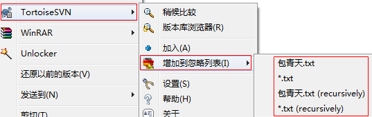

## 忽略文件

TortoiseSVN → Unversion and add to ignore list,取消版本控制并添加至忽略列表.

2.添加至忽略列表

　　　　在根目录建立server.xml 和common目录,此时有两种忽略方式,

　　　　i.本地忽略方式,不体现到整个SVN项目团队中.

　　　　　　　　使用SVN客户端的全局忽略样式 ,右键->设置->全局忽略样式  ,此时该两种文件仍然以问号文件的样式显示,但是在SVN提交时,这些文件会被忽略,不会体现在未控制版本的文件列表中.

　　　　ii.全局忽略方式,即服务端忽略方式,体现到整个SVN项目团队中

　　　　　　　　右键->增加至忽略列表->server.xml(recursively),此种方式会与服务端同步,整个团队的所有人将会同步此忽略,所有该两种文件会以忽略图标的样式显示.

 

---