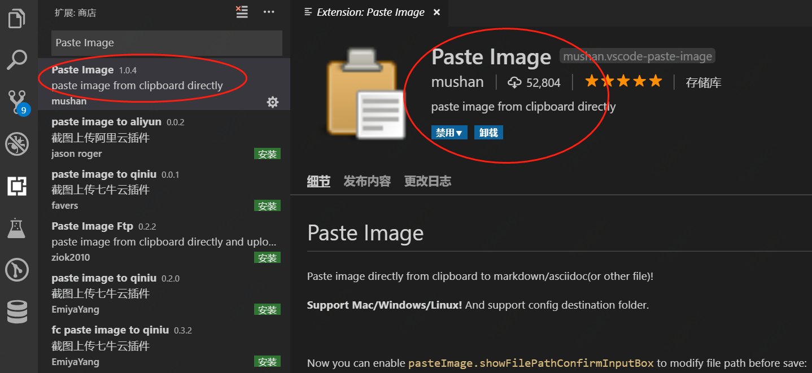

日常用vscode写markdown时可能会需要添加截图，这时一般的做法有两种，

- 一种是把图片上传到图床，然后把图片链接写到 ``里
- 另一种是，把图片保存到本地某个目录下，使用相对路径添加图片

这两种方式操作起来都比较麻烦，因为都需要先把截图保存下来，所以有没有类似qq，wechat那种可以直接使用截图的方式呢，最后发现了Paste Image这个插件。

在插件商店搜索“Paste Image”，安装好这个插件后，截好图后，默认按下`Ctrl+Alt+V`就能把截图添加到md文档里面了。
> Type: "Paste Image" or you can use default keyboard binding: Ctrl+Alt+V (Cmd+Alt+V on Mac).

图片会默认保存在当前编辑文档的所在目录，当然你也可以自定义路径，如下

文件——首选项——设置——搜索“Paste Image” 

- 修改 `Paste Image: Path` 可以设置图片的保存路径，我这里设置的是`${currentFileDir}/img`，即在当前文档目录下再创建一个名为img的文件夹，所有的截图存在这个img文件夹下。如果img文件夹不存在会自动创建的。
- 修改 `Paste Image: Name Prefix` 给图片添加一个前缀，主要是个人习惯了，方便以后整理。 

此外还可以设置 截图保存文件名称 `Paste Image: Default Name` ，默认是年月日时分秒。

至此，利用Paste Image插件可以把截图直接添加到markdown里面了。

