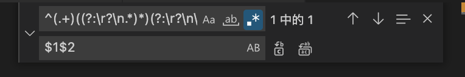
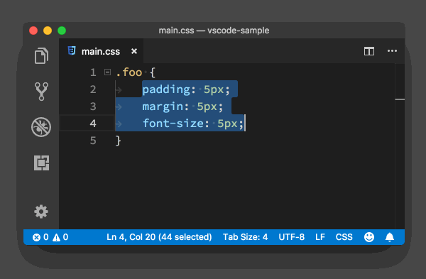

## 去除空行的正则表达式

按下ctrl+h键进行正则匹配：^\s*(?=\r?$)\n


## 去除重复行

在查找框输入正则表达式：^(.+)((?:\r?\n.*)*)(?:\r?\n\1)$

在替换框输入：$1$2




## 行排序
命令行 搜索 “按升序排列行” “按降序排列行”




## 相同内容多选 并同时编辑

选中，然后 Crtl + Shift + L

## 不同工作空间设置不同主题

vscode同时打开多个工作空间，相同的主题容易搞混，可以设置成不同的主题

1. File → Preferences → Settings
2. 搜索color theme
3. 选择Workspace标签
4. 选择喜欢的主题


---

## 时序图

先安装插件Markdown Preview Enhanced

```sequence
title: sequence
```

```plantuml
@startuml

title: 时序图demo

participant AAA
participant BBB as B
participant CCC as D


# 注释

AAA -> B:

@enduml
```


