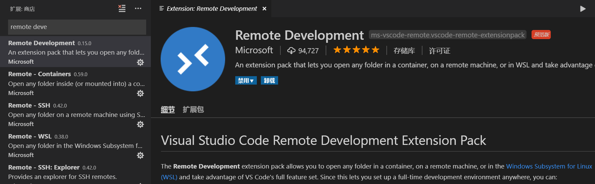
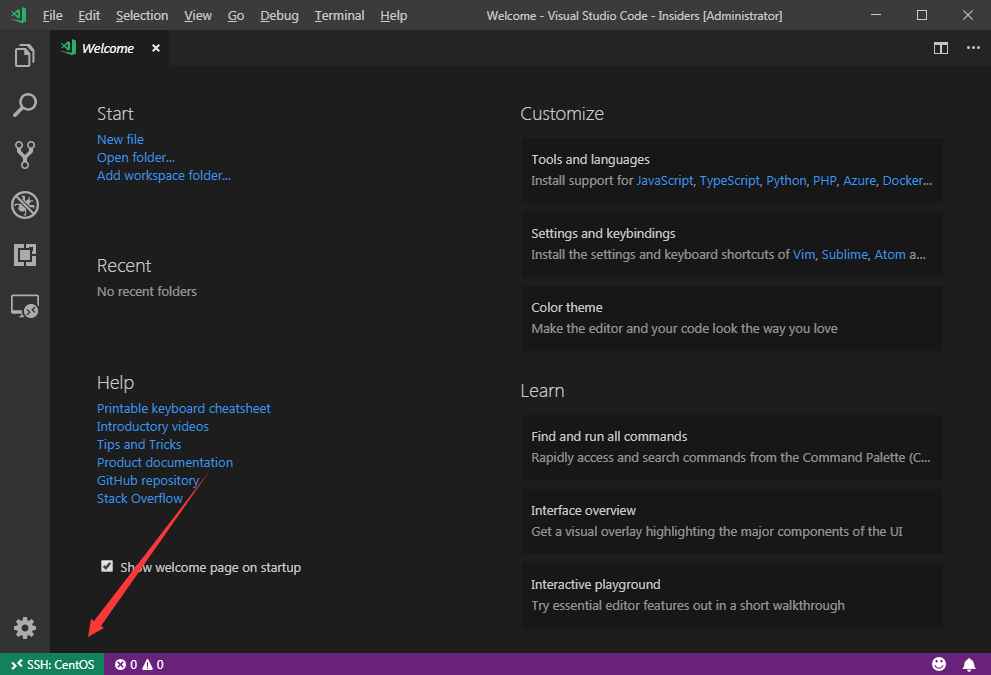
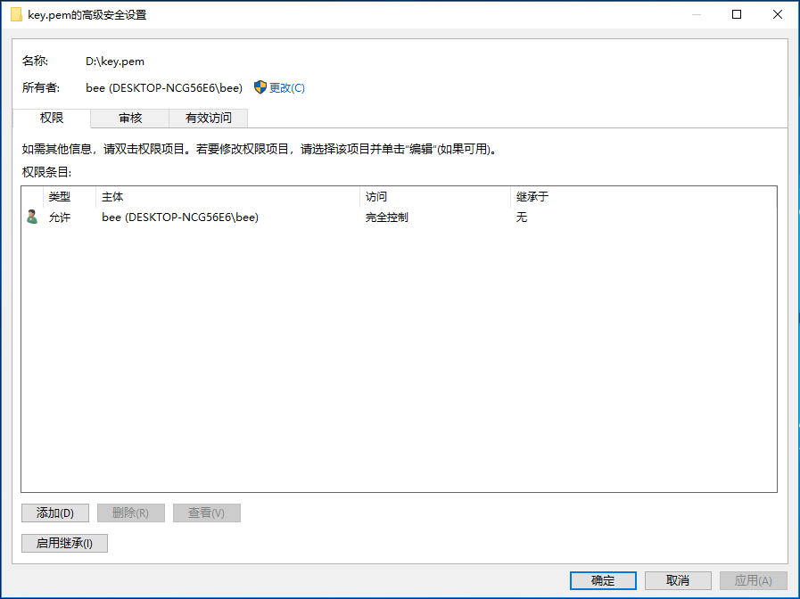

## 添加 Remote Development 插件




## 配置服务器

服务器信息 
Ubuntu 18.10 
IP 192.168.0.111
User root

### 安装openssh-server

apt-get install openssh-server
启动ssh
service ssh start
修改root密码
passwd
这里假设密码是123456

## 配置ssh免登录

- 用ssh-keygen生成秘钥

执行ssh-keygen
然后输入`vscKey`，因为我机器~/.ssh/目录下已经配置了git的密匙，所以改名`vscKey`。

- 把秘钥上传服务器的~/.ssh目录下

scp vscKey.pub root@192.168.0.111:~/.ssh/

# 指定端口号
scp vscKey.pub -p 22 root@192.168.0.111:~/.ssh/

第一次需要确认，输入yes，然后再输入上边设置的密码123456。

- 把公钥加入到authorized_keys文件中

登录服务器
ssh root@192.168.0.111

cd ~/.ssh/
cat vscKey.pub >> authorized_keys

退出服务器，

执行命令即可实现ssh免登录

ssh -i vscKey root@192.168.0.111

## 配置Remote SSH


- 设置 "remote.SSH.showLoginTerminal": true


Ctrl+Shift+p 在命令面板输入 remote-ssh,选择 Remote-SSH:Settings
点击勾选


- 配置ssh_config

Ctrl+Shift+p 在命令面板输入 remote-ssh,选择 Remote-SSH:Open Configuration File...
选择一个文件进行编辑

Host后面填服务器名称(想填什么就填什么)
HostName后面填远程主机的IP地址或域名
User后面填远程主机的用户(用户必须能用ssh登录)
Port 指定端口号，默认为22
IdentityFile 私钥路径

```
# Read more about SSH config files: https://linux.die.net/man/5/ssh_config
Host ubuntu
    HostName 192.168.0.111
    User root
    IdentityFile C:\ProgramData\ssh\vscKey
```

保存


连接


左下角出现SSH: <Host>就表示连接到了远程主机



## 其它

### 最后连接时可能会出现`Load key ****** bad permissions`这样的错误提示
原因是vscKey秘钥文件权限问题导致的。
**修改秘钥文件权限**
- 右键vscKey秘钥文件->属性->安全->高级
- 1.把所有者改为当前用户(如果是当前用户就不用管了)
- 2.禁用继承->从此对象中删除所有已继承的权限
- 3.添加当前用户, 并设置访问类型为完全控制
最终的效果如截图 



参考文章：

https://blog.starunity.dev/2019/05/08/remote-ssh-configure/

https://blog.csdn.net/engineer520/article/details/82714696

https://superuser.com/questions/1296024/windows-ssh-permissions-for-private-key-are-too-open


---