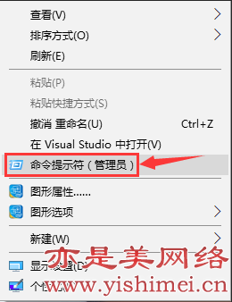
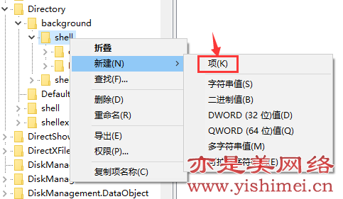
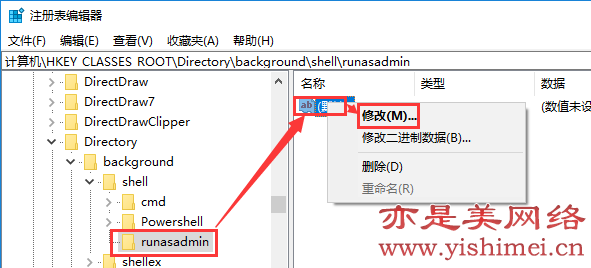
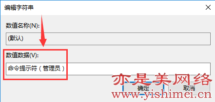
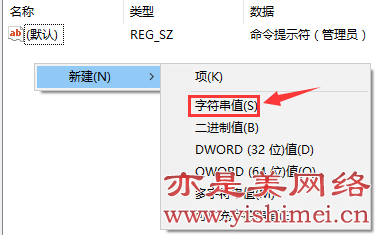
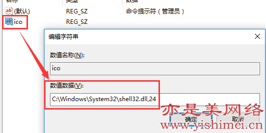
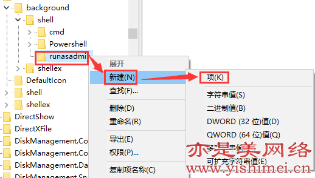
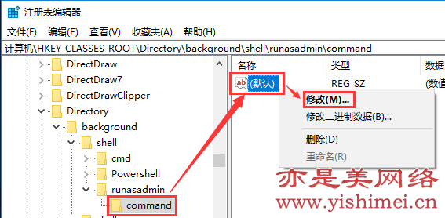

说起命令提示符，在最早的图形化windows系统开始就有了，无论是winxp还是win7/8/10，或者是Windows服务器系统，一直被大家使用着，命令提示符也确实给我们带来了不少方便，但是随着win10系统版本的更新，微软居然想要把命令提示符慢慢的给弱化，然后使用Windows powershell取而代之，因为我们右键点击win10开始菜单之后，出现的不是命令提示符，而是Windows powershell，虽然后者命令更丰富、功能更强大，但是对于习惯了使用命令提示符的我们来说，这是不可容忍的，为了解决这一问题，亦是美网络小编就给win10系统的右键菜单添加了命令提示符（管理员）选项，下面给大家说明。

首先给大家看下效果图：

OK，下面给大家介绍添加方法，

首先我们按下win+R组合键打开运行窗口，输入regedit后回车打开注册表，然后依次在注册表找到HKEY_CLASSES_ROOT\Directory\background\shell，我们右键点击“shell”，选择“新建”-“项”，

建立好以后，我们将新建的项名称命名为runasadmin，接着我们单击runasadmin，然后在右边用右键点击“默认”，选择“修改”，如下图：

点击“修改”后，弹出“编辑字符串”对话框，如下图所示，

我们在“数值数据”处填写命令提示符（管理员），然后点击“确定”。

接下来在右边空白处点击右键，“新建”-“字符串值”，如下图所示，

建立好以后给字符串值命名为ico，然后我们右键点击ico，选择“修改”，弹出如下图，

我们在“数值数据”处输入C:\Windows\System32\shell32.dll,24，然后点击“确定”。

说明：其实添加ico这一步可以省略，这一步的目的就是给命令提示符（管理员）前面添加个ico图标，见图一。

接下来我们用鼠标右键点击runasadmin，选择“新建”-“项”，如下图所示，

我们给新建的项命名为command，然后单击选中command，在右边用鼠标右键点击“默认”，选择“修改”，如下图，

然后在弹出的“编辑字符串”界面中，在“数值数据”处输入cmd.exe /s /k pushd "%V"，然后点击“确定”按钮，如下图所示，

OK啦，现在你可以回到桌面或者其他任何一个文件夹的空白处，点击右键，看看右键菜单中是否多出一项“命令提示符（管理员）”呢？！

其实，要实现以上步骤，只需要几句命令就可以了，为什么亦是美网络小编要一步一步的介绍给大家呢，一是锻炼大家的动手能力，二是在操作过程中认识到为什么要这样做，好了，下面给大家分享一个等效的操作方法：

Windows Registry Editor Version 5.00

[HKEY_CLASSES_ROOT\Directory\Background\shell\runas]

@="命令提示符（管理员）"  

"icon"="C:\\Windows\\System32\\shell32.dll,24"     

[HKEY_CLASSES_ROOT\Directory\Background\shell\runas\command]

@="cmd.exe /s /k pushd \"%V\""  

只需将以上命令复制到记事本，然后将记事本保存为后缀名为.reg的注册表格式，再双击直接导入注册表即可。

