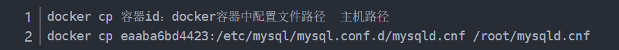
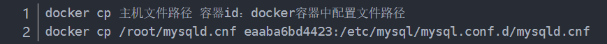

## docker build

使用当前目录的Dockerfile创建镜像。
docker build -t com/ubuntu:zsx .
注意最后一个点，表示当前目录下的Dockerfile

	docker build -t ubuntu:zsx .

## docker容器设置自动启动

### 启动时加--restart=always

```
docker run -tid --name ubuntu -p 8081:8080 --restart=always ubuntu


Flag	Description
no		不自动重启容器. (默认value)
on-failure 	容器发生error而退出(容器退出状态不为0)重启容器
unless-stopped 	在容器已经stop掉或Docker stoped/restarted的时候才重启容器
always 	在容器已经stop掉或Docker stoped/restarted的时候才重启容器
```

### 如果已经启动的项目，则使用update更新：

```
docker update --restart=always ubuntu
```

## 删除镜像

强制删除本地镜像runoob/ubuntu:v4。

docker rmi -f runoob/ubuntu:v4

---

## 查看docker日志


docker logs -f -t --tail 行数 容器名

例如：查看mysql容器最后10行日志

docker logs -f -t --tail 10 mysql


## docker修改无法启动的容器的配置文件

> 修改了docker容器中的配置信息，由于配置文件写错，或者配置文件格式错误等原因，导致容器无法再次启动

### 方法一
docker容器的一些配置信息一般在var/lib/docker/overlay下面，我们到此目录找到对应的配置，修改后即可重新启动


### 方法二
把docker容器中的配置文件复制到主机中，然后再主机中修改，修改完成后再复制到docker容器中

- 1、复制docker容器的文件到主机中



- 2、修改配置文件中出错的部分

- 3、配置文件到docker容器中



- 4、重启容器

> 两种方法均可以解决容器在无法启动的情况下，修改容器中的配置文件。我比较喜欢使用第二种方法，主要知道是哪个配置文件即可复制到主机中，自由修改。


## --privileged

```
docker run --privileged=true
```

使用该参数，container内的root拥有真正的root权限。否则，container内的root只是外部的一个普通用户权限。


---