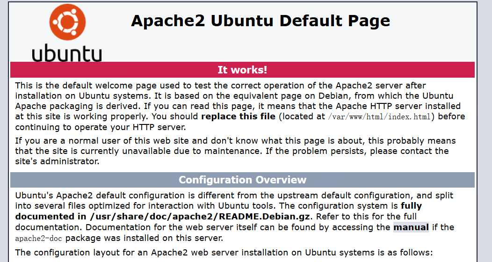
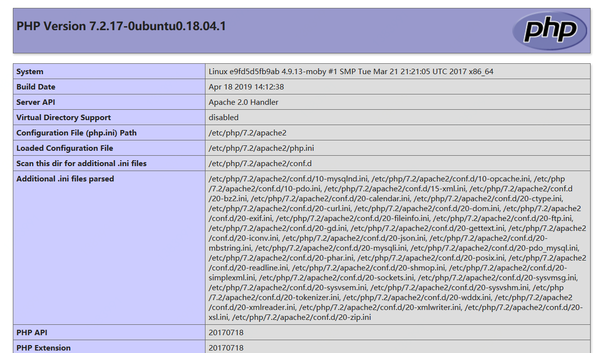

## 拉取

docker pull ubuntu:18.10

## 启动

docker run --name u1 -t -i -p 60022:22 -p 8080:8080 -p 8081:8081 -p 8082:8082 -p 8083:8083 -p 8084:8084 ubuntu:18.10 /bin/bash 

## 安装ssh

apt-get update

apt-get install openssh*

## 安装vi

apt-get install vim


## 修改root密码

passwd root

## 设置root用户可以ssh远程连接

- 修改 /etc/ssh/sshd_config :

vi /etc/ssh/sshd_config

- 注释掉 #PermitRootLogin without-password，添加 PermitRootLogin yes

# Authentication:
LoginGraceTime 120
#PermitRootLogin without-password
PermitRootLogin yes
StrictModes yes

- 重启 ssh  服务

service ssh restart
或者  sudo service ssh restart


## 使用传输文件的命令： rz  sz
需要安装：  apt-get install lrzsz

## 安装unzip

sudo apt-get install zip 或者 yum install -y unzip zip

## 安装Apache2

apt-get install apache2

查看Apache是否安装成功
apache2 –v

安装完毕后，可以使用以下命令：

- 开启、关闭和重启服务器

    + 1、/etc/init.d/apache2 start

    + 2、/etc/init.d/apache2 stop

    + 3、/etc/init.d/apache2 restart

这时可能会出现下面的错误，需要设置 ServerName。

```
root@e9fd5d5fb9ab:/# /etc/init.d/apache2  restart
 * Restarting Apache httpd web server apache2                                                            AH00558: apache2: Could not reliably determine the server's fully qualified domain name, using 172.17.0.4. Set the 'ServerName' directive globally to suppress this message
                                                                                                  [ OK ]
```

编辑 vim /etc/apache2/apache2.conf 文件，在第一行添加下面一行即可：
```
ServerName localhost:80
```

这时访问 http://localhost 就可以看到apache的页面



## 安装mysql

apt-get install mysql-server -y

- 修改密码


## 安装其它库

apt-get install curl
apt-get install wget


## 安装php

- 安装php7及其扩展
apt-get install php7.2 -y
apt-get install libapache2-mod-php7.2
apt-get install php7.2-mysql

- 安装组件支持

apt-get install php7.2-curl php7.2-json php7.2-cgi php-pear

- 最重要的一步是安装 apt-get install php7.2-gd  安装GD库

验证php安装成功

php -v

---
在 /var/www/html 目录下，创建一个index.php的文件，
vim /var/www/html/index.php

内容如下：
```
<?
    echo phpinfo();
?>
```
然后执行命令 service apache2 restart 重启apache服务，然后访问 http://localhost/index.php 即可看到php的安装信息界面。



# 安装Discuz

下载

把upload整个文件传到服务器上，copy到/var/www/html下

cp -r upload/* /var/www/html/bbs

浏览器访问  http://localhost/bbs， 可以看到安装向导。

*记得重启apache2*

### 开始给文件夹授权

设置目录权限

chmod -R 777 /var/www/html/bbs/config
chmod -R 777 /var/www/html/bbs/data
chmod -R 777 /var/www/html/bbs/uc_client
chmod -R 777 /var/www/html/bbs/uc_server

### 准备DB

登录MySQL数据库：mysql -u root -p，为Discuz!创建专用DB及用户，

mysql> CREATE DATABASE discuz;
mysql> GRANT all privileges on discuz.* TO 'discuz'@'localhost' IDENTIFIED BY 'discuz!123';
mysql> FLUSH PRIVILEGES;
mysql> exit


## 开始安装

在安装数据库界面填写上面创建的数据库信息

最后即可创建完成。


> 登录后，选择右上角 管理中心： 可以看到 Please delete install/index.php via FTP! 字样

这是为了防止再次安装，因此一般只需把”install“目录，修改为”install_bk"或其他名字即可，修改命令： 
mv  install  install_bk


---