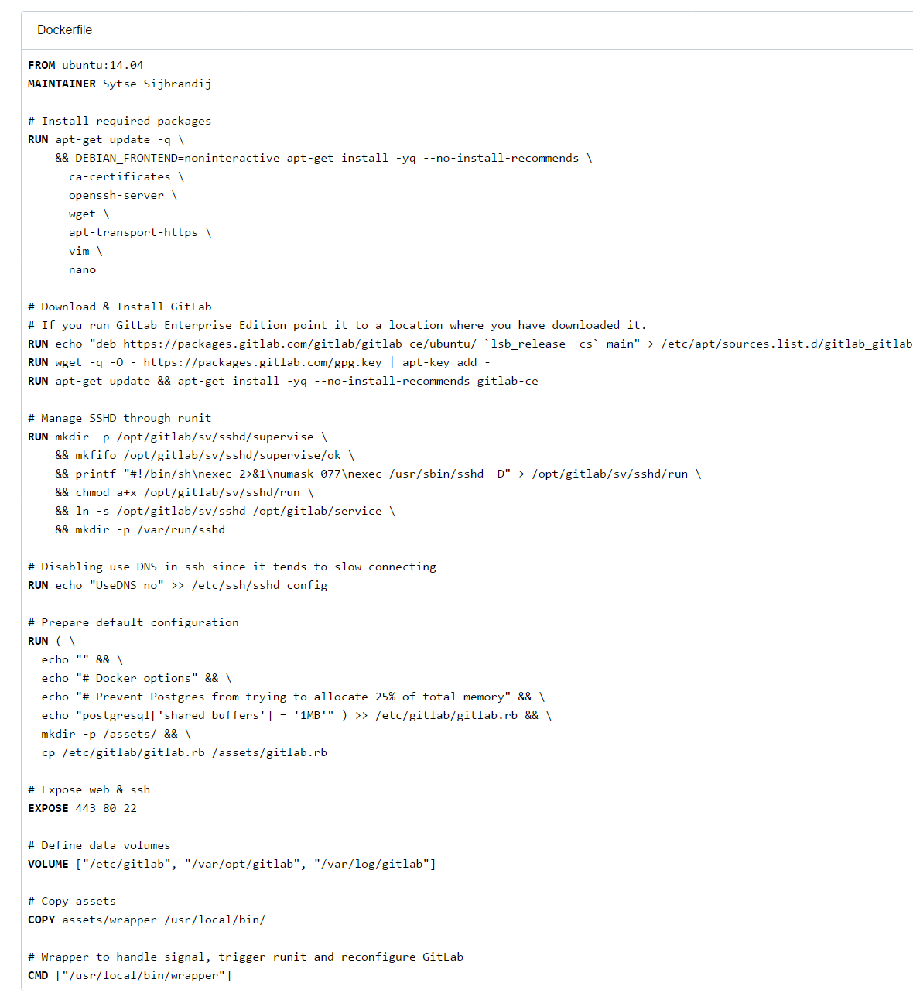

##

docker pull gitlab/gitlab-ce

docker run --name gitlab -t -i -p 60122:22 -p 60180:80 -p 60443:443 gitlab/gitlab-ce:latest /bin/bash

## 

根据dockerfile

默认用户名root
第一次需要设置密码

---

whereis gitlab

可以看到 /assert

进入该目录

执行

---

GitLab 项目创建后地址由Localhost改为实际IP的方法

vim /opt/gitlab/embedded/service/gitlab-rails/config/gitlab.yml

 host: localhost         >> 这里改为主机的IP即可

重启GitLab  

gitlab-ctl restart

---

GitLab用ssh免密钥认证确实很好用，只是配置的时候发现修改了ssh默认端口（22）

1、修改ssh端口（此步骤略过）
Port 端口
2、修改/etc/gitlab/gitlab.rb [gitlab.yml中的配置会被这个给覆盖]
 //在后面修改自己的ssh端口
 gitlab_rails['gitlab_shell_ssh_port'] = 21386
3、使其生效
gitlab-ctl reconfigure
默认是22端口，直接访问则不会出现端口的。）

---

ssh 端口改为了60122 

host 改为 localhost

要使用下面这种地址链接

git clone ssh://git@localhost:60122/zsx/weibotest.git