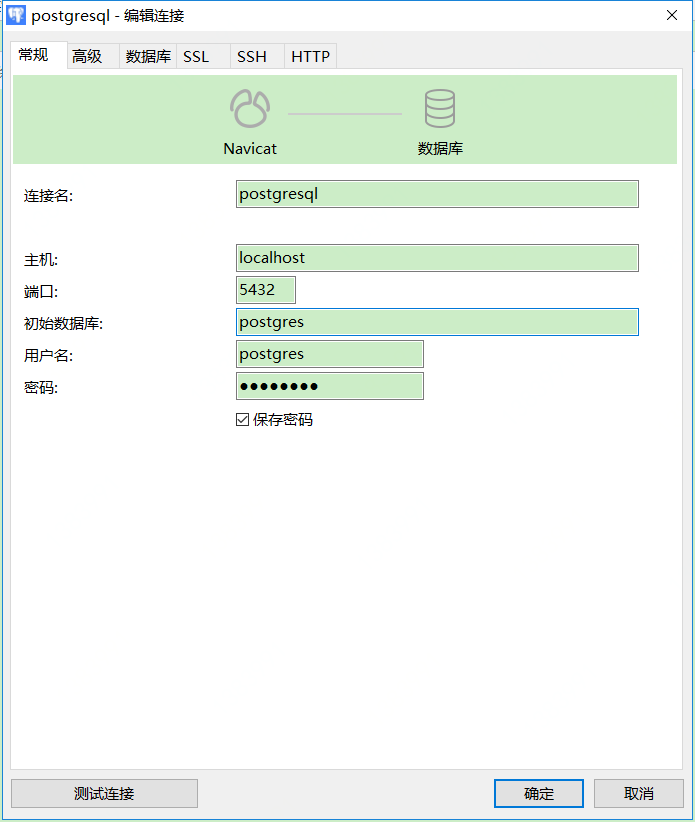

## 

docker run --name postgresql -t -i -p 60062:22 -p 5432:5432 centos:7 /bin/bash 

## 下面这种方式是为了防止报错： Failed to get D-Bus connection: Operation not permitted
docker run --privileged -ti --name postgresql -p 60062:22 -p 5432:5432 centos:7 /usr/sbin/init


然后  docker start postgresql 来启动

## 安装ssh


yum install openssh-server -y

## 开启ssh

systemctl start sshd.service
- 查看状态
systemctl status sshd.service
- 重启服务
systemctl restart sshd.service
- 开机自启
systemctl enable sshd.service


## 修改密码

passwd root

## 安装

打开，里面有Centos系统的安装步骤
https://www.postgresql.org/download/linux/redhat/


- 1.Select version:
- 2.Select platform:
- 3.Select architecture:
- 4.Install the repository RPM:

```
yum install https://download.postgresql.org/pub/repos/yum/reporpms/EL-7-x86_64/pgdg-redhat-repo-latest.noarch.rpm
```

- 5.Install the client packages:

```
yum install postgresql11
```

- 6.Optionally install the server packages:

```
yum install postgresql11-server
```

- 7.Optionally initialize the database and enable automatic start:

```
/usr/pgsql-11/bin/postgresql-11-setup initdb
systemctl enable postgresql-11
systemctl start postgresql-11
```


## 默认会创建一个名为postgres的用户

### 切换用户，执行后提示符会变成：`bash-4.2$`
su postgres
### 登录数据库，执行后提示符会变成：`postgres=#`
psql -U postgres
### 修改postgres用户的密码为123456
ALTER USER postgres WITH PASSWORD '123456'
### 退出
\q


```
[root@e258dab1cb90 bin]# su postgres
bash-4.2$ psql -U postgres
psql (11.4)
Type "help" for help.

postgres=# ALTER USER postgres WITH PASSWORD '123456'
postgres=# \q
bash-4.2$ exit
exit
[root@e258dab1cb90 bin]#
```

## 开启远程访问

vi /var/lib/pgsql/11/data/postgresql.conf
修改#listen_addresses = 'localhost'  为  listen_addresses='*'
当然，此处‘*’也可以改为任何你想开放的服务器IP

## 信任远程连接

vi /var/lib/pgsql/11/data/pg_hba.conf
修改如下内容，信任指定服务器连接
# IPv4 local connections:
host    all            all      127.0.0.1/32      trust
host    all            all      172.17.0.1/32（需要连接的服务器IP）  trust


## 重启服务即可

systemctl restart postgresql-11

## 客户端连接



# 卸载

yum remove postgresql*
