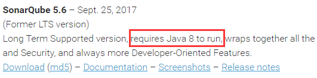
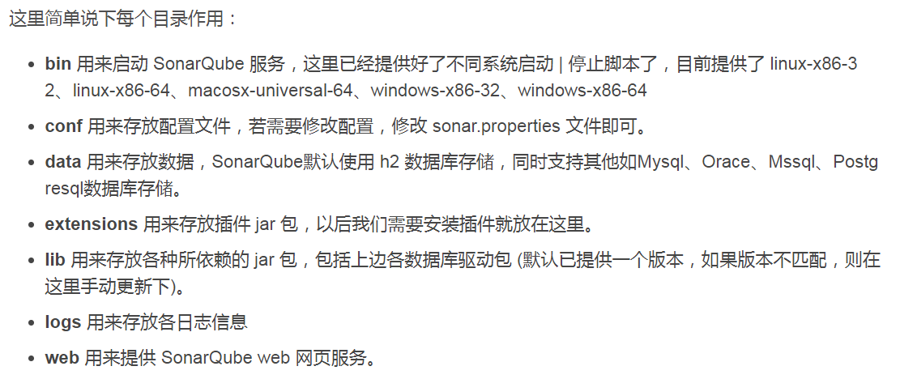
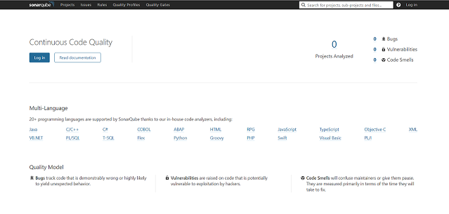
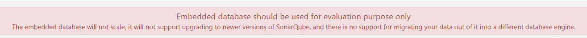
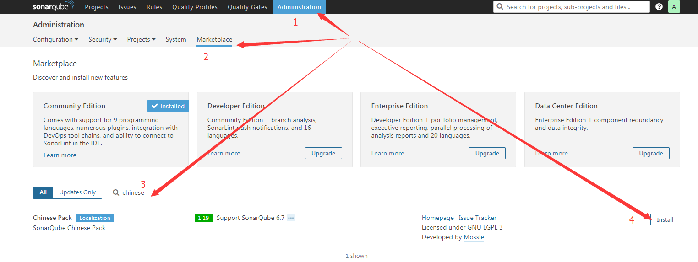
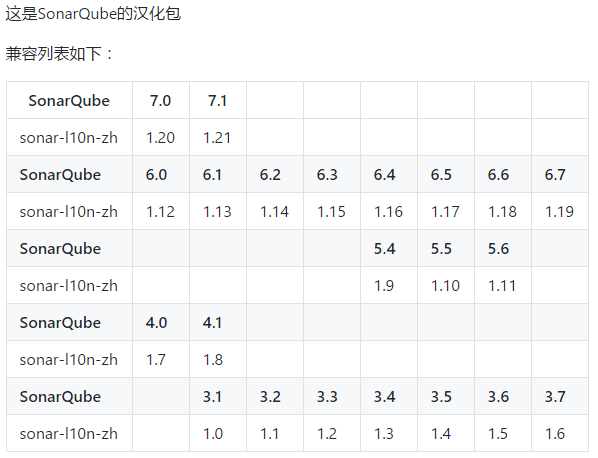

## 启动

docker run --name sonar -t -i -p 60026:22 -p 9000:9000 ubuntu:17.10 /bin/bash

## 安装ssh

apt-get update

apt-get install openssh*

## 安装vim等一系列命令


apt-get install vim zip iputils-ping net-tools


## 修改root密码

passwd root

## 设置root用户可以ssh远程连接

- 修改 /etc/ssh/sshd_config :

vi /etc/ssh/sshd_config

- 修改 #PermitRootLogin without-password
为 PermitRootLogin yes


- 重启 ssh  服务

service ssh restart

## 使用传输文件的命令： rz  sz
需要安装：  apt-get install lrzsz


## 安装java

- 上传jdk压缩包

- 设置环境变量

vim /etc/profile

>  export JAVA_HOME=/data/jdk
   export PATH=$PATH:$JAVA_HOME/bin

source /etc/profile
java -version


## 安装maven

- 上传压缩包
- 设置环境变量

vim /etc/profile

......
export M2_HOME=/data/apache-maven-3.5.2
export PATH=${M2_HOME}/bin:$PATH
......

使配置文件生效

source /etc/profile
mvn -version

## 安装Sonar

下载地址： https://www.sonarqube.org/downloads/



> sonar从5.6版本后就必须使用java8运行了，所以下载时需要注意版本，如果服务器安装的是jdk1.7，就下载5.5或者以前的版本。

> 如果你的服务器jdk版本是1.7，但还要用高版本sonar的话，可以修改sonar/conf/wrapper.conf，

wrapper.java.command=/sonar/jdk1.8.0_121/bin/java  //加入1.8jdk作为启动jdk


---

这里使用的是6.7.3版本。

下载下来的是一个压缩包`sonarqube-6.7.3.zip`，上传到服务器上

- 解压sonarqube-6.7.3.zip

unzip sonarqube-6.7.3.zip



- 启动

进入到`sonarqube-6.7.3/bin/linux-x86-64`目录，执行下面命令即可启动sonar：

```
sh sonar.sh start
```

启动日志可以去`sonarqube-6.7.3/logs`目录下查看。

>
```
如果是使用root用户启动的话会失败，查看日志可以看到： can not run elasticsearch as root，

需要创建一个新的用户，

adduser sonar
passwd sonar

- 授权

chown -R sonar sonarqube-6.7.3

- 切换到sonar用户再执行启动命令

su sonar

sh sonar.sh start
```

在浏览器输入http://ip:9000

看到如下界面表示成功




## 修改数据库为mysql


默认使用的是H2，



- 创建数据库sonar

```
CREATE DATABASE sonar CHARACTER SET utf8 COLLATE utf8_general_ci;

CREATE USER 'sonar' IDENTIFIED BY 'sonar';

GRANT ALL PRIVILEGES ON *.* TO 'sonar'@'%' IDENTIFIED BY 'sonar' WITH GRANT OPTION;

FLUSH PRIVILEGES;
```

- 修改Sonar的配置文件

sonarqube-4.5.2/conf

vim sonar.properties

3 # 只需修改username，password和url即可
4 sonar.jdbc.username=sonar
5 sonar.jdbc.password=password
6 sonar.jdbc.url=
7 sonar.jdbc.url=jdbc:mysql://10.37.251.224:3310/sonar?useUnicode=true&characterEncoding=utf8&rewriteBatchedStatements=true&useConfigs=maxPerformance&useSSL=false


配置完成后，到bin目录下执行 sh sonar.sh restart，重启Sonar，再次打开界面，即可看到数据库已配置成功；


默认管理员账号密码为admin:admin


## 安装chinese插件（汉化）

登录后可以在Administration菜单下在线下载插件




- 离线安装

安装插件 (下载两个附件，直接将文件拷贝到sonarqube/extensions/plugins/目录，可略过本节，重启sonarqube即可）


到chinese的网站：https://github.com/SonarQubeCommunity/sonar-l10n-zh


下载对应版本的jar包
将生成的jar包拷贝到sonarqube的extensions\plugins目录下即可，重启sonarqube,即可看到中文界面：




# 配置maven的settings.xml
打开maven所在目录的conf\settings.xml，添加如下内容：


```
<settings>		
	<!-- 这个节默认都有的，只需要添加pluginGroups和profile即可 -->    
	<pluginGroups>        
		<pluginGroup>
			org.sonarsource.scanner.maven
		</pluginGroup>    
	</pluginGroups>    

	<profiles>        
		<profile>            
			<id>sonar</id>            
			<activation>                
				<activeByDefault>true</activeByDefault>            
			</activation>            
			<properties>                
				<sonar.host.url>http://localhost:9000</sonar.host.url>            
			</properties>        
		</profile>     
	</profiles>
</settings>
```

进入我们需要进行检查的工程所在目录，输入以下命令：
mvn clean install org.sonarsource.scanner.maven:sonar-maven-plugin:3.3.0.603:sonar
maven执行结束后，便当sonarqube，可以看到如下界面：


sonarqube-4.5.2/bin/linux-x86-64目录下


执行：sh sonar.sh start

启动sonar，访问：192.168.11.234:9000

可出现如下画面，说明sonar已安装成功，


zhaoshuxue: 17818eb327378ed252da55d2d2e5351e166c8698
The token is used to identify you when an analysis is performed. If it has been compromised, you can revoke it at any point of time in your user account.


## 配置MySQL
Sonar默认是用H2

```
CREATE DATABASE sonar CHARACTER SET utf8 COLLATE utf8_general_ci;
CREATE USER 'sonar' IDENTIFIED BY 'sonar';
GRANT ALL PRIVILEGES ON *.* TO 'sonar'@'%' IDENTIFIED BY 'sonar' WITH GRANT OPTION;
FLUSH PRIVILEGES;
```


配置Sonar

# 只需修改username，password和url即可
4 sonar.jdbc.username=sonar
5 sonar.jdbc.password=password
6 sonar.jdbc.url=
7 jdbc:mysql://192.168.11.212:3306/sonar?useUnicode=true&characterEncoding=utf8&rewriteBatchedStatements=true&useConfigs=maxPerformance


配置完成后，到bin目录下执行 sh sonar.sh restart，重启Sonar，再次打开界面，即可看到数据库已配置成功；


## 解压安装包

 tar -xjf ffmpeg-4.0.tar.bz2

## 编译

./configure --enable-version3 --enable-postproc --enable-libvorbis --enable-libvpx


make

> 耐心等待


checkinstall --pkgname=ffmpeg --pkgversion="5:4.0" --backup=no --deldoc=yes --default


执行到这里安装完成

验证

ffmpeg -version

```
ffmpeg -version
ffmpeg version 4.0 Copyright (c) 2000-2018 the FFmpeg developers
built with gcc 5.4.0 (Ubuntu 5.4.0-6ubuntu1~16.04.4) 20160609
configuration: --enable-version3 --enable-postproc --enable-libvorbis --enable-libvpx
libavutil      56. 14.100 / 56. 14.100
libavcodec     58. 18.100 / 58. 18.100
libavformat    58. 12.100 / 58. 12.100
libavdevice    58.  3.100 / 58.  3.100
libavfilter     7. 16.100 /  7. 16.100
libswscale      5.  1.100 /  5.  1.100
libswresample   3.  1.100 /  3.  1.100
```

---
