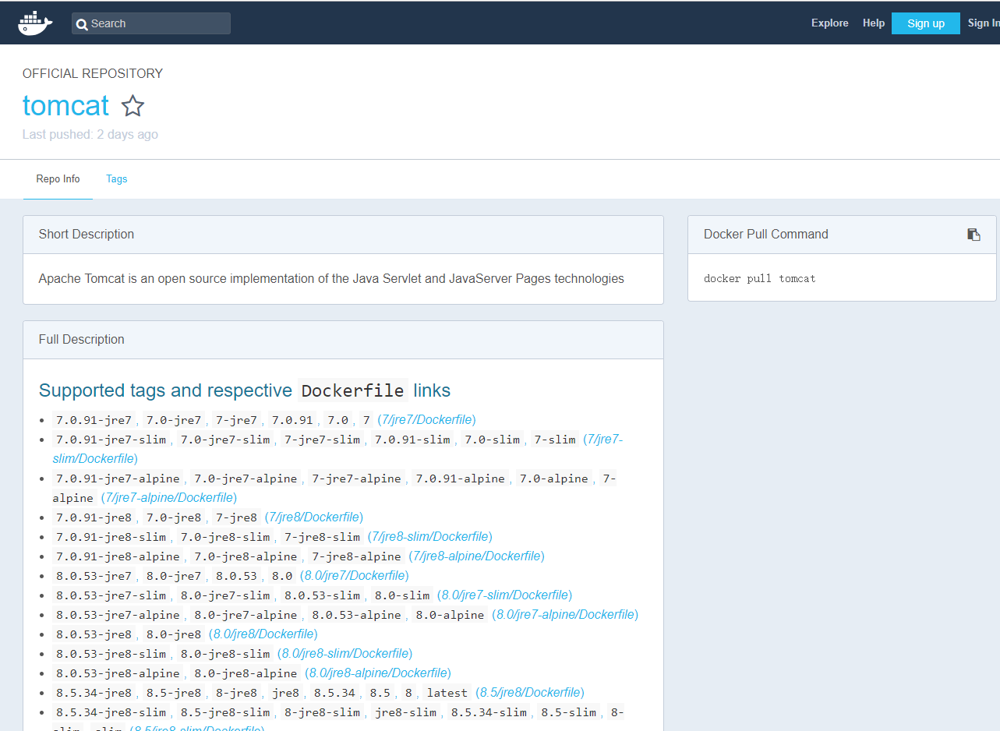
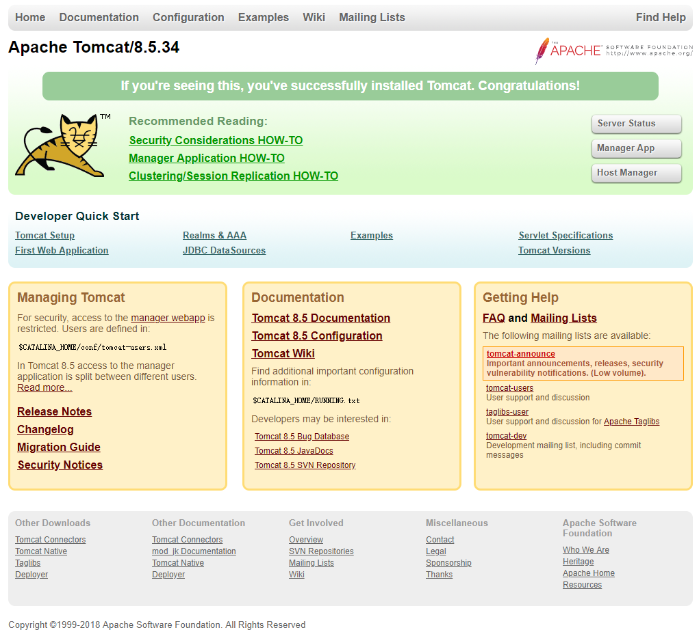

## 下载tomcat镜像

执行下面的命令，默认会下载最新版本的tomcat镜像

```
docker pull tomcat 
```

如果想使用其它版本的tomcat，可以到下面网址查找

[https://hub.docker.com/r/library/tomcat/](https://hub.docker.com/r/library/tomcat/)

如下图




- 下载完毕后，可以执行`docker images`命令查看下载好的镜像

```
PS D:\> docker images
REPOSITORY          TAG                 IMAGE ID            CREATED             SIZE
tomcat              latest              41a54fe1f79d        13 days ago         463MB
```

## 启动tomcat

执行命令：

`docker run -p 8080:8080 --name mytomcat tomcat:latest`

> -p : 前边的8080是本机的端口，冒号后面的8080是docker容器的端口，tomcat默认是8080

> --name : 是给容器起一个别名，方便使用，不然docker会默认给容器一个随机字符串的名称


执行完命令后，在命令行可以看到tomcat启动的日志。

- 在浏览器输入：http://localhost:8080/ ，即可看到熟悉的tomcat首页界面




- 在命令行输入`docker ps`，可以看到正在运行的容器

```
PS D:\> docker ps
CONTAINER ID        IMAGE               COMMAND             CREATED             STATUS              PORTS                    NAMES
77f1e983fd94        tomcat:latest       "catalina.sh run"   8 seconds ago       Up 6 seconds        0.0.0.0:8080->8080/tcp   mytomcat
```

- 进入容器

执行命令：`docker exec -it mytomcat bash` ，在这里用到了上面提到的容器别名`mytomcat`


```
PS D:\> docker exec -it mytomcat bash
root@77f1e983fd94:/usr/local/tomcat# ls
BUILDING.txt     NOTICE         RUNNING.txt  include  native-jni-lib  work
CONTRIBUTING.md  README.md      bin          lib      temp
LICENSE          RELEASE-NOTES  conf         logs     webapps
```

可以看到一个标准的tomcat的目录

## 部署项目到tomcat

把项目打包成一个war包文件，这里暂时假设名称为`demo.war`，然后在war包所在的目录，执行以下命令：

```
docker cp demo.war mytomcat:/usr/local/tomcat/webapps
```

war包会自动解压，然后执行下面命令重启容器

```
docker restart mytomcat
```

最后在浏览器输入：http://localhost:8080/demo ，即可访问项目


---


