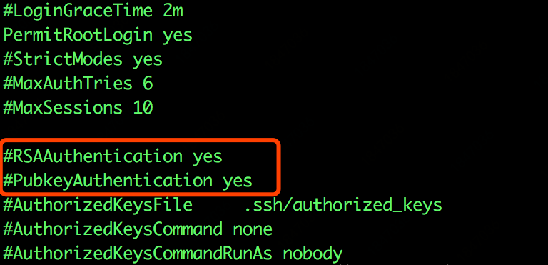

## 先定制一台机器

### 启动ubuntu

```
docker run --name ubuntu -t -i -p 50021:22 -p 8081:8081 ubuntu:20.04 /bin/bash 
```

### 安装所需的包

**先升级一下**

```
apt update
```

1. 安装ssh，vim
```
apt install openssh*
apt install vim
```

2. 安装jdk，过程略

3. 安装ifconfig（主要用于查看当前机器ip）

```
apt-get install net-tools
```

### 配置环境

修改 /etc/ssh/sshd_config ， 将下图中的两个配置打开




### 提交镜像

```
docker commit 83f75401d59e ubuntu:java
```


## 启动三台机器

使用上面定制好的镜像，启动三台机器

```
docker run --name u1 -t -i -p 50021:22 -p 8081:8081 ubuntu:java /bin/bash 

docker run --name u2 -t -i -p 50022:22 -p 8082:8081 ubuntu:java /bin/bash 

docker run --name u3 -t -i -p 50023:22 -p 8083:8081 ubuntu:java /bin/bash 
```

## 配置ssh免登录

**注意下面的命令，需要在三台机器上分别操作一次**

### 首先打开ssh服务

```
# service ssh status
service ssh start
```

### 修改root密码
```
passwd root
```

### 生成ssl秘钥
```
ssh-keygen -t rsa
```

连续回车，然后会在`/root/.ssh`目录下生成`id_rsa`和`id_rsa.pub`文件

---

假设三台机器的ip分别为 172.17.0.1 、 172.17.0.2 、 172.17.0.3 ， 分别对应hostname为u1，u2，u3

---

- 第一步

在u1机器上，进入`/root/.ssh`目录下，执行命令：
```
cat id_rsa.pub>> authorized_keys
```
将u1的公钥追加到authorized_keys文件中

- 第二步  
在u1机器上，执行命令：

```
ssh root@172.17.0.2 cat ~/.ssh/id_rsa.pub>> authorized_keys
```
需要输入上面修改后的密码，密码验证成功后，会把u2的公钥追加到u1的authorized_keys文件中。

- 第三步  
在u1机器上，执行命令：

```
ssh root@172.17.0.3 cat ~/.ssh/id_rsa.pub>> authorized_keys
```
需要输入上面修改后的密码，密码验证成功后，会把u3的公钥追加到u1的authorized_keys文件中。

最后，可以执行`cat authorized_keys`查看一下authorized_keys文件，可以看到里面已经有了三台机器的公钥。


### 复制公钥

- 1. 登录到u2机器，执行下面的命令：

```
ssh root@172.17.0.1 cat ~/.ssh/authorized_keys>> ~/.ssh/authorized_keys
```

- 2. 登录到u3机器，执行下面的命令：

```
ssh root@172.17.0.1 cat ~/.ssh/authorized_keys>> ~/.ssh/authorized_keys
```

### 验证免密码登录

在u1执行：`ssh root@172.17.0.2` `ssh root@172.17.0.3`
在u2执行：`ssh root@172.17.0.1` `ssh root@172.17.0.3`
过程中可能需要确认一下，输入`yes`即可，之后便可以直接免密码登录。


