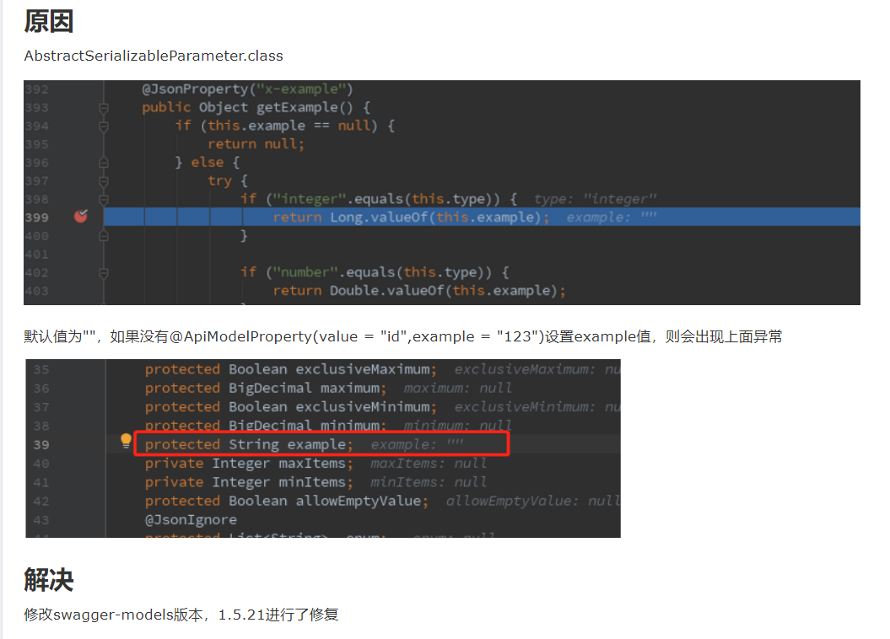
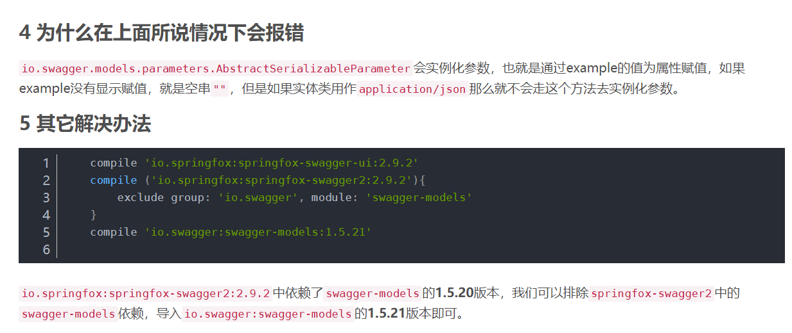

## Swagger报错java.lang.NumberFormatException: For input string: ""

```

java.lang.NumberFormatException: For input string: ""
    at java.lang.NumberFormatException.forInputString(NumberFormatException.java:65)
    at java.lang.Long.parseLong(Long.java:601)
    at java.lang.Long.valueOf(Long.java:803)
    at io.swagger.models.parameters.AbstractSerializableParameter.getExample(AbstractSerializableParameter.java:412)
    at sun.reflect.NativeMethodAccessorImpl.invoke0(Native Method)
    at sun.reflect.NativeMethodAccessorImpl.invoke(NativeMethodAccessorImpl.java:62)
    at sun.reflect.DelegatingMethodAccessorImpl.invoke(DelegatingMethodAccessorImpl.java:43)
    at java.lang.reflect.Method.invoke(Method.java:498)
    at com.fasterxml.jackson.databind.ser.BeanPropertyWriter.serializeAsField(BeanPropertyWriter.java:687)
    at com.fasterxml.jackson.databind.ser.std.BeanSerializerBase.serializeFields(BeanSerializerBase.java:719)

```

报错的版本是2.9.2，2.7.0的版本是不报错的，2.8的版本也不会







### 也可以选择降低版本，使用2.7或者2.8