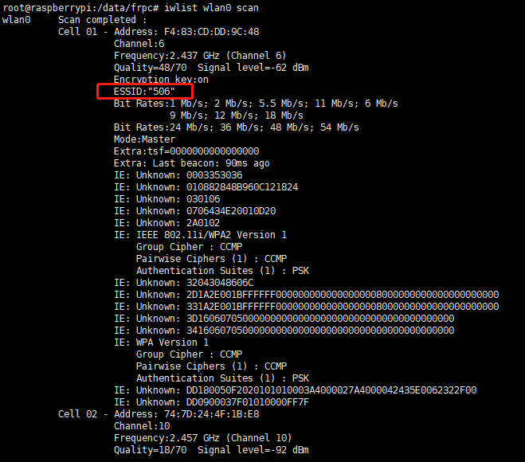

## 树莓派3启动wifi并且配置wifi

### 首先通过网线连接树莓派，然后执行命令：

```
iwlist wlan0 scan  
```

查看树莓派已经识别的wifi



如上图所示，每一个cell是一个网络，其中的ESSID是我们关注的，它是wifi的名称，找到自己路由wifi的名字。

### 第二步，配置wifi信息：

```
vim  /etc/wpa_supplicant/wpa_supplicant.conf  
```

在这个文件最后添加wifi的名字和密码

```
network={
    ssid="506"
    key_mgmt=WPA-PSK
    psk="12345678"
}
```

key_mgmt=WPA-PSK是加密方式.


### 最后重启树莓派

```
reboot
```

然后我们就可以拔下网线了。稍等一会，再登陆路由器的管理界面，查看新的树莓派的IP，重新ssh即可。


> 那如果我要配置多个wifi呢？
> 
> 只需要为每一个wifi配置一个network{}的变量即可。

## 定时任务

crontab -e 

crontab -l

/etc/init.d/cron restart
/etc/init.d/crond restart


---
```
apt-get install apache2
apt-get install mysql-server
apt-get install php5 php5-mysql
apt-get install phpmyadmin
```
---
